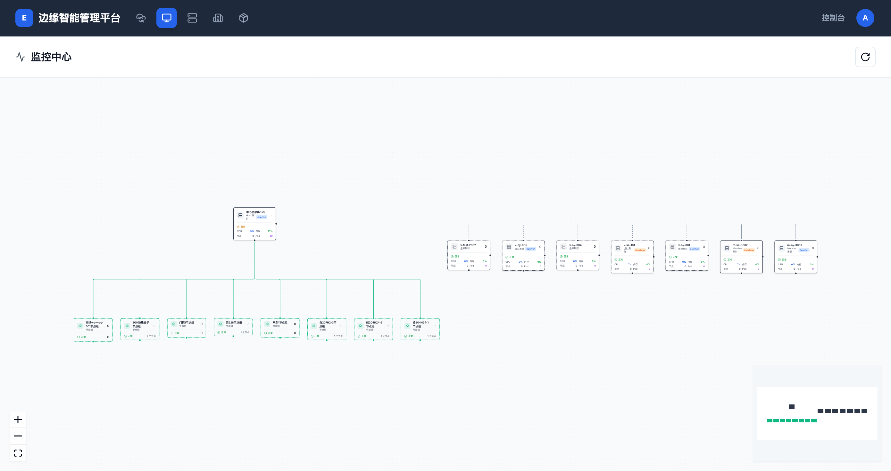

# 监控平台概述

> **导航路径**: 顶部导航栏 > 监控中心
> **访问地址**: `/metrics`
> **所需权限**: 平台管理员或具有集群监控权限的用户

## 功能说明

监控中心提供集群和节点的实时资源监控。通过拓扑视图可以直观了解所有集群、节点组和虚拟集群的运行状态和资源使用情况。

## 页面概览

监控中心首页以拓扑图形式展示整个平台的集群架构：

- **中心节点**：Host 集群，显示集群类型、边缘框架、告警状态、CPU/内存使用率、节点数和容器组数
- **节点组**：Host 集群下属的各节点组，显示名称、状态和节点数量
- **虚拟集群**：独立运行的虚拟集群，显示 CPU/内存使用率、节点数和容器组数
- **Member 集群**：加入平台的成员集群

## 入口说明

监控功能有两个入口：

| 入口 | 导航路径 | 功能 |
|------|----------|------|
| 监控中心 | 顶部导航栏 > 监控中心 | 查看拓扑全景、进入节点监控 |
| 集群监控告警 | 集群 > 选择集群 > 监控告警 | 查看集群指标、告警、趋势图 |

## 快速导航

| 文档 | 说明 |
|------|------|
| [集群节点监控](./monitoring-dashboard.md) | 查看集群内所有节点的资源使用情况 |
| [集群监控指标](./cluster-metrics.md) | 查看集群整体的 CPU、内存、磁盘和网络指标 |
| [告警管理](./alert-management.md) | 查看活跃告警和创建告警规则 |
| [趋势分析](./trend-analysis.md) | 查看 CPU 和内存的历史趋势图表 |

## 常见问题

### 问题：监控中心页面为空
**现象**：拓扑图没有显示任何集群节点
**原因**：当前用户没有任何集群的访问权限，或监控服务未正常运行
**解决**：联系平台管理员确认权限分配和监控服务状态

### 问题：节点显示为警告状态
**现象**：拓扑图中某个集群显示橙色警告标识
**原因**：该集群存在活跃的告警（如内存使用率过高、磁盘空间不足等）
**解决**：点击进入该集群的监控页面，在「告警」标签页查看具体告警信息
