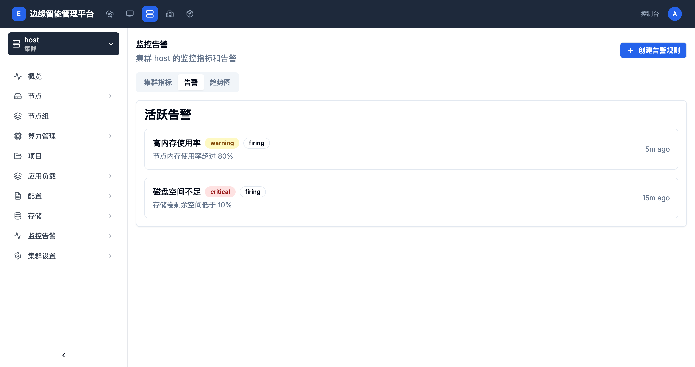

# 告警管理

> **导航路径**: 集群 > 选择集群 > 监控告警 > 告警
> **访问地址**: `/boss/clusters/{集群ID}/monitoring`（点击「告警」标签页）
> **所需权限**: 平台管理员或集群管理员

## 功能说明

告警管理展示集群中当前触发的活跃告警。每条告警包含告警名称、级别、状态和触发时间，帮助您快速定位和响应系统异常。

## 页面概览

告警页面显示「活跃告警」列表，每条告警包含以下信息：

| 信息 | 说明 |
|------|------|
| 告警名称 | 描述告警内容，如「高内存使用率」、「磁盘空间不足」 |
| 级别标签 | warning（黄色）或 critical（红色） |
| 状态标签 | firing（正在触发） |
| 告警描述 | 具体的告警说明，如「节点内存使用率超过 80%」 |
| 触发时间 | 告警持续时间，如「5m ago」表示 5 分钟前触发 |

## 操作指南

### 操作一：查看活跃告警

**操作步骤**

1. 在集群监控告警页面，点击 **告警** 标签页

2. 查看「活跃告警」列表中的所有当前告警

3. 根据告警级别判断处理优先级：

   | 级别 | 含义 | 建议操作 |
   |------|------|----------|
   | critical（红色） | 严重问题，可能影响业务运行 | 立即处理 |
   | warning（黄色） | 潜在风险，资源使用偏高 | 尽快关注 |

**操作结果**

了解集群当前存在的异常情况和需要处理的问题。

### 操作二：创建告警规则

**操作步骤**

1. 在监控告警页面，点击右上角的 **创建告警规则** 按钮

2. 在创建页面中，配置告警规则：

   | 字段 | 是否必填 | 说明 |
   |------|----------|------|
   | 告警名称 | 是 | 为告警规则命名 |
   | 监控指标 | 是 | 选择要监控的指标（CPU、内存、磁盘等） |
   | 触发条件 | 是 | 设置阈值和持续时间 |
   | 告警级别 | 是 | 选择 critical 或 warning |
   | 告警描述 | 否 | 补充说明告警的具体含义 |

3. 点击 **确认** 保存告警规则

**操作结果**

告警规则创建成功后，系统会持续监控指定指标。当指标超过阈值并持续达到设定时间时，告警将出现在活跃告警列表中。

## 告警级别说明

| 级别 | 标签颜色 | 典型场景 |
|------|----------|----------|
| critical | 红色 | 磁盘空间剩余低于 10%、服务完全不可用、节点离线 |
| warning | 黄色 | 内存使用率超过 80%、CPU 使用率偏高、磁盘使用率超过 70% |

## 常见问题

### 问题：告警列表为空但节点显示警告
**现象**：监控中心拓扑图中集群显示警告标识，但告警标签页没有内容
**原因**：告警可能已自动恢复，或告警规则尚未配置
**解决**：检查是否已创建告警规则；如已创建，可能是告警短暂触发后条件已恢复

### 问题：同一告警反复出现
**现象**：某条告警消失后又重新出现
**原因**：告警条件在阈值边界波动，导致告警反复触发和恢复
**解决**：适当提高告警阈值或增加持续时间要求，避免因短暂波动频繁触发
