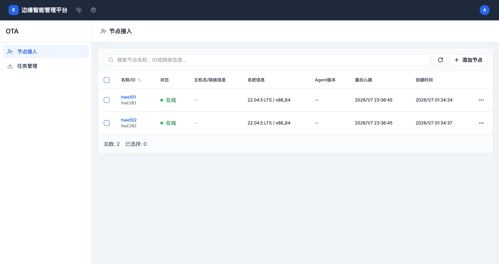

# 集群监控指标

## 概述

集群监控指标是边缘计算平台可观测性系统的核心组成部分，提供对集群资源使用情况、性能表现和运行状态的全面监控。通过实时和历史指标数据，运维人员可以及时发现和解决系统问题。



## 指标架构

### 数据采集层

#### Prometheus 采集器
- **组件**：Prometheus Server
- **���能**：定期抓取监控指标
- **协议**：HTTP + Metrics格式
- **存储**：时序数据库（TSDB）

#### cAdvisor
- **功能**：容器资源使用监控
- **监控对象**：Pod、Container
- **指标类型**：CPU、内存、文件系统、网络
- **采集频率**：默认15秒

#### Node Exporter
- **功能**：节点级系统监控
- **监控对象**：物理机、虚拟机
- **指标类型**：系统级资源指标
- **采集频率**：默认15秒

#### Kube-State-Metrics
- **功能**：Kubernetes对象状态监控
- **监控对象**：Pod、Node、Deployment等
- **指标类型**：资源状态和标签信息
- **采集频率**：默认30秒

### 数据处理层

#### Prometheus Query Engine
- **即时查询**：当前时刻的指标值
- **范围查询**：指定时间段的指标序列
- **聚合计算**：对指标进行统计和聚合

#### Recording Rules
- **预计算规则**：提前计算常用指标
- **性能优化**：减少查询计算量
- **数据降采样**：降低历史数据存储成本

### 数据展示层

#### Grafana集成
- **可视化面板**：丰富的图表类型
- **仪表板模板**：预配置监控面板
- **告警集成**：与告警系统联动

#### 自定义API
- **REST API**：程序化访问监控数据
- **GraphQL**：灵活的数据查询接口
- **WebSocket**：实时数据推送

## 核心指标详解

### 1. CPU指标

#### 1.1 CPU使用率 (CPU Usage Rate)

**指标名称**：`cpu_usage_percent`

**计算公式**：
```promql
sum(rate(container_cpu_usage_seconds_total{namespace!="", pod!=""}[5m])) by (cluster)
/
sum(kube_node_status_capacity{resource="cpu"}) by (cluster)
* 100
```

**数据来源**：
- cAdvisor：容器CPU使用时间
- Kubernetes API：节点CPU容量
- Prometheus：计算聚合

**采集频率**：15秒

**数据精度**：保留2位小数

**正常范围**：
- 轻度负载：0-40%
- 中度负载：40-70%
- 重度负载：70-90%
- 过载状态：>90%

**告警阈值**：
- Warning：>80%（持续5分钟）
- Critical：>90%（持续10分钟）

**影响因素**：
- 业务负载增加
- 计算密集型进程
- CPU资源争抢
- 不合理的调度策略

**优化建议**：
- 垂直扩展：增加CPU资源
- 水平扩展：增加Pod副本数
- 负载均衡：优化Pod分布
- 代码优化：降低CPU使用率

#### 1.2 CPU核心数 (CPU Core Count)

**指标名称**：`cpu_core_count`

**计算公式**：
```promql
sum(kube_node_status_capacity{resource="cpu"}) by (cluster)
```

**数据来源**：Kubernetes Node信息

**更新频率**：节点状态变化时更新

**说明**：
- 显示集群可用的总CPU核心数
- 包括可调度和不可调度的资源
- 用于容量规划和资源评估

#### 1.3 CPU负载 (CPU Load)

**指标名称**：`cpu_load_avg`

**计算公式**：
```promql
avg(node_load1{job="node-exporter"}) by (cluster)
```

**数据来源**：Node Exporter

**采集频率**：15秒

**说明**：
- 显示1分钟平均负载
- 与CPU核心数对比评估负载状态
- Load > CPU cores表示过载

### 2. 内存指标

#### 2.1 内存使用率 (Memory Usage Rate)

**指标名称**：`memory_usage_percent`

**计算公式**：
```promql
sum(container_memory_working_set_bytes{namespace!="", pod!=""}) by (cluster)
/
sum(kube_node_status_capacity{resource="memory"}) by (cluster)
* 100
```

**数据来源**：
- cAdvisor：容器内存使用量（工作集）
- Kubernetes API：节点内存容量
- Prometheus：计算聚合

**采集频率**：15秒

**数据精度**：保留2位小数

**正常范围**：
- 轻度使用：0-50%
- 中度使用：50-75%
- 重度使用：75-90%
- 内存不足：>90%

**告警阈值**：
- Warning：>80%（持续5分钟）
- Critical：>90%（持续10分钟）

**内存类型说明**：
- **工作集内存**：实际使用的物理内存
- **缓存内存**：文件系统缓存，可回收
- **交换内存**：使用swap分区，影响性能

**影响因素**：
- 应用内存需求增加
- 内存泄漏
- Java堆内存配置不当
- 缓存策略不合理

**优化建议**：
- 增加内存资源
- 优化应用内存使用
- 检查内存泄漏问题
- 调整JVM参数

#### 2.2 内存使用量 (Memory Usage)

**指标名称**：`memory_usage_bytes`

**计算公式**：
```promql
sum(container_memory_working_set_bytes{namespace!="", pod!=""}) by (cluster)
```

**单位**：Bytes (字节)

**显示单位**：
- GB (Gigabytes)
- MB (Megabytes)

**说明**：
- 显示实际使用的物理内存总量
- 排除缓存和缓冲区
- 用于容量规划和成本分析

#### 2.3 内存缓存 (Memory Cache)

**指标名称**：`memory_cache_bytes`

**计算公式**：
```promql
sum(container_memory_cache{namespace!="", pod!=""}) by (cluster)
```

**说明**：
- 文件系统缓存大小
- 可在内存压力时回收
- 影响应用性能但不是实际使用

### 3. 磁盘指标

#### 3.1 磁盘使用率 (Disk Usage Rate)

**指标名称**：`disk_usage_percent`

**计算公式**：
```promql
avg(node_filesystem_size_bytes{fstype!="tmpfs"} - node_filesystem_avail_bytes{fstype!="tmpfs"})
/
node_filesystem_size_bytes{fstype!="tmpfs"}
* 100
```

**数据来源**：Node Exporter

**采集频率**：30秒

**监控范围**：
- 系统磁盘：/、/var等系统目录
- 数据磁盘：数据卷和持久化存储
- 容器镜像：容器存储驱动

**正常范围**：
- 正常使用：0-70%
- 空间紧张：70-85%
- 空间不足：85-95%
- 严重不足：>95%

**告警阈值**：
- Warning：>80%（持续10分钟）
- Critical：>90%（持续5分钟）

**影响因素**：
- 日志文件累积
- 容器镜像未清理
- 临时文件未清理
- 数据增长超出预期

**优化建议**：
- 清理旧日志文件
- 清理未使用的容器镜像
- 扩容磁盘空间
- 配置日志自动清理策略

#### 3.2 磁盘I/O (Disk I/O)

**指标名称**：
- `disk_read_bytes_per_sec` - 磁盘读取速率
- `disk_write_bytes_per_sec` - 磁盘写入速率

**计算公式**：
```promql
rate(node_disk_read_bytes_total{job="node-exporter"}[5m])
rate(node_disk_write_bytes_total{job="node-exporter"}[5m])
```

**单位**：Bytes/sec (字节/秒)

**显示单位**：
- MB/s (兆字节/秒)
- GB/s (吉字节/秒)

**采集频率**：15秒

**性能基准**：
- SSD磁盘：读100-500 MB/s，写100-300 MB/s
- HDD磁盘：读50-150 MB/s，写50-100 MB/s
- NVMe磁盘：读1000+ MB/s，写800+ MB/s

**异常检测**：
- I/O突然下降：磁盘故障或性能问题
- I/O持续过高：数据库或存储服务负载高
- 读写比例异常：访问模式变化

### 4. 网络指标

#### 4.1 网络流量 (Network Traffic)

**指标名称**：
- `network_in_bytes_per_sec` - 入站流量
- `network_out_bytes_per_sec` - 出站流量

**计算公式**：
```promql
sum(rate(container_network_receive_bytes_total{namespace!="", pod!=""}[5m])) by (cluster)
sum(rate(container_network_transmit_bytes_total{namespace!="", pod!=""}[5m])) by (cluster)
```

**单位**：Bytes/sec (字节/秒)

**显示单位**：
- MB/s (兆字节/秒)
- GB/s (吉字节/秒)

**采集频率**：15秒

**监控范围**：
- Pod间通信流量
- 集群外部访问流量
- 节点间同步流量
- 存储网络流量

**正常范围**：
- 小型集群：&lt;100 MB/s
- 中型集群：100-500 MB/s
- 大型集群：500+ MB/s

**异常检测**：
- 流量激增：DDoS攻击或业务异常
- 流量骤降：网络故障或服务中断
- 出站流量异常：数据泄露风险
- 入站流量异常：被攻击风险

#### 4.2 网络连接数 (Network Connections)

**指标名称**：`network_connections_count`

**计算公式**：
```promql
node_netstat_Tcp_CurrEstab{job="node-exporter"}
```

**说明**：
- 当前活跃的TCP连接数
- 按节点和协议统计
- 用于评估网络负载

**正常范围**：
- 小规模服务：1000-10000
- 中规模服务：10000-50000
- 大规模服务：50000+

**告警阈值**：
- Warning：>50000 连接
- Critical：>80000 连接

**优化建议**：
- 调整TCP连接超时时间
- 启用连接复用
- 优化网络服务架构
- 增加网络带宽

#### 4.3 网络错误率 (Network Error Rate)

**指标名称**：
- `network_receive_errors_per_sec` - 接收错误率
- `network_transmit_errors_per_sec` - 发送错误率

**计算公式**：
```promql
rate(node_network_receive_errs_total{job="node-exporter"}[5m])
rate(node_network_transmit_errs_total{job="node-exporter"}[5m])
```

**说明**：
- 网络传输错误数量
- 包含丢包、校验错误等
- 用于网络质量评估

**告警阈值**：
- Warning：错误率>0.1%
- Critical：错误率>1%

## 指标查询与分析

### PromQL查询示例

#### 1. 集群级别聚合

**CPU使用率**：
```promql
sum(rate(container_cpu_usage_seconds_total{namespace!="", pod!=""}[5m])) by (cluster)
/
sum(kube_node_status_capacity{resource="cpu"}) by (cluster)
* 100
```

**内存使用率**：
```promql
sum(container_memory_working_set_bytes{namespace!="", pod!=""}) by (cluster)
/
sum(kube_node_status_capacity{resource="memory"}) by (cluster)
* 100
```

#### 2. 节点级别分析

**Top 5 CPU使用节点**：
```promql
topk(5, sum(rate(container_cpu_usage_seconds_total{namespace!="", pod!=""}[5m])) by (node))
```

**节点内存使用排行**：
```promql
sum(container_memory_working_set_bytes{namespace!="", pod!=""}) by (node)
```

#### 3. Pod级别监控

**Pod CPU使用率**：
```promql
rate(container_cpu_usage_seconds_total{namespace="default", pod="my-app"}[5m]) * 100
```

**Pod内存使用量**：
```promql
container_memory_working_set_bytes{namespace="default", pod="my-app"}
```

#### 4. 应用级别聚合

**命名空间资源使用**：
```promql
sum(rate(container_cpu_usage_seconds_total{namespace="production"}[5m])) by (pod)
```

**Deployment资源使用**：
```promql
sum(rate(container_cpu_usage_seconds_total{namespace="default"}[5m])) by (pod)
/
sum(kube_deployment_spec_replicas{namespace="default"})
```

### 数据聚合策略

#### 时间维度聚合
- **即时查询**：查询当前时刻的值
- **范围查询**：查询指定时间段的序列
- **时间窗口**：5m、15m、1h等不同粒度

#### 空间维度聚合
- **集群聚合**：所有节点的总和
- **节点聚合**：单个节点的Pod聚合
- **命名空间聚合**：同一项目的资源聚合
- **Pod聚合**：单个容器的指标

#### 函数应用
- **rate()**：计算速率
- **irate()**：计算瞬时速率
- **avg()**：计算平均值
- **sum()**：计算总和
- **max()**：计算最大值
- **min()**：计算最小值

## 性能基线与容量规划

### 性能基线建立

#### 1. 基线指标定义
- **正常运行期**：业务平稳时的指标值
- **高峰期**：业务高峰期的指标值
- **低谷期**：业务低谷期的指标值
- **异常期**：故障或异常时的指标值

#### 2. 基线数据采集
- **采集周期**：至少30天数据
- **数据频率**：每小时一个数据点
- **数据清洗**：剔除异常数据点
- **统计分析**：计算平均值、峰值、谷值

#### 3. 基线应用场景
- **异常检测**：偏离基线超过3σ触发告警
- **容量规划**：基于基线增长趋势预测
- **性能评估**：与基线对比评估性能
- **预算制定**：基于资源使用制定预算

### 容量规划

#### 1. 容量预测模型

**线性增长模型**：
```
预测值 = 当前值 + 月增长率 × 月数
```

**指数增长模型**：
```
预测值 = 当前值 × (1 + 增长率)^月数
```

**季节性调整**：
```
预测值 = 趋势值 × 季节性系数
```

#### 2. 扩容决策标准

**立即扩容**：
- CPU持续>90%（超过1小时）
- 内存持续>90%（超过1小时）
- 磁盘使用>95%（超过30分钟）

**计划扩容**：
- CPU持续>80%（超过3天）
- 内存持续>80%（超过3天）
- 磁盘使用>85%（持续增长）

**预测扩容**：
- 基于趋势预测1个月内达到阈值
- 考虑业务增长计划
- 提前2-4周进行扩容

#### 3. 资源优化建议

**CPU优化**：
- 识别CPU密集型应用
- 优化调度策略
- 启用节点自动伸缩
- 配置资源限制

**内存优化**：
- 检查内存泄漏
- 优化缓存策略
- 调整JVM参数
- 启用内存压缩

**存储优化**：
- 实施数据分层
- 清理过期数据
- 压缩存储数据
- 使用高性能存储

## 故障诊断

### 常见性能问题

#### 1. CPU过载

**症状**：
- CPU使用率持续>90%
- 应用响应变慢
- 系统负载过高

**诊断步骤**：
1. 查看Top进程使用情况
2. 分析Prometheus查询找到高消耗Pod
3. 检查是否有异常进程
4. 评估是否需要扩容

**解决方案**：
- 增加CPU资源
- 优化应用代码
- 调整Pod副本数
- 实施负载均衡

#### 2. 内存泄漏

**症状**：
- 内存使用率持续上升
- 应用重启后内存下降
- 系统出现OOM Kill

**诊断步骤**：
1. 监控内存增长趋势
2. 分析应用内存堆栈
3. 检查是否有未释放的对象
4. 评估内存分配策略

**解决方案**：
- 修复内存泄漏代码
- 调整内存限制
- 实施健康检查重启
- 优化对象生命周期

#### 3. 磁盘空间不足

**症状**：
- 磁盘使用率>90%
- 无法写入新数据
- 应用功能异常

**诊断步骤**：
1. 查看磁盘使用分布
2. 识别大文件和目录
3. 检查日志文件大小
4. 分析容器镜像占用

**解决方案**：
- 清理日志文件
- 删除未使用的镜像
- 清理临时文件
- 扩容磁盘空间

#### 4. 网络性能问题

**症状**：
- 网络延迟增加
- 丢包率上升
- 连接数异常

**诊断步骤**：
1. 检查网络连接状态
2. 分析网络流量模式
3. 测试网络带宽
4. 检查网络配置

**解决方案**：
- 增加网络带宽
- 优化网络拓扑
- 调整网络参数
- 实施流量控制

## 最佳实践

### 1. 监控策略

#### 分级监控
- **P0级**：核心业务指标，实时监控
- **P1级**：重要业务指标，5分钟监控
- **P2级**：一般业务指标，15分钟监控
- **P3级**：辅助分析指标，小时级监控

#### 动态调整
- 根据业务变化调整监控频率
- 根据重要程度调整告警阈值
- 根据成本预算调整数据保留期

### 2. 告警配置

#### 告警级别
- **Critical**：影响业务连续性，立即处理
- **Warning**：影响服务质量，及时处理
- **Info**：提供参考信息，计划处理

#### 告警抑制
- 时间窗口内相同告警只发送一次
- 上游故障抑制下游告警
- 维护期间暂停非关键告警

### 3. 数据管理

#### 数据保留
- **详细数据**：15秒粒度，保留7天
- **汇总数据**：5分钟粒度，保留30天
- **趋势数据**：小时级粒度，保留365天

#### 查询优化
- 避免全量数据查询
- 使用预聚合数据
- 合理设置时间范围
- 缓存常用查询结果

### 4. 安全考虑

#### 访问控制
- 监控数据只读访问
- 按角色控制访问权限
- 审计监控数据访问记录

#### 数据隔离
- 多租户数据隔离
- 敏感指标脱敏处理
- 加密传输和存储

---

**最后更新**：2026-01-08
**适用版本**：v1.0+
**维护团队**：Edge Platform Team