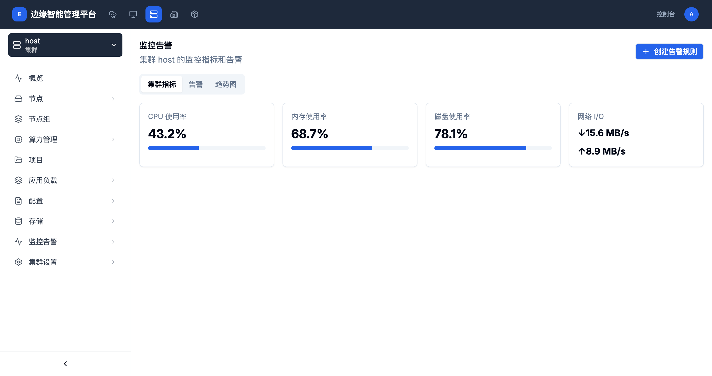

# 集群监控指标

> **导航路径**: 集群 > 选择集群 > 监控告警 > 集群指标
> **访问地址**: `/boss/clusters/{集群ID}/monitoring`
> **所需权限**: 平台管理员或集群管理员

## 功能说明

集群监控指标页面展示集群整体的 CPU 使用率、内存使用率、磁盘使用率和网络吞吐量。这些指标聚合了集群内所有节点的数据，帮助您快速了解集群的资源使用状况。

## 页面概览

监控告警页面包含三个标签页：

| 标签页 | 说明 |
|--------|------|
| 集群指标 | 实时展示 CPU、内存、磁盘和网络四项核心指标 |
| 告警 | 显示当前集群的活跃告警列表 |
| 趋势图 | 展示 CPU 和内存使用率的历史趋势折线图 |

## 操作指南

### 操作一：查看集群指标

**操作步骤**

1. 在顶部导航栏点击 **集群**，选择目标集群

2. 在左侧侧边栏中，点击 **监控告警**

3. 默认显示「集群指标」标签页，查看四项核心指标：

   | 指标 | 说明 | 示例 |
   |------|------|------|
   | CPU 使用率 | 集群所有节点的 CPU 综合使用百分比 | 43.2% |
   | 内存使用率 | 集群所有节点的内存综合使用百分比 | 68.7% |
   | 磁盘使用率 | 集群所有节点的磁盘综合使用百分比 | 78.1% |
   | 网络 I/O | 集群的入站和出站网络流量速率 | 入 15.6 MB/s / 出 8.9 MB/s |

   每项指标以数值和进度条形式展示，便于快速判断资源使用程度。

**操作结果**

了解集群当前的整体资源使用情况。

### 操作二：创建告警规则

**操作步骤**

1. 在监控告警页面，点击右上角的 **创建告警规则** 按钮

2. 按照引导配置告警条件和通知方式

**操作结果**

告警规则创建后，当集群指标超过设定阈值时会自动触发告警。

## 常见问题

### 问题：指标数据长时间未更新
**现象**：页面上的指标数值不变化
**原因**：监控数据采集服务可能异常
**解决**：尝试刷新页面；如问题持续，联系平台管理员检查监控服务状态

### 问题：网络 I/O 显示为 0
**现象**：网络入站和出站流量均显示为 0 MB/s
**原因**：集群当前无网络活动，或网络监控指标未正确采集
**解决**：确认集群内有运行中的应用；如有应用运行仍显示为 0，检查监控配置
