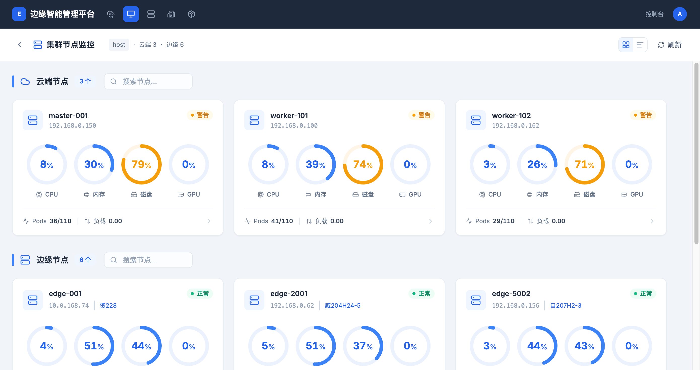
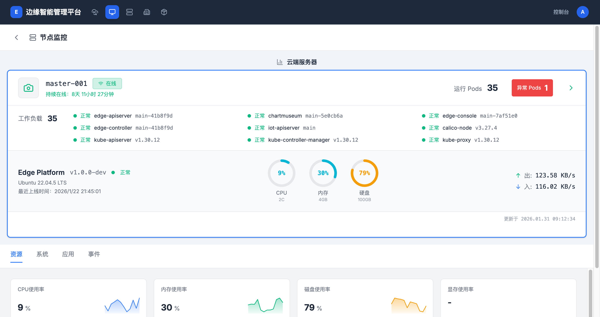

# 集群节点监控

> **导航路径**: 顶部导航栏 > 监控中心 > 点击集群节点
> **访问地址**: `/metrics/clusters/{集群ID}/nodes`
> **所需权限**: 平台管理员或具有集群监控权限的用户

## 功能说明

集群节点监控页面展示选定集群内所有节点的资源使用情况。页面将节点按类型分为云端节点和边缘节点两组，每个节点以卡片形式展示 CPU、内存、磁盘和 GPU 的实时使用率。

## 页面概览

页面顶部显示集群名称、云端节点数量和边缘节点数量。右上角支持在卡片视图和列表视图之间切换。

## 操作指南

### 操作一：查看节点概况

**操作步骤**

1. 在监控中心拓扑图中，点击目标集群节点

2. 进入集群节点监控页面，查看两个分区：

   **云端节点**

   | 信息 | 说明 |
   |------|------|
   | 节点名称 | 云端服务器名称，如 master-001、worker-101 |
   | IP 地址 | 节点的网络地址 |
   | 状态 | 正常（绿色）、警告（橙色） |
   | CPU | CPU 使用率百分比（环形图） |
   | 内存 | 内存使用率百分比（环形图） |
   | 磁盘 | 磁盘使用率百分比（环形图） |
   | GPU | GPU 使用率百分比（环形图） |
   | Pods | 已运行容器组数 / 最大容器组数 |
   | 负载 | 系统负载值 |

   **边缘节点**

   | 信息 | 说明 |
   |------|------|
   | 节点名称 | 边缘设备名称，如 edge-001、edge-2001 |
   | IP 地址 | 节点的网络地址 |
   | 所属节点组 | 该节点所在的节点组名称 |
   | 状态 | 正常（绿色）、警告（橙色）、离线（灰色） |
   | CPU / 内存 / 磁盘 / GPU | 使用率百分比 |

3. 使用搜索框按节点名称搜索

**操作结果**

查看到集群内所有节点的实时资源使用状况。

### 操作二：查看节点详情

**操作步骤**

1. 在节点卡片上，点击右侧的箭头按钮（或点击节点卡片）

2. 进入节点监控详情页面

   

3. 详情页面展示以下信息：

   **顶部概览区域**
   - 节点名称和在线状态
   - 持续在线时间
   - 运行容器组数和异常容器组数
   - 工作负载列表（名称、版本、状态）
   - 系统信息（平台版本、操作系统、上线时间）
   - CPU / 内存 / 磁盘使用率环形图
   - 网络出站和入站速率

   **标签页区域**

   | 标签页 | 说明 |
   |--------|------|
   | 资源 | CPU、内存、磁盘、显存使用率的实时数值和迷你趋势图 |
   | 系统 | 节点系统信息和运行参数 |
   | 应用 | 节点上运行的应用列表 |
   | 事件 | 节点相关的系统事件记录 |

**操作结果**

查看到该节点的完整运行状态、资源使用详情和历史趋势。

### 操作三：切换视图模式

**操作步骤**

1. 在页面右上角，找到视图切换按钮

2. 点击网格图标切换为卡片视图，点击列表图标切换为列表视图

**操作结果**

卡片视图适合快速浏览资源使用率，列表视图适合查看更多节点的详细数据。

## 常见问题

### 问题：节点状态显示为警告
**现象**：节点卡片右上角显示橙色"警告"标识
**原因**：该节点的某项资源使用率超过了告警阈值（如磁盘使用率超过 70%）
**解决**：点击进入节点详情，查看具体哪项资源使用率偏高

### 问题：边缘节点的资源数据为空
**现象**：边缘节点卡片中 CPU、内存等数据显示为「-」
**原因**：边缘节点可能刚接入或网络连接不稳定，导致监控数据未采集到
**解决**：等待片刻后点击右上角 **刷新** 按钮；如持续为空，检查边缘节点的网络连接
