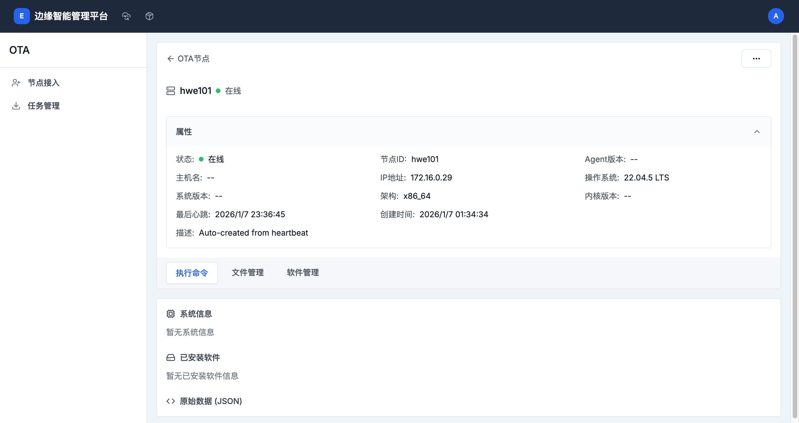

# 节点接入管理指南

## 概述

节点接入是 OTA 模块的基础功能，负责边缘节点的注册、管理和监控。通过节点接入功能，管理员可以轻松管理大规模的边缘节点，实时了解节点状态，并执行各种维护操作。

## 访问节点接入

- **路径**: `/boss/ota/node-access`
- **权限**: 需要管理员或集群管理权限
- **导航**: 控制台 → OTA → 节点接入

## 主界面概览

节点接入主界面显示所有已注册的边缘节点列表，包含以下信息：

### 节点列表字段

- **名称/ID**: 节点的唯一标识符，可点击查看详情
- **状态**: 节点当前状态（在线/离线）
- **主机名/网络信息**: 节点主机名和 IP 地址
- **系统信息**: 操作系统和架构信息
- **Agent 版本**: Edge Agent 的版本号
- **最后心跳**: 最后一次连接时间
- **创建时间**: 节点注册时间

### 功能按钮

- **搜索节点**: 支持按节点名称、ID 或网络信息搜索
- **添加节点**: 注册新的边缘节点
- **批量操作**: ��择多个节点进行批量管理

## 注册新节点

### 单个节点注册

#### 步骤

1. 点击"添加节点"按钮
2. 选择"单个注册"标签
3. 填写节点信息：

**必填字段**:
- **节点名称**: 节点的唯一标识符
  - 只能包含小写字母、数字和连字符(-)
  - 必须以小写字母开头
  - 最长 63 个字符

- **节点 IP 地址**: 边缘节点的 SSH 登录 IP
  - 支持 IPv4 和 IPv6 地址
  - 确保管理平台能访问此地址

- **SSH 端口**: SSH 服务端口（默认：22）
- **用户名**: SSH 登录用户名
- **密码**: SSH 登录密码
- **文件服务器注册地址**: 文件服务器地址（默认：docker.io）

**可选字段**:
- **别名**: 节点的显示名称
  - 可包含中文、字母、数字和连字符
  - 不可以小写字母开头
  - 最长 63 个字符

- **文件服务器用户名**: 文件服务器认证用户名
- **文件服务器密码**: 文件服务器认证密码
- **描述**: 节点的详细描述信息

4. 点击"确定"完成注册

### 批量节点注册

批量注册适用于同时注册多个节点的情况，使用 hostname + MAC 地址后缀自动生成节点名称。

#### 步骤

1. 点击"添加节点"按钮
2. 选择"批量注册"标签
3. 填写批量注册信息：

**必填字段**:
- **节点 IP 地址**: 每行一个 IP 地址
  - 支持多行输入
  - 系统将自动访问每个 IP 获取 hostname 和 MAC 地址

- **SSH 端口**: 统一的 SSH 端口（默认：22）
- **用户名**: 统一的 SSH 登录用户名
- **密码**: 统一的 SSH 登录密码
- **文件服务器注册地址**: 文件服务器地址

**可选字段**:
- **别名**: 所有节点的统一别名
- **文件服务器认证信息**: 如果需要的话
- **描述**: 批量节点的描述信息

4. 点击"确定"开始批量注册

#### 批量注册注意事项

- 确保所有节点使用相同的 SSH 认证信息
- 节点名称自动格式：`{hostname}-{mac地址后缀}`
- 如果某个节点注册失败，不影响其他节点的注册
- 建议在非高峰期执行大批量注册操作

## 节点详情管理

点击节点名称可以进入节点详情页面，查看和管理单个节点的详细信息。

### 节点属性信息

#### 基本属性
- **状态**: 节点当前状态（在线/离线）
- **节点ID**: 节点的唯一标识符
- **Agent版本**: Edge Agent 的版本信息
- **主机名**: 节点的主机名称
- **IP地址**: 节点的 IP 地址
- **操��系统**: 操作系统类型和版本
- **系统版本**: 系统版本详细信息
- **架构**: 系统架构（x86_64、arm64 等）
- **内核版本**: Linux 内核版本
- **最后心跳**: 最后一次连接时间
- **创建时间**: 节点注册时间
- **描述**: 节点的描述信息

### 节点操作标签

节点详情页面包含三个主要功能标签：

#### 1. 执行命令

**功能**: 在节点上远程执行 Shell 命令

**特点**:
- 支持执行任意 Shell 命令
- 默认超时时间 30 秒
- 输出结果最大 10MB
- 提供常用命令快捷按钮

**快捷命令按钮**:
- **查看系统信息**: `uname -a`
- **查看磁盘使用**: `df -h`
- **查看内存使用**: `free -h`
- **查看 CPU 信息**: `cat /proc/cpuinfo`
- **查看运行时间**: `uptime`
- **查看进程列表**: `ps aux`
- **查看网络连接**: `netstat -tuln`
- **查看系统日志**: `journalctl -n 50`

**使用步骤**:
1. 在命令输入框中输入要执行的命令
2. 按 `Ctrl+Enter` 或点击"执行"按钮
3. 查看命令执行结果
4. 结果包含标准输出和错误输出

**使用说明**:
- 支持执行任意 shell 命令
- 默认超时时间为 30 秒
- 输出结果最大为 10MB
- 点击预设按钮可快速填入常用命令

#### 2. 文件管理

**功能**: 读取和写入节点上的文件

**读取文件**:
1. 在"文件路径"输入框中输入文件路径
  - 支持绝对路径和相对路径
  - 相对路径从节点根目录开始解析
2. 点击"读取"按钮
3. 文件内容将显示在"文件内容"文本框中

**快捷文件按钮**:
- **主机名**: `/etc/hostname`
- **系统版本**: `/etc/os-release`
- **主机配置**: `/etc/hosts`
- **环境变量**: `/etc/environment`
- **时区配置**: `/etc/timezone`

**写入文件**:
1. 在"文件路径"输入框中输入目标文件路径
2. 在"文件权限"输入框中设置文件权限（如 0644、0755）
3. 在"文件内容"文本框中输入或粘贴文件内容
4. 点击"写入"按钮完成写入

**使用说明**:
- 支持读取和写入节点上的任意文件
- 读取文件最大为 1MB，超时时间 30 秒
- 写入时需指定文件权限（如 0644, 0755）
- 相对路径将从节点根目录开始解析
- 实时显示字符数和行数统计

**注意事项**:
- 写入操作会覆盖原有文件内容，请谨慎操作
- 确保有足够的权限访问目标文件和目录
- 大文件操作可能需要较长的时间

#### 3. 软件管理

**功能**: 管理节点上的软件安装和版本

**已安装软件**:
- 显示当前节点已安装的软件列表
- 包含软件名称、版本和安装时间

**可安装软件**:
系统提供以下常用软件的快速安装：

- **Docker**
  - 版本：24.0.7、20.10.21
  - 描述：Docker Engine - 行业标准容器运行时

- **Containerd**
  - 版本：1.7.0
  - 描述：行业标准容器运行时

- **Nvidia-Docker2**
  - 版本：2.13.0
  - 描述：NVIDIA 容器工具包，支持 GPU
  - 依赖：需要先安装 Docker

**软件安装步骤**:
1. 在"可安装软件"区域找到目标软件
2. 从下拉菜单中选择要安装的版本
3. 点击"安装"按钮
4. 等待安装完成（可能需要几分钟）
5. 安装完成后会自动刷新已安装软件列表

**使用说明**:
- 选择软件版本后点击"安装"按钮进行安装
- 安装过程可能需要几分钟，请耐心等待
- 安装完成后会自动刷新已安装软件列表
- 支持安装容器运行时（Docker、Containerd）和设备驱动（NVIDIA）

**注意事项**:
- 安装操作需要 root 权限
- 某些软件有依赖关系，需要按顺序安装
- 安装过程中不要关闭页面
- 安装失败时请检查节点网络连接和磁盘空间

## 节点搜索和过滤

### 搜索功能

在节点接入页面顶部提供强大的搜索功能：

**搜索范围**:
- 节点名称
- 节点 ID
- IP 地址
- 主机名
- 网络信息

**使用方法**:
1. 在搜索框中输入关键词
2. 系统实时过滤显示匹配的节点
3. 支持模糊搜索和部分匹配

### 状态过滤

虽然当前版本主要通过搜索来过滤节点，但可以通过以下方式按状态查看：

1. 使用搜索功能查找特定状态的节点
2. 查看节点状态列（在线/离线）
3. 点击状态列可以进行排序

## 节点操作菜单

每个节点行末尾都有一个操作菜单按钮（三个点），提供以下操作：

### 可用操作

- **查看详情**: 进入节点详情页面
- **编辑节点**: 修改节点的别名和描述
- **删除节点**: 从系统中移除节点
- **刷新状态**: 手动刷新节点连接状态
- **导出配置**: 导出节点配置信息

## 节点状态监控

### 状态类型

- **在线**: 节点正常连接，心跳正常
- **离线**: 节点失去连接或心跳超时

### 心跳机制

- 节点定期发送心跳到管理平台
- 默认心跳间隔：30 秒
- 心跳超时时间：90 秒
- 最后心跳时间显示在节点列表中

### 自动状态更新

- 系统自动监控节点心跳
- 超过超时时间自动标记为离线
- 节点重新连接后自动恢复在线状态
- 无需手动刷新，状态实时更新

## 节点批量操作

### 选择节点

1. 点击节点行的复选框选择单个节点
2. 点击列表头的复选框选择所有节点
3. 可以跨页选择多个节点

### 批量操作功能

- **批量删除**: 删除选中的多个节点
- **批量导出**: 导出选中节点的配置信息
- **批量刷新**: 刷新选中节点的状态
- **批量任务创建**: 为选中的节点创建任务

## 节点维护最佳实践

### 节点命名规范

- 使用有意义的命名规则
- 包含位置、用途等信息
- 例如：`edge-beijing-web-01`

### 定期维护

1. **定期检查节点状态**
   - 每周检查一次离线节点
   - 及时处理连接问题

2. **清理无效节点**
   - 删除长期离线的节点
   - 清理测试用的临时节点

3. **更新节点信息**
   - 保持描述信息的准确性
   - 及时更新别名和分类

### 安全考虑

1. **访问控制**
   - 使用强密码
   - 定期更新 SSH 密钥
   - 限制管理权限

2. **网络安全**
   - 使用 VPN 或专线连接
   - 配置防火墙规则
   - 启用 SSL/TLS 加密

3. **审计日志**
   - 记录所有管理操作
   - 定期审查访问日志
   - 监控异常行为

## 故障排除

### 节点无法注册

**问题**: 添加节点后显示离线或无法连接

**解决方案**:
1. 检查节点网络连接
2. 验证 SSH 连接参数
3. 确认 SSH 服务运行状态
4. 检查防火墙设置
5. 验证用户名和密码

### 节点频繁掉线

**问题**: 节点状态在在线和离线之间切换

**解决方案**:
1. 检查网络稳定性
2. 调整心跳超时时间
3. 检查 Edge Agent 运行状态
4. 查看节点系统资源使用情况

### 命令执行失败

**问题**: 命令执行超时或返回错误

**解决方案**:
1. 检查节点在线状态
2. 验证命令语法正确性
3. 增加超时时间设置
4. 检查用户权限
5. 查看节点系统日志

### 文件操作失败

**问题**: 无法读取或写入文件

**解决方案**:
1. 检查文件路径是否正确
2. 验证文件权限设置
3. 确认磁盘空间充足
4. 检查文件大小限制
5. 验证用户访问权限

## 相关文档

- [任务管理指南](./task-management.md)
- [命令执行参考](./command-reference.md)
- [故障排除指南](./troubleshooting.md)
- [API 参考](./api-reference.md)