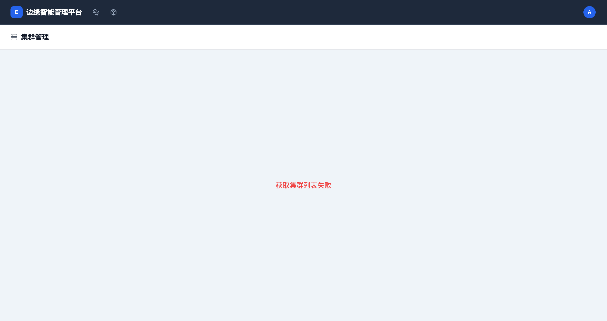
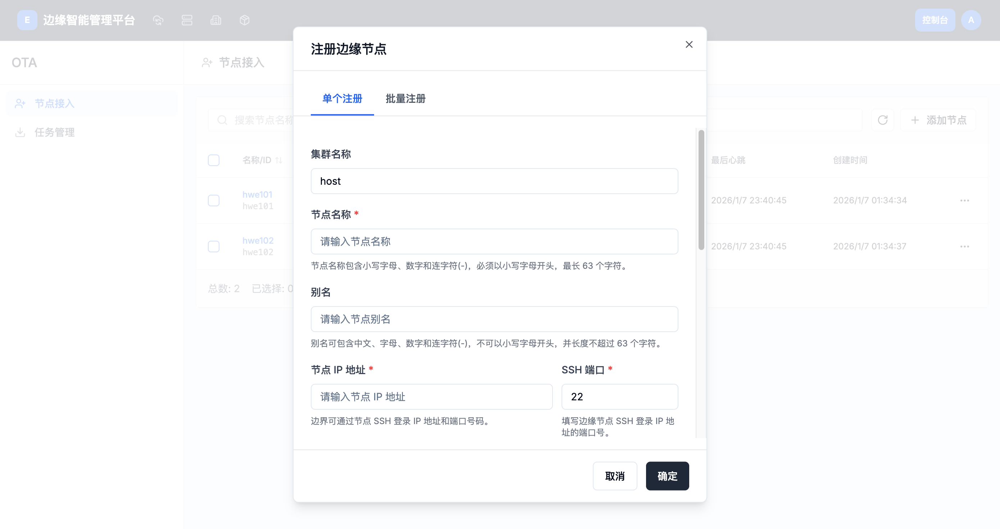
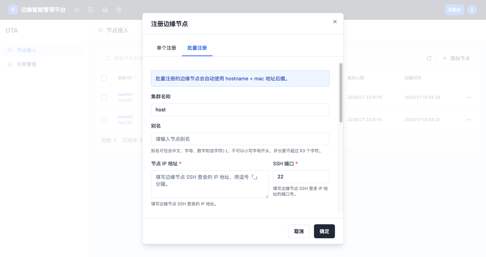
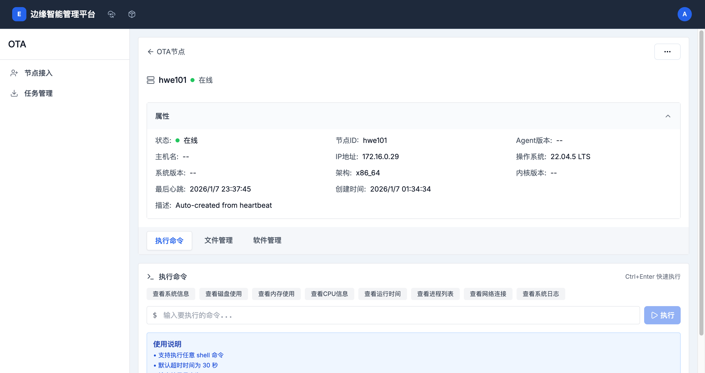
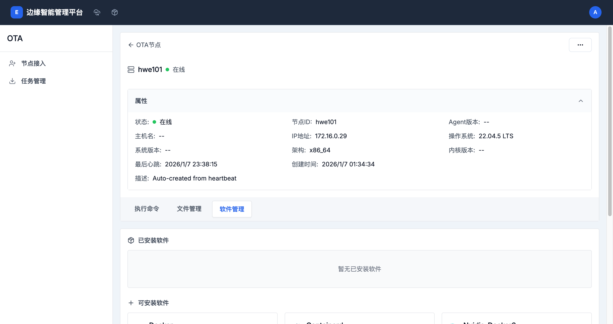

# 节点接入

> **导航路径**: 控制台 > OTA > 节点接入
> **访问地址**: `/boss/ota/node-access`
> **所需权限**: 平台管理员

## 功能说明

节点接入页面用于注册和管理边缘节点。您可以查看所有已注册节点的在线状态，添加新节点，以及对节点执行远程操作（执行命令、文件管理、查看软件包）。

## 页面概览

节点列表包含以下信息：

| 列 | 说明 |
|------|------|
| 节点名称 | 节点的名称和标识 |
| 状态 | 节点在线状态（在线、离线） |
| IP 地址 | 节点的 IP 地址 |
| 操作系统 | 节点的操作系统信息 |
| 最后上线时间 | 节点最后一次连接的时间 |

## 操作指南

### 操作一：添加单个节点

**操作步骤**

1. 在节点列表页面，点击 **添加节点** 按钮

2. 选择 **单个添加**

   

3. 填写节点信息：

   | 字段 | 是否必填 | 说明 |
   |------|----------|------|
   | 节点名称 | 是 | 节点的标识名称 |
   | IP 地址 | 是 | 节点的访问地址 |
   | 端口 | 是 | 节点的连接端口 |
   | 认证方式 | 是 | 密码或密钥 |

4. 点击 **确认** 添加节点

**操作结果**

节点添加成功，出现在节点列表中。

### 操作二：批量导入节点

**操作步骤**

1. 在节点列表页面，点击 **添加节点** 按钮

2. 选择 **批量导入**

   

3. 上传包含节点信息的文件

4. 确认导入

**操作结果**

多个节点批量添加到列表中。

### 操作三：远程执行命令

**操作步骤**

1. 在节点列表中，点击目标节点的名称

2. 进入节点详情，点击 **执行命令** 标签页

   

3. 在命令输入框中输入要执行的命令

4. 点击 **执行**

**操作结果**

命令在节点上远程执行，执行结果实时显示在页面上。

### 操作四：文件管理

**操作步骤**

1. 在节点详情中，点击 **文件管理** 标签页

   

2. 浏览节点上的目录和文件

3. 支持上传、下载和删除文件

**操作结果**

远程查看和管理节点上的文件。

### 操作五：查看软件包

**操作步骤**

1. 在节点详情中，点击 **软件管理** 标签页

   

2. 查看节点上已安装的软件包列表

**操作结果**

了解节点上安装的软件包及其版本信息。

## 常见问题

### 问题：节点状态显示「离线」
**现象**：添加的节点在列表中状态为「离线」
**原因**：节点网络不通，或节点上的 Agent 未运行
**解决**：检查节点网络连接，确认 Agent 服务已启动

### 问题：命令执行超时
**现象**：远程执行命令后长时间无响应
**原因**：命令执行时间过长，或节点网络延迟高
**解决**：尝试更简单的命令（如 `echo test`）验证连接，检查网络状况
