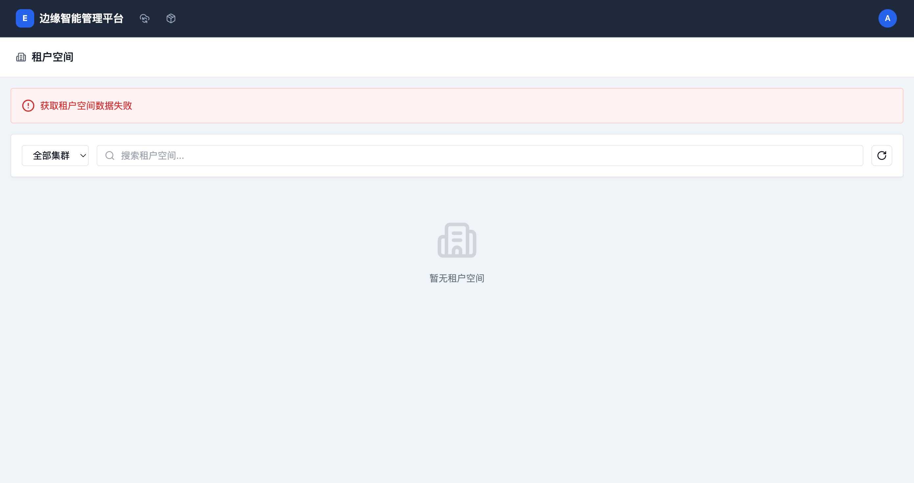
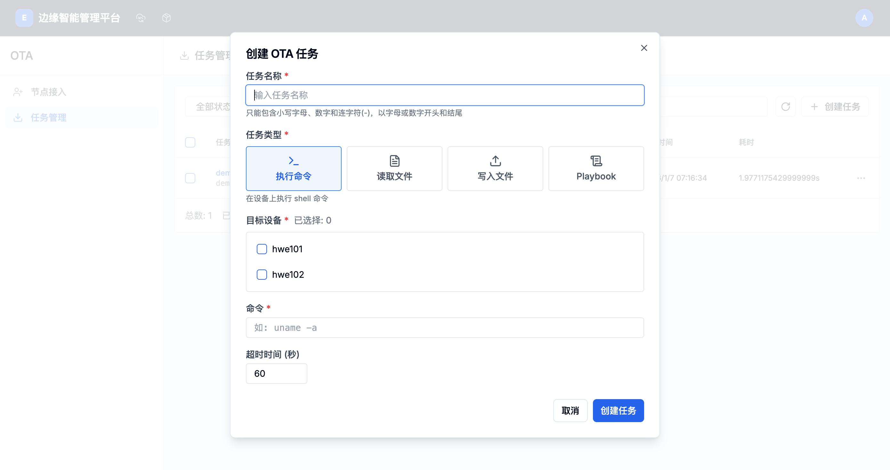
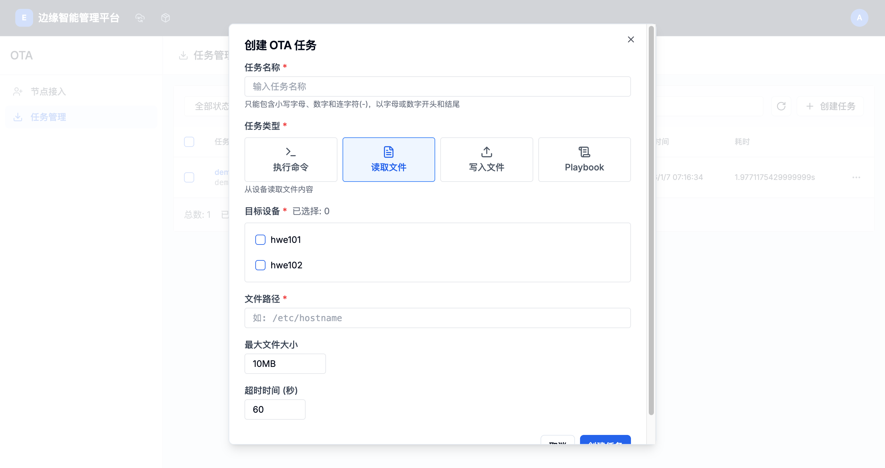
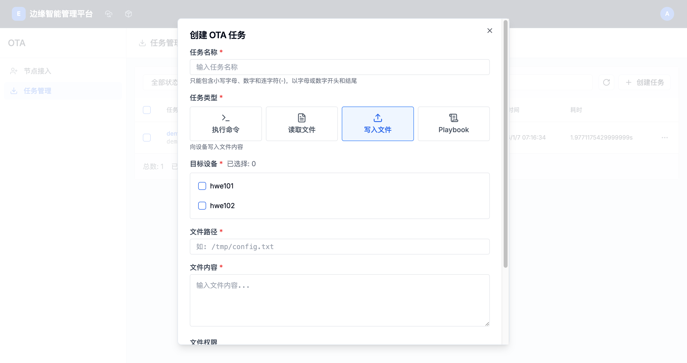
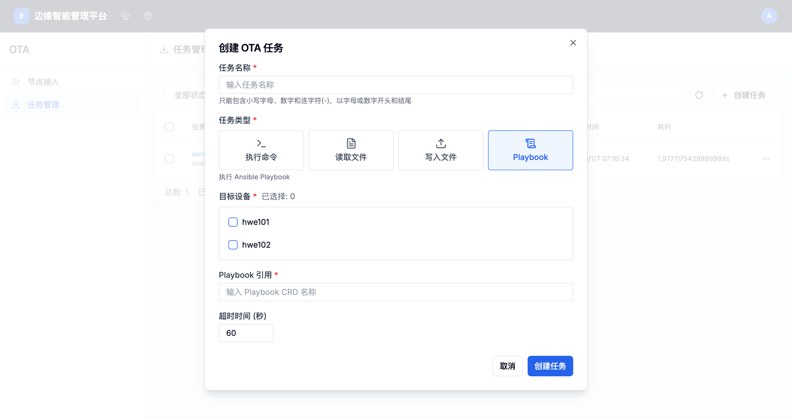
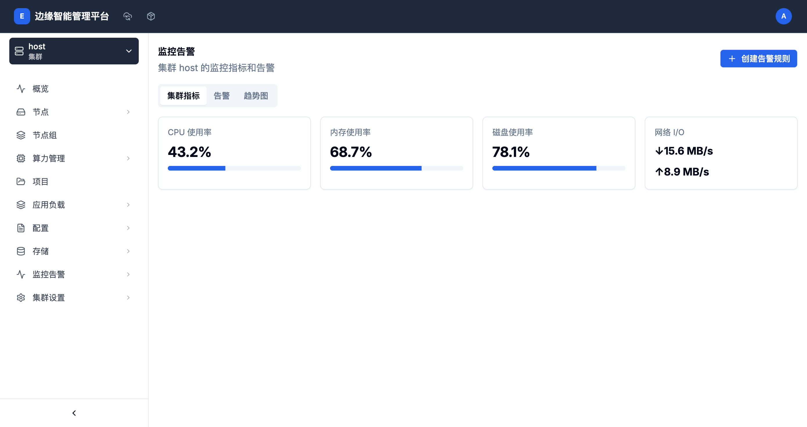
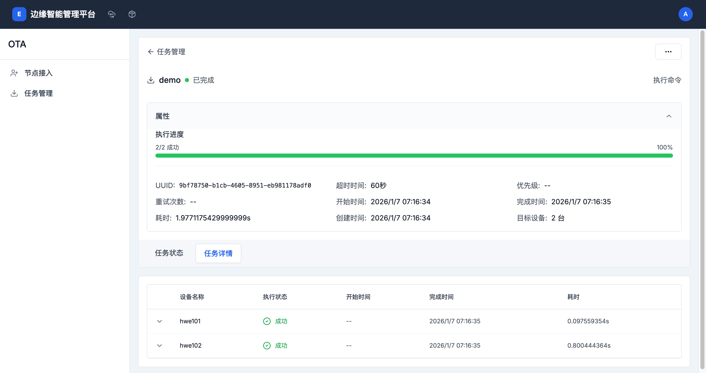

# 任务管理指南

## 概述

任务管理是 OTA 模块的核心功能，提供批量任务创建、调度和监控能力。通过任务管理功能，管理员可以高效地对多个边缘节点执行批量操作，实现统一的运维管理。

## 访问任务管理

- **路径**: `/boss/ota/task-management`
- **权限**: 需要管理员或集群管理权限
- **导航**: 控制台 → OTA → 任务管理

## 主界面概览



任务管理主界面显示所有 OTA 任务列表，包含以下信息：

### 任务列表字段

- **任务名称/ID**: 任务的唯一标识符，可点击查看详情
- **类型**: 任务类型（执行命令、读取文件、写入文件、Playbook）
- **状态**: 任务执行状态（等待中、运行中、已完成、失败）
- **执行进度**: 任务完成进度（已完成数/总数）
- **目标设备**: 任务执行的目标节点列表
- **创建时间**: 任务创建时间
- **耗时**: 任务执行总时长

### 功能按钮

- **状态过滤**: 按任务状态过滤（全部状态、等待中、运行中、已完成、失败）
- **搜索任务**: 支持按任务名称、ID 或目标设备搜索
- **创建任务**: 创建新的 OTA 任务
- **批量操作**: 选择多个任务进行批量管理

## 任务类型

OTA 系统支持以下四种任务类型：

### 1. 执行命令任务

在目标节点上执行 Shell 命令。

**适用场景**:
- 系统维护操作
- 批量软件更新
- 系统信息收集
- 配置修改

**特点**:
- 支持任意 Shell 命令
- 可同时向多个节点下发
- 实时返回执行结果
- 支持超时控制

### 2. 读取文件任务

从目标节点读取文件内容。

**适用场景**:
- 配置文件备份
- 日志文件收集
- 系统文件检查
- 数据文件采集

**特点**:
- 支持任意文件路径
- 文件大小限制可配置
- 批量文件收集
- 结果集中展示

### 3. 写入文件任务

向目标节点写入文件内容。

**适用场景**:
- 配置文件分发
- 脚本文件部署
- 证书文件更新
- 配置统一管理

**特点**:
- 支持自定义文件权限
- 批量文件分发
- 内容一致性保证
- 写入结果验证

### 4. Playbook 任务

执行 Ansible Playbook。

**适用场景**:
- 复杂的自动化部署
- 多步骤配置管理
- 应用安装和配置
- 系统初始化

**特点**:
- 支持复杂自动化流程
- 幂等性保证
- 详细的执行报告
- 错误处理机制

## 创建任务

### 创建任务对话框

点击"创建任务"按钮打开任务创建对话框。

### 执行命令任务



#### 配置参数

**必填字段**:
- **任务名称**: 任务的唯一标识符
  - 只能包含小写字母、数字和连字符(-)
  - 必须以字母或数字开头和结尾
  - 最长 63 个字符

- **任务类型**: 选择"执行命令"
- **目标设备**: 选择要执行任务的节点
  - 勾选复选框选择一个或多个节点
  - 显示已选择节点数量
  - 至少选择一个节点

- **命令**: 要执行的 Shell 命令
  - 如：`uname -a`
  - 支持任意有效的 Shell 命令

**可选字段**:
- **超时时间**: 命令执行超时时间（秒）
  - 范围：1-600 秒
  - 默认：60 秒

#### 使用示例

```bash
# 查看系统信息
uname -a

# 检查磁盘使用
df -h

# 更新软件包
apt-get update && apt-get upgrade -y

# 重启服务
systemctl restart docker

# 查看进程
ps aux | grep nginx
```

### 读取文件任务



#### 配置参数

**必填字段**:
- **任务名称**: 任务的唯一标识符
- **任务类型**: 选择"读取文件"
- **目标设备**: 选择要读取文件的节点
- **文件路径**: 要读取的文件路径
  - 如：`/etc/hostname`
  - 支持绝对路径

**可选字段**:
- **最大文件大小**: 读取文件的大小限制
  - 默认：10MB
  - 可根据需要调整

- **超时时间**: 文件读取超时时间（秒）
  - 范围：1-600 秒
  - 默认：60 秒

#### 使用场景

```bash
# 读取配置文件
/etc/nginx/nginx.conf

# 读取日志文件
/var/log/syslog

# 读取系统信息
/etc/os-release

# 读取环境配置
/.env
```

### 写入文件任务



#### 配置参数

**必填字段**:
- **任务名称**: 任务的唯一标识符
- **任务类型**: 选择"写入文件"
- **目标设备**: 选择要写入文件的节点
- **文件路径**: 目标文件的路径
  - 如：`/tmp/config.txt`
  - 支持绝对路径

- **文件内容**: 要写入的文件内容
  - 支持多行文本
  - 支持各种字符编码

**可选字段**:
- **文件权限**: 文件的访问权限
  - 如：`0644`、`0755`
  - 默认：`0644`
  - 使用八进制权限表示

- **超时时间**: 文件写入超时时间（秒）
  - 范围：1-600 秒
  - 默认：60 秒

#### 使用示例

```bash
# 写入配置文件
��径: /etc/myapp/config.conf
权限: 0644
内容:
[database]
host = localhost
port = 3306
name = mydb

# 写入脚本文件
路径: /usr/local/bin/myscript.sh
权限: 0755
内容:
#!/bin/bash
echo "Hello World"

# 写入环境变量
路径: /etc/environment
权限: 0644
内容:
MY_VAR=value
ANOTHER_VAR=another_value
```

### Playbook 任务



#### 配置参数

**必填字段**:
- **任务名称**: 任务的唯一标识符
- **任务类型**: 选择"Playbook"
- **目标设备**: 选择要执行 Playbook 的节点
- **Playbook 引用**: Playbook CRD 名称
  - 输入已创建的 Playbook 资源名称
  - 确保 Playbook 资源存在且有效

**可选字段**:
- **超时时间**: Playbook 执行超时时间（秒）
  - 范围：1-600 秒
  - 默认：60 秒

#### Playbook 前置条件

使用 Playbook 任务前，需要：

1. 创建 Playbook CRD 资源
2. 定义 Playbook 内容和参数
3. 确保目标节点已安装 Ansible
4. 验证 Playbook 语法正确性

## 任务执行流程

### 任务生命周期

```
创建 → 等待中 → 运行中 → 已完成/失败
```

### 状态说明

1. **等待中**: 任务已创建，等待调度执行
2. **运行中**: 任务正在执行中
3. **已完成**: 任务成功执行完成
4. **失败**: 任务执行失败

### 执行机制

- **并发执行**: 同时向多个目标节点下发任务
- **队列管理**: 任务按创建顺序排队执行
- **重试机制**: 失败的任务自动重试（可配置）
- **超时控制**: 超过超时时间自动终止任务

## 任务详情查看

点击任务名称可以进入任务详情页面。

### 任务概览



**任务属性信息**:
- **执行进度**: 已完成/总数 + 百分比
- **UUID**: 任务的唯一标识符
- **超时时间**: 任务超时设置
- **优先级**: 任务执行优先级
- **重试次数**: 失败重试次数
- **开始时间**: 任务开始执行时间
- **完成时间**: 任务完成时间
- **耗时**: 任务执行总时长
- **创建时间**: 任务创建时间
- **目标设备**: 目标节点数量

**任务配置**:
- **命令/文件路径**: 任务的具体配置
- **目标设备列表**: 所有目标节点名称

**执行结果汇总**:
- **总计**: 总任务数
- **成功**: 成功执行的任务数
- **失败**: 失败的任务数
- **运行中**: 还在执行中的任务数

### 任务状态标签

任务详情页面包含两个主要标签：

#### 1. 任务状态

显示任务的整体执行状态和统计信息。

#### 2. 任务详情



显示每个目标节点的执行详情：

- **设备名称**: 节点名称
- **执行状态**: 节点上的任务执行状态
- **开始时间**: 在该节点开始执行的时间
- **完成时间**: 在该节点完成的时间
- **耗时**: 在该节点执行的耗时

## 任务监控和管理

### 实时监控

- **进度跟踪**: 实时查看任务执行进度
- **状态更新**: 自动更新任务状态
- **结果展示**: 实时显示执行结果

### 任务搜索和过滤

#### 按状态过滤

- **全部状态**: 显示所有任务
- **等待中**: 显示等待执行的任务
- **运行中**: 显示正在执行的任务
- **已完成**: 显示成功完成的任务
- **失败**: 显示执行失败的任务

#### 搜索功能

支持按以下内容搜索：
- 任务名称
- 任务 ID
- 目标设备名称

### 任务操作

每个任务行末尾的操作菜单提供以下操作：

- **查看详情**: 查看任务详细信息
- **重新执行**: 重新执行失败的任务
- **删除任务**: 删除任务记录
- **导出结果**: 导出任务执行结果
- **取消任务**: 取消正在运行的任务

## 批量任务管理

### 选择任务

1. 点击任务行的复选框选择单个任务
2. 点击列表头的复选框选择所有任务
3. 可以跨页选择多个任务

### 批量操作

- **批量删除**: 删除选中的任务记录
- **批量导出**: 导出选中任务的执行结果
- **批量重试**: 重新执行选中的失败任务

## 任务最佳实践

### 任务创建建议

1. **命名规范**
   - 使用有意义的任务名称
   - 包含操作类型和目标信息
   - 例如：`update-nginx-config-prod`

2. **目标选择**
   - 测试环境先验证
   - 分批执行大规模任务
   - 避免在业务高峰期执行

3. **超时设置**
   - 根据任务复杂度设置合理超时
   - 简单命令：30-60 秒
   - 复杂操作：300-600 秒

### 任务监控建议

1. **实时跟踪**
   - 任务创建后立即关注执行状态
   - 及时处理失败的任务
   - 保存重要任务的执行结果

2. **结果分析**
   - 分析失败原因
   - 总结成功经验
   - 优化任务参数

### 安全考虑

1. **权限控制**
   - 限制敏感任务的访问权限
   - 记录任务操作日志
   - 定期审计任务历史

2. **内容验证**
   - 验证命令和文件内容
   - 避免包含敏感信息
   - 使用参数化配置

## 高级功能

### 任务模板

常用任务可以保存为模板，提高重复创建的效率：

1. 创建任务时选择"保存为模板"
2. 为模板设置名称和描述
3. 下次创建时选择"从模板创建"

### 任务调度

支持定时执行任务：

1. 创建任务时设置执行时间
2. 支持一次性执行和周期执行
3. 查看调度任务列表

### 任务依赖

支持设置任务依赖关系：

1. 定义任务的前置任务
2. 前置任务完成后自动执行
3. 构建复杂的任务流程

## 故障排除

### 任务执行失败

**常见原因**:
- 目标节点离线
- 命令语法错误
- 文件路径不存在
- 权限不足
- 网络连接问题

**解决方案**:
1. 检查目标节点状态
2. 验证命令或文件路径
3. 确认权限设置
4. 查看详细错误信息
5. 重新执行失败的任务

### 任务超时

**常见原因**:
- 命令执行时间过长
- 网络延迟过高
- 节点负载过高

**解决方案**:
1. 增加超时时间设置
2. 优化命令执行效率
3. 分批执行大规模任务
4. 在节点负载低时执行

### 任务卡住不动

**常见原因**:
- 系统资源不足
- 网络连接中断
- 任务调度器异常

**解决方案**:
1. 检查系统资源使用情况
2. 重启相关服务
3. 取消卡住的任务
4. 联系系统管理员

## 性能优化

### 提高任务执行效率

1. **合理设置并发数**
   - 根据系统资源调整
   - 避免过度并发

2. **优化任务命令**
   - 使用高效的命令
   - 避免不必要的操作

3. **批量操作优化**
   - 合理分配批次
   - 监控执行进度

### 资源管理

1. **内存管理**
   - 监控任务内存使用
   - 及时清理完成的任务

2. **磁盘管理**
   - 定期清理历史任务记录
   - 导出重要任务数据

3. **网络管理**
   - 避免网络拥塞
   - 优化数据传输

## 相关文档

- [节点接入管理指南](./node-access.md)
- [命令执行参考](./command-reference.md)
- [Playbook 开发指南](./playbook-development.md)
- [故障排除指南](./troubleshooting.md)
- [API 参考](./api-reference.md)