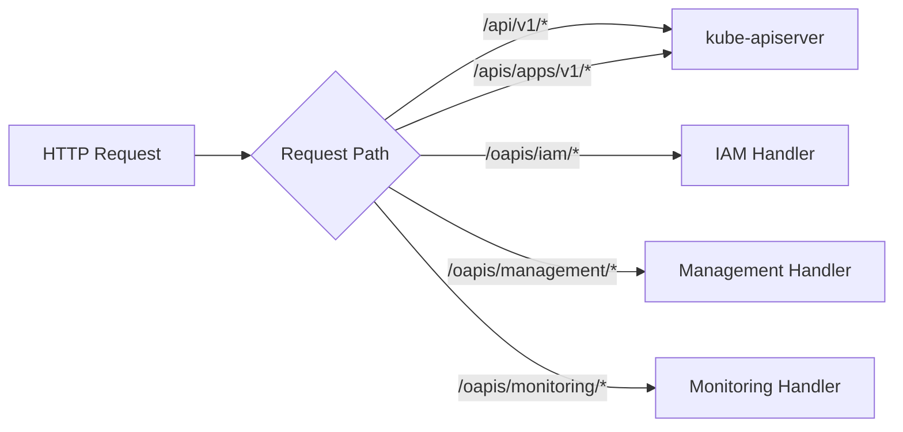

# API 扩展机制

本文档详细介绍边缘平台的 API 扩展机制,包括 oapis 组织 API 设计、APIService 扩展、ReverseProxy 代理和第三方 API 集成。

## oapis 组织 API 设计

### 设计目标

采用 `/oapis` (Organization APIs) 前缀区分自定义 API 和标准 Kubernetes API,实现清晰的命名空间分离。

### API 路径设计规范

#### 标准 Kubernetes API 路径

```
/api/v1/*                           # Core API (Pod, Service, etc.)
/apis/{group}/{version}/*           # Extended API (Deployment, etc.)
```

#### 组织自定义 API 路径

```
/oapis/{module}/{version}/*         # 组织自定义 API
```

### API 模块组织结构

#### 当前 API 组

| API模块 | 路径 | 描述 | 资源 |
|---------|------|------|------|
| **iam** | `/oapis/iam/v1alpha1/*` | 身份访问管理 | roletemplates, iamroles, iamrolebindings |
| **management** | `/oapis/management/v1/*` | 基础设施管理 | clusters, workspaces, system |

#### 未来扩展 API 组

| API模块 | 路径 | 描述 | 计划资源 |
|---------|------|------|---------|
| **monitoring** | `/oapis/monitoring/v1/*` | 监控告警 | alerts, metrics, dashboards |
| **storage** | `/oapis/storage/v1/*` | 存储管理 | volumes, snapshots, policies |
| **network** | `/oapis/network/v1/*` | 网络管理 | vpcs, subnets, firewalls |
| **security** | `/oapis/security/v1/*` | 安全管理 | policies, scans, reports |

## 请求路由逻辑



### 路由判断逻辑

```
HTTP请求 → RequestInfo解析 → 路由判断

┌─────────────────────────────────────────┐
│         Request Path                    │
├─────────────────────────────────────────┤
│ /api/v1/namespaces                      │ → kube-apiserver
│ /apis/apps/v1/deployments               │ → kube-apiserver
│ /apis/rbac.authorization.k8s.io/v1/*    │ → kube-apiserver
├─────────────────────────────────────────┤
│ /oapis/iam/v1alpha1/roletemplates        │ → 本地IAM Handler
│ /oapis/management/v1/clusters           │ → 本地Management Handler
│ /oapis/monitoring/v1/alerts             │ → 本地Monitoring Handler
└─────────────────────────────────────────┘
```

## 设计优势

### 1. 清晰的 API 命名空间分离

- **标准 K8s API**: `/api/*` 和 `/apis/*` → 自动转发 kube-apiserver
- **组织 API**: `/oapis/*` → 本地 handler 处理
- **系统 API**: `/healthz`, `/metrics` → 系统功能

### 2. 简洁的 URL 结构

```bash
# 传统复杂模式
/kapis/iam.domain.io/v1alpha2/users

# 我们的设计 - 更简洁
/oapis/iam/v1alpha1/users
```

### 3. 版本化管理

```bash
/oapis/iam/v1alpha1/*          # 当前版本
/oapis/iam/v1/*               # 稳定版本
/oapis/iam/v2alpha1/*         # 下一代版本
```

### 4. 模块化扩展

每个 API 模块独立开发、独立版本化:

```
pkg/apiserver/apis/
├── iam/v1alpha1/              # IAM模块
├── management/v1/             # 管理模块
├── monitoring/v1/             # 监控模块
└── storage/v1/                # 存储模块
```

## APIService 扩展机制

### APIService 资源定义

通过 Kubernetes APIService 资源扩展 kube-apiserver:

```yaml
apiVersion: apiregistration.k8s.io/v1
kind: APIService
metadata:
  name: v1alpha1.iam.theriseunion.io
spec:
  group: iam.theriseunion.io
  version: v1alpha1
  service:
    name: edge-apiserver
    namespace: edge-system
  groupPriorityMinimum: 1000
  versionPriority: 15
  insecureSkipTLSVerify: false
```

### 实现步骤

#### 1. 定义 API Group 和版本

```go
// pkg/apiserver/apis/iam/v1alpha1/register.go
package v1alpha1

const (
    GroupName = "iam.theriseunion.io"
    Version   = "v1alpha1"
)

var SchemeGroupVersion = schema.GroupVersion{
    Group:   GroupName,
    Version: Version,
}
```

#### 2. 注册资源类型

```go
func addKnownTypes(scheme *runtime.Scheme) error {
    scheme.AddKnownTypes(SchemeGroupVersion,
        &RoleTemplate{},
        &RoleTemplateList{},
        &IAMRole{},
        &IAMRoleList{},
    )
    metav1.AddToGroupVersion(scheme, SchemeGroupVersion)
    return nil
}
```

#### 3. 实现 API Handler

```go
type IAMAPIInstaller struct {
    group string
    version string
}

func (i *IAMAPIInstaller) Install(c *server.Config) error {
    // 注册路由处理器
    c.GenericAPIServer.Handler.NonGoRestfulMux.HandleFunc(
        "/oapis/iam/v1alpha1/roletemplates",
        i.handleRoleTemplates,
    )
    return nil
}
```

## ReverseProxy 权限过滤器

### ReverseProxy CRD 定义

```yaml
apiVersion: iam.theriseunion.io/v1alpha1
kind: ReverseProxy
metadata:
  name: example-api-proxy
spec:
  matcher:
    method: "*"
    path: "/api/example/*"
  upstream:
    scheme: http
    host: example-service.default.svc.cluster.local
    port: 8080
  directives:
    authProxy: true
    stripPathPrefix: "/api/example"
```

### 权限过滤集成

ReverseProxy 与 UniversalAuthorizer 无缝集成:

```go
// 权限检查发生在代理请求之前
func (h *ReverseProxyHandler) ServeHTTP(w http.ResponseWriter, req *http.Request) {
    // 1. 匹配 ReverseProxy 规则
    proxy := h.findMatchingProxy(req)
    if proxy == nil {
        http.NotFound(w, req)
        return
    }

    // 2. 执行权限检查
    user := getUserFromRequest(req)
    authorized := h.authorizer.Authorize(user, req.Method, req.URL.Path)
    if !authorized {
        http.Error(w, "Forbidden", http.StatusForbidden)
        return
    }

    // 3. 代理请求
    h.proxyRequest(w, req, proxy)
}
```

### NonResourceURLs 支持

ReverseProxy 支持非资源 URL 的权限控制:

```yaml
apiVersion: rbac.authorization.k8s.io/v1
kind: ClusterRole
metadata:
  name: proxy-user
rules:
- nonResourceURLs:
  - "/api/example/*"
  verbs:
  - get
  - post
```

## 第三方 API 集成实战

### 场景 1: 微服务 API 聚合

将多个微服务 API 统一到 APIServer 下:

```yaml
# 用户服务代理
apiVersion: iam.theriseunion.io/v1alpha1
kind: ReverseProxy
metadata:
  name: user-service-proxy
spec:
  matcher:
    path: "/api/users/*"
  upstream:
    host: user-service.default.svc.cluster.local
    port: 8080
  directives:
    authProxy: true
    stripPathPrefix: "/api/users"

---
# 订单服务代理
apiVersion: iam.theriseunion.io/v1alpha1
kind: ReverseProxy
metadata:
  name: order-service-proxy
spec:
  matcher:
    path: "/api/orders/*"
  upstream:
    host: order-service.default.svc.cluster.local
    port: 8080
  directives:
    authProxy: true
    stripPathPrefix: "/api/orders"
```

### 场景 2: 传统系统集成

将传统非 K8s 系统集成到统一权限体系:

```yaml
apiVersion: iam.theriseunion.io/v1alpha1
kind: ReverseProxy
metadata:
  name: legacy-crm-proxy
spec:
  matcher:
    path: "/crm/*"
  upstream:
    host: legacy-crm.internal
    port: 3000
    scheme: http
  directives:
    authProxy: false  # 传统系统可能不支持
    stripPathPrefix: "/crm"

    # 请求转换
    headerUp:
      - "X-Legacy-System true"
      - "X-Integration-Version v2"

    # 路径适配
    rewrite:
      - from: "^/customers/([0-9]+)$"
        to: "/legacy/customer.php?id=$1"
```

### 场景 3: 外部 API 网关

代理外部第三方 API 服务:

```yaml
apiVersion: iam.theriseunion.io/v1alpha1
kind: ReverseProxy
metadata:
  name: external-api-proxy
spec:
  matcher:
    path: "/external/*"
  upstream:
    scheme: https
    host: api.external-service.com
    port: 443
  directives:
    authProxy: false
    stripPathPrefix: "/external"

    # API密钥注入
    headerUp:
      - "Authorization Bearer ${API_KEY}"
      - "X-Client-ID ${CLIENT_ID}"

    # 移除内部头
    headerUp:
      - "-X-Internal-*"
```

## 使用示例

### 创建集群

```bash
POST /oapis/management/v1/clusters
Content-Type: application/json

{
  "apiVersion": "management.theriseunion.io/v1",
  "kind": "Cluster",
  "metadata": {"name": "prod-cluster"},
  "spec": {"region": "us-east-1"}
}
```

### 查询权限模板

```bash
GET /oapis/iam/v1alpha1/roletemplates?labelSelector=category=compute
```

### 系统状态

```bash
GET /oapis/management/v1/system/status
```

## 监控和调试

### 查看代理状态

```bash
# 查看所有代理
kubectl get reverseproxy

# 查看详细状态
kubectl describe reverseproxy <name>

# 查看事件
kubectl get events --field-selector involvedObject.kind=ReverseProxy
```

### 日志调试

```bash
# 查看APIServer日志
kubectl logs <apiserver-pod> | grep reverse-proxy

# 开启详细日志
--v=4  # 显示详细的代理处理过程
--v=2  # 显示代理匹配信息
```

## 最佳实践

### 1. API 设计原则

- 使用语义化的 API 路径
- 保持 API 版本向后兼容
- 提供清晰的文档和示例

### 2. 安全考虑

- 始终启用 authProxy 进行身份验证
- 使用 RBAC 控制 API 访问权限
- 定期审查 ReverseProxy 配置

### 3. 性能优化

- 合理设置匹配规则,避免过于宽泛
- 启用连接复用提高性能
- 监控代理状态和性能指标

## 相关文档

- [权限概览](./overview.md)
- [RoleTemplate 详解](./role-template.md)
- [IAMRole 详解](./iam-role.md)
- [权限调试指南](./debugging.md)
