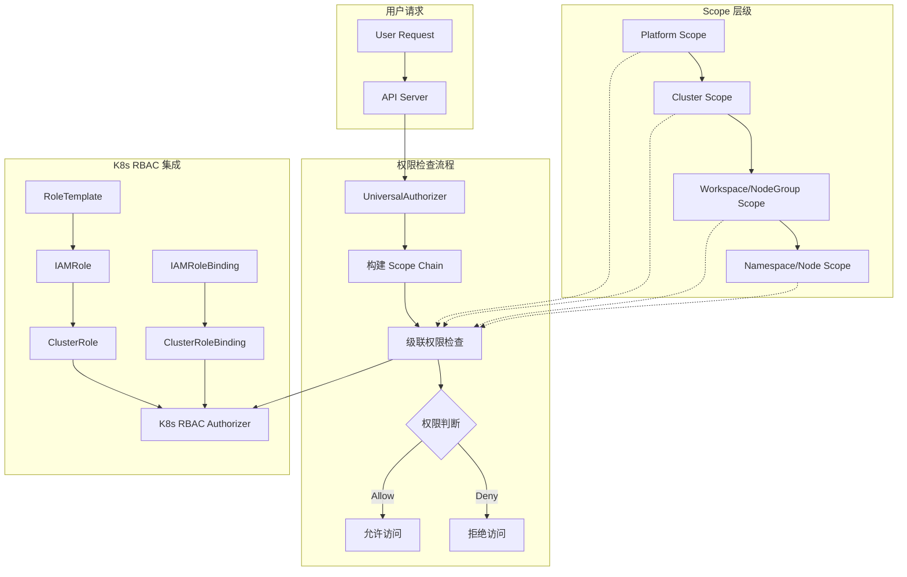
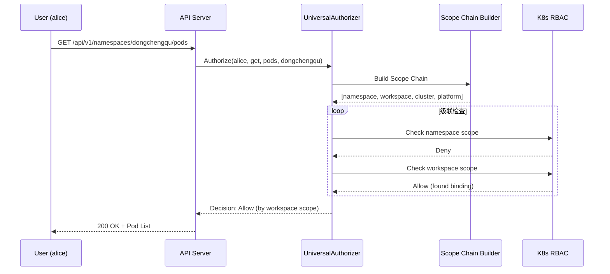

# 权限体系总览

边缘平台的权限体系基于 Kubernetes RBAC 构建，通过创新的 Scope 感知机制实现了多层级、细粒度的权限管理。本章节详细介绍权限体系的设计理念、核心组件和工作原理。

## 设计理念

### 三大核心原则

**1. 完全兼容 Kubernetes RBAC**

边缘平台不重新发明轮子，而是完全基于 Kubernetes 标准 RBAC 机制：
- 所有权限检查最终委托给 K8s RBAC
- 支持所有 kubectl 命令和 K8s 生态工具
- 保持与 K8s 集群的原生兼容性

**2. Scope 感知的多层级权限**

通过 Scope 标签系统实现多层级权限管理：
- **Platform** - 平台全局权限
- **Cluster** - 集群级别权限
- **Workspace/NodeGroup** - 中间组织级别权限
- **Namespace/Node** - 最细粒度权限

**3. 级联权限继承**

权限沿 Scope 链向下传递：
- 上级 Scope 的权限自动覆盖下级
- 任何一层允许 = 整体允许
- 短路优化，找到权限立即返回

## 权限体系架构



## 核心组件

### 1. IAMRole - 角色定义

IAMRole 是边缘平台的角色抽象，继承自 K8s RBAC 概念：

```yaml
apiVersion: iam.theriseunion.io/v1alpha1
kind: IAMRole
metadata:
  name: workspace-developer
  labels:
    iam.theriseunion.io/scope: workspace
spec:
  # K8s 标准 RBAC 规则
  rules:
  - apiGroups: [""]
    resources: ["pods", "services"]
    verbs: ["get", "list", "create", "update"]

  # UI 权限标识
  uiPermissions:
  - "workload/deployment/view"
  - "workload/deployment/create"

  # 聚合 RoleTemplate
  aggregationRoleTemplates:
    templateNames:
    - "template-pod-manager"
    - "template-service-viewer"
```

**关键特性：**
- 使用标准 `rbacv1.PolicyRule` 定义权限
- 支持 RoleTemplate 聚合
- 通过 Scope 标签指定作用域
- 自动转换为 K8s ClusterRole

### 2. IAMRoleBinding - 角色绑定

IAMRoleBinding 将用户/组与角色关联，并指定作用域：

```yaml
apiVersion: iam.theriseunion.io/v1alpha1
kind: IAMRoleBinding
metadata:
  name: alice-workspace-developer
  labels:
    iam.theriseunion.io/scope: workspace
    iam.theriseunion.io/scope-value: dev-team
spec:
  subjects:
  - kind: User
    name: alice
  roleRef:
    kind: IAMRole
    name: workspace-developer
```

**关键特性：**
- 使用 Scope 标签明确绑定范围
- 支持用户、组、ServiceAccount
- 自动转换为 K8s ClusterRoleBinding
- 级联权限检查的基础

### 3. RoleTemplate - 权限模板

RoleTemplate 是可复用的权限片段：

```yaml
apiVersion: iam.theriseunion.io/v1alpha1
kind: RoleTemplate
metadata:
  name: template-pod-manager
  labels:
    iam.theriseunion.io/scope: namespace
    iam.theriseunion.io/category: compute
spec:
  displayName:
    en: "Pod Manager"
    zh-CN: "Pod 管理员"
  description:
    en: "Manage pods in namespace"
    zh-CN: "管理命名空间中的 Pod"
  rules:
  - apiGroups: [""]
    resources: ["pods", "pods/log"]
    verbs: ["*"]
  uiPermissions:
  - "workload/pod/manage"
```

**关键特性：**
- 支持多语言显示名称和描述
- 可被 IAMRole 聚合
- 按 Category 和 Scope 分类
- 修改后自动更新所有引用的 IAMRole

### 4. UniversalAuthorizer - 统一授权器

UniversalAuthorizer 是权限检查的核心引擎：

**职责：**
1. 构建 Scope 级联链
2. 按顺序检查每一层 Scope 的权限
3. 委托给 K8s RBAC 执行实际权限验证
4. 实现短路优化和缓存

**工作流程：**
```go
func (ua *UniversalAuthorizer) Authorize(ctx context.Context, attr authorizer.Attributes) (decision, reason, error) {
    // 1. 构建 Scope 级联链
    scopeChain := ua.buildScopeChain(ctx, attr)
    // 示例: [namespace → workspace → cluster → platform]

    // 2. 级联检查权限
    for _, scope := range scopeChain {
        // 3. 委托给 K8s RBAC
        if decision := ua.checkWithK8sRBAC(ctx, attr, scope); decision == Allow {
            return Allow, fmt.Sprintf("allowed by %s scope", scope.Type), nil
        }
    }

    // 4. 所有层都拒绝
    return Deny, "no matching role binding found", nil
}
```

## 权限检查完整流程

### 示例：用户访问 Namespace 资源

假设用户 `alice` 访问 `namespace-dongchengqu` 中的 Pod：



**详细步骤：**

**步骤 1: 构建 Scope Chain**
```
namespace-dongchengqu
  ∈ workspace-beijing
    ∈ cluster-china
      ∈ platform
```

**步骤 2: 查找 IAMRoleBinding**
```bash
# Namespace 级别 - 未找到
# Workspace 级别 - 找到！
IAMRoleBinding: alice-workspace-developer
  Scope: workspace
  Scope-Value: beijing
  RoleRef: workspace-developer
```

**步骤 3: 委托 K8s RBAC**
```bash
# 检查对应的 ClusterRoleBinding
kubectl auth can-i get pods --namespace=dongchengqu --as=alice
# yes (通过 workspace-developer ClusterRole)
```

**步骤 4: 返回结果**
```
Decision: Allow
Reason: "allowed by workspace scope"
```

## 与核心概念的关系

权限体系与边缘平台核心概念紧密集成：

### 1. 与 Scope 系统的关系

权限检查完全基于 Scope 标签：
- `iam.theriseunion.io/scope` - 指定权限作用域类型
- `iam.theriseunion.io/scope-value` - 指定具体的作用域实例
- Scope Chain 决定权限检查顺序

详见：[Scope 系统详解](../concepts/scope-system.md)

### 2. 与 RoleTemplate 机制的关系

RoleTemplate 提供权限模板化能力：
- 预定义常用权限组合
- 支持动态聚合到 IAMRole
- RoleTemplate 变更自动传播

详见：[RoleTemplate 机制](../concepts/roletemplate.md)

### 3. 与架构的关系

权限体系是边缘平台架构的核心安全层：
- 所有 API 请求都经过 UniversalAuthorizer
- 支持 oapis 扩展 API 的权限检查
- ReverseProxy 代理的外部 API 也纳入统一权限管理

详见：[系统架构](../concepts/architecture.md)

## 权限体系的优势

### 1. 完全兼容性

**与 K8s 生态无缝集成：**
- 所有 kubectl 命令正常工作
- 支持 K8s Dashboard、Lens 等工具
- 与 ServiceAccount、Pod Security Policy 兼容

### 2. 灵活的多层级管理

**适应不同组织结构：**
- 平台管理员 - Platform Scope
- 集群运维 - Cluster Scope
- 团队负责人 - Workspace/NodeGroup Scope
- 开发者 - Namespace/Node Scope

### 3. 高性能

**优化策略：**
- Scope Chain 缓存
- 短路机制（第一个 Allow 立即返回）
- IAMRole 转换缓存
- 权限检查 P95 延迟 < 10ms

### 4. 易于管理

**简化权限配置：**
- RoleTemplate 复用常用权限
- 标签选择器批量聚合
- 可视化 UI 管理
- 审计日志完整记录

## 本章节导航

### 基础篇

1. **[RBAC 集成](./rbac.md)** - 深入理解 K8s RBAC 委托机制
2. **[Scope 感知授权](./scope-aware.md)** - Scope 感知授权的实现原理

### 进阶篇

3. **[角色绑定](./role-binding.md)** - IAMRoleBinding 的设计与实战
4. **[级联权限继承](./cascading.md)** - 级联权限算法详解
5. **[API 扩展](./api-extension.md)** - 扩展 API 的权限集成

## 快速开始

### 创建一个简单的权限配置

**1. 创建 RoleTemplate**
```bash
kubectl apply -f - <<EOF
apiVersion: iam.theriseunion.io/v1alpha1
kind: RoleTemplate
metadata:
  name: pod-viewer
  labels:
    iam.theriseunion.io/scope: namespace
spec:
  rules:
  - apiGroups: [""]
    resources: ["pods"]
    verbs: ["get", "list"]
EOF
```

**2. 创建 IAMRole**
```bash
kubectl apply -f - <<EOF
apiVersion: iam.theriseunion.io/v1alpha1
kind: IAMRole
metadata:
  name: developer
  labels:
    iam.theriseunion.io/scope: workspace
spec:
  aggregationRoleTemplates:
    templateNames:
    - pod-viewer
EOF
```

**3. 创建 IAMRoleBinding**
```bash
kubectl apply -f - <<EOF
apiVersion: iam.theriseunion.io/v1alpha1
kind: IAMRoleBinding
metadata:
  name: alice-developer
  labels:
    iam.theriseunion.io/scope: workspace
    iam.theriseunion.io/scope-value: dev-team
spec:
  subjects:
  - kind: User
    name: alice
  roleRef:
    kind: IAMRole
    name: developer
EOF
```

**4. 验证权限**
```bash
kubectl auth can-i get pods --namespace=dev-namespace --as=alice
# yes
```

## 下一步

- 学习 **[RBAC 集成](./rbac.md)** - 了解如何与 K8s RBAC 深度集成
- 阅读 **[Scope 感知授权](./scope-aware.md)** - 掌握 Scope 感知的实现原理
- 实践 **[角色绑定](./role-binding.md)** - 配置实际的权限绑定

## 参考资料

- [Kubernetes RBAC 官方文档](https://kubernetes.io/docs/reference/access-authn-authz/rbac/)
- [边缘平台 Scope 系统设计](../concepts/scope-system.md)
- [RoleTemplate 机制详解](../concepts/roletemplate.md)
