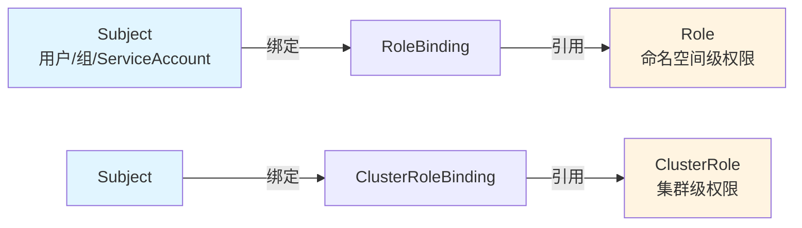
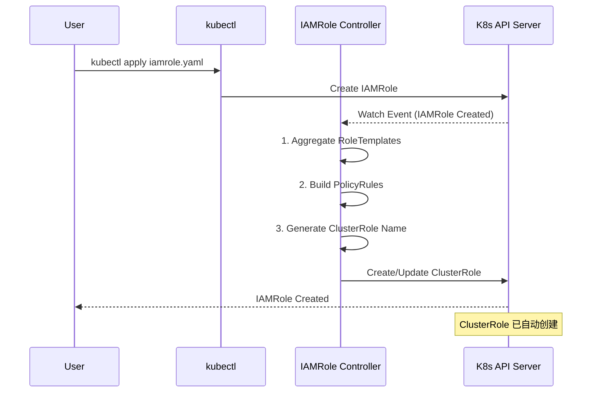
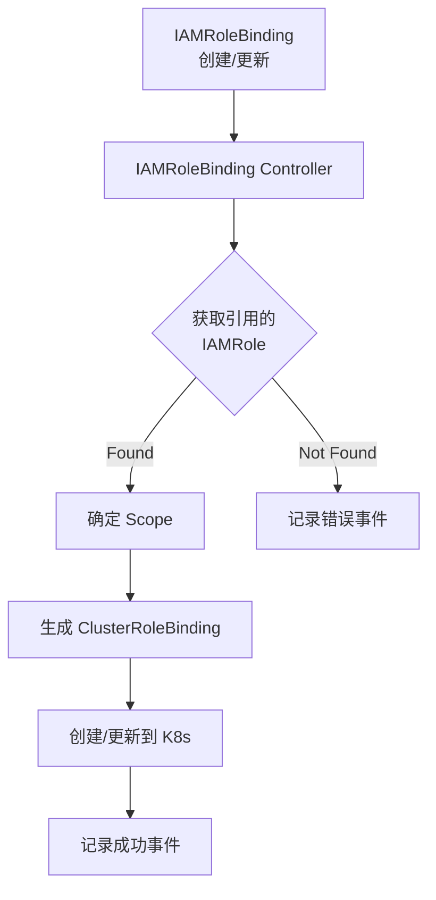
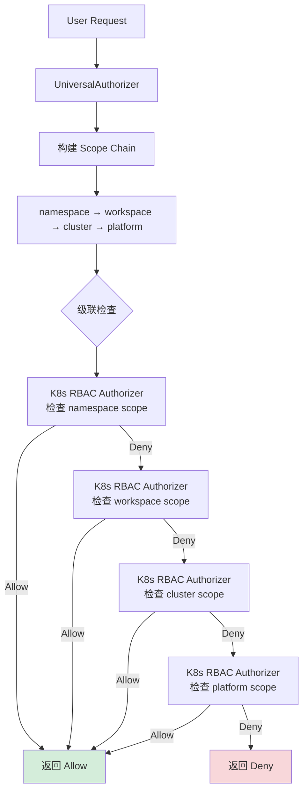

# RBAC 集成

边缘平台的权限体系完全基于 Kubernetes RBAC 构建，通过 IAMRole 和 IAMRoleBinding 抽象层，实现了与 K8s 标准 RBAC 的无缝集成。本文详细介绍 RBAC 集成的设计思想、转换机制和最佳实践。

## K8s RBAC 基础

### RBAC 核心概念

Kubernetes RBAC（Role-Based Access Control）包含四个核心资源：



**1. Role / ClusterRole - 权限定义**
- **Role**: 命名空间级别的权限
- **ClusterRole**: 集群级别的权限
- 使用 PolicyRule 定义允许的操作

**2. RoleBinding / ClusterRoleBinding - 权限绑定**
- **RoleBinding**: 在命名空间内绑定 Role
- **ClusterRoleBinding**: 在集群范围内绑定 ClusterRole
- 关联 Subject（用户/组）与 Role

### PolicyRule 详解

PolicyRule 是 RBAC 权限的基本单位：

```yaml
# 标准 PolicyRule 结构
rules:
- apiGroups: [""]           # API 组（空字符串表示 core API）
  resources: ["pods"]       # 资源类型
  verbs: ["get", "list"]    # 允许的操作

- apiGroups: ["apps"]
  resources: ["deployments"]
  verbs: ["*"]              # 所有操作

- apiGroups: [""]
  resources: ["pods/log"]   # 子资源
  verbs: ["get"]

- nonResourceURLs: ["/healthz", "/metrics"]  # 非资源 URL
  verbs: ["get"]
```

**Verbs 常用值：**
- `get` - 获取单个资源
- `list` - 列出多个资源
- `watch` - 监听资源变化
- `create` - 创建资源
- `update` - 更新资源
- `patch` - 部分更新
- `delete` - 删除资源
- `deletecollection` - 批量删除
- `*` - 所有操作

## IAMRole 到 ClusterRole 的转换

### 转换架构

边缘平台使用 Controller 模式自动将 IAMRole 转换为 K8s ClusterRole：



### IAMRole CRD 定义

```go
// IAMRoleSpec 定义
type IAMRoleSpec struct {
    // 直接定义的 RBAC 规则
    Rules []rbacv1.PolicyRule `json:"rules,omitempty"`

    // UI 权限标识（不影响 RBAC）
    UIPermissions []string `json:"uiPermissions,omitempty"`

    // 聚合 RoleTemplate
    AggregationRoleTemplates *AggregationRoleTemplates `json:"aggregationRoleTemplates,omitempty"`
}

// 聚合规则
type AggregationRoleTemplates struct {
    // 按名称聚合
    TemplateNames []string `json:"templateNames,omitempty"`

    // 按标签选择器聚合
    RoleSelector *metav1.LabelSelector `json:"roleSelector,omitempty"`
}
```

### 转换规则

#### 规则 1: Scope 决定 ClusterRole 类型

```yaml
# IAMRole with workspace scope
apiVersion: iam.theriseunion.io/v1alpha1
kind: IAMRole
metadata:
  name: workspace-developer
  labels:
    iam.theriseunion.io/scope: workspace
spec:
  rules:
  - apiGroups: [""]
    resources: ["pods"]
    verbs: ["get", "list"]
```

**转换为：**

```yaml
# 生成的 ClusterRole（所有 IAMRole 都转换为 ClusterRole）
apiVersion: rbac.authorization.k8s.io/v1
kind: ClusterRole
metadata:
  name: iamrole-workspace-developer
  labels:
    iam.theriseunion.io/managed: "true"
    iam.theriseunion.io/scope: workspace
    iam.theriseunion.io/source: iamrole
rules:
- apiGroups: [""]
  resources: ["pods"]
  verbs: ["get", "list"]
```

#### 规则 2: RoleTemplate 聚合

```yaml
# IAMRole 聚合 RoleTemplate
apiVersion: iam.theriseunion.io/v1alpha1
kind: IAMRole
metadata:
  name: full-developer
spec:
  # 自有规则
  rules:
  - apiGroups: [""]
    resources: ["configmaps"]
    verbs: ["*"]

  # 聚合模板
  aggregationRoleTemplates:
    templateNames:
    - template-pod-manager
    - template-service-viewer
```

**Controller 处理逻辑：**

```go
func (r *IAMRoleController) Reconcile(ctx context.Context, req ctrl.Request) {
    // 1. 获取 IAMRole
    iamRole := &iamv1alpha1.IAMRole{}
    r.Get(ctx, req.NamespacedName, iamRole)

    // 2. 聚合 RoleTemplate 规则
    aggregatedRules := iamRole.Spec.Rules // 初始规则

    for _, templateName := range iamRole.Spec.AggregationRoleTemplates.TemplateNames {
        template := &iamv1alpha1.RoleTemplate{}
        r.Get(ctx, client.ObjectKey{Name: templateName}, template)

        // 合并规则
        aggregatedRules = append(aggregatedRules, template.Spec.Rules...)
    }

    // 3. 创建/更新 ClusterRole
    clusterRole := &rbacv1.ClusterRole{
        ObjectMeta: metav1.ObjectMeta{
            Name: naming.RoleName(iamRole),
        },
        Rules: aggregatedRules,
    }
    r.CreateOrUpdate(ctx, clusterRole)
}
```

**最终生成的 ClusterRole：**

```yaml
apiVersion: rbac.authorization.k8s.io/v1
kind: ClusterRole
metadata:
  name: iamrole-full-developer
rules:
# 来自 IAMRole 自有规则
- apiGroups: [""]
  resources: ["configmaps"]
  verbs: ["*"]

# 来自 template-pod-manager
- apiGroups: [""]
  resources: ["pods", "pods/log"]
  verbs: ["*"]

# 来自 template-service-viewer
- apiGroups: [""]
  resources: ["services"]
  verbs: ["get", "list"]
```

#### 规则 3: 命名规范

边缘平台使用统一的命名规范避免冲突：

```go
// pkg/internal/naming/naming.go

// IAMRole → ClusterRole
func RoleName(iamRole *iamv1alpha1.IAMRole) string {
    scope := iamRole.Labels["iam.theriseunion.io/scope"]
    scopeValue := iamRole.Labels["iam.theriseunion.io/scope-value"]

    if scopeValue != "" {
        return fmt.Sprintf("iamrole-%s-%s-%s", scope, scopeValue, iamRole.Name)
    }
    return fmt.Sprintf("iamrole-%s-%s", scope, iamRole.Name)
}

// 示例输出：
// - iamrole-workspace-beijing-developer
// - iamrole-cluster-prod-operator
// - iamrole-platform-admin
```

## IAMRoleBinding 到 ClusterRoleBinding 的转换

### 转换流程



### IAMRoleBinding 示例

```yaml
apiVersion: iam.theriseunion.io/v1alpha1
kind: IAMRoleBinding
metadata:
  name: alice-workspace-dev
  labels:
    iam.theriseunion.io/scope: workspace
    iam.theriseunion.io/scope-value: dev-team
spec:
  subjects:
  - kind: User
    name: alice
    apiGroup: rbac.authorization.k8s.io

  - kind: Group
    name: developers
    apiGroup: rbac.authorization.k8s.io

  roleRef:
    kind: IAMRole
    name: workspace-developer
    apiGroup: iam.theriseunion.io
```

### 转换后的 ClusterRoleBinding

```yaml
apiVersion: rbac.authorization.k8s.io/v1
kind: ClusterRoleBinding
metadata:
  name: iamrolebinding-workspace-dev-team-alice-workspace-dev
  labels:
    iam.theriseunion.io/managed: "true"
    iam.theriseunion.io/source: iamrolebinding
    iam.theriseunion.io/binding-name: alice-workspace-dev
    iam.theriseunion.io/role-name: workspace-developer
    iam.theriseunion.io/scope: workspace
    iam.theriseunion.io/scope-value: dev-team
  annotations:
    iam.theriseunion.io/source-binding: alice-workspace-dev
subjects:
- kind: User
  name: alice
  apiGroup: rbac.authorization.k8s.io
- kind: Group
  name: developers
  apiGroup: rbac.authorization.k8s.io
roleRef:
  kind: ClusterRole
  name: iamrole-workspace-developer
  apiGroup: rbac.authorization.k8s.io
```

### Controller 实现

```go
// internal/controller/iamrolebinding_controller.go

func (r *IAMRoleBindingReconciler) convertToClusterRoleBinding(
    ctx context.Context,
    iamRoleBinding *iamv1alpha1.IAMRoleBinding,
    iamRole *iamv1alpha1.IAMRole,
) *rbacv1.ClusterRoleBinding {

    // 1. 生成 ClusterRoleBinding 名称
    clusterRoleBindingName := naming.RoleBindingName(iamRoleBinding)

    // 2. 转换 Subjects
    var subjects []rbacv1.Subject
    for _, subject := range iamRoleBinding.Spec.Subjects {
        subjects = append(subjects, rbacv1.Subject{
            Kind:      subject.Kind,
            Name:      subject.Name,
            Namespace: subject.Namespace,
        })
    }

    // 3. 构建 RoleRef
    roleRef := rbacv1.RoleRef{
        Kind: "ClusterRole",
        Name: naming.RoleName(iamRole),
        APIGroup: "rbac.authorization.k8s.io",
    }

    // 4. 构建标签（包含 Scope 信息）
    labels := map[string]string{
        "iam.theriseunion.io/managed": "true",
        "iam.theriseunion.io/source": "iamrolebinding",
        "iam.theriseunion.io/scope": naming.GetScopeForBinding(iamRoleBinding),
        "iam.theriseunion.io/scope-value": naming.GetScopeValueForBinding(iamRoleBinding),
    }

    return &rbacv1.ClusterRoleBinding{
        ObjectMeta: metav1.ObjectMeta{
            Name:   clusterRoleBindingName,
            Labels: labels,
        },
        Subjects: subjects,
        RoleRef:  roleRef,
    }
}
```

## UniversalAuthorizer 的 RBAC 委托机制

### 架构设计

UniversalAuthorizer 不重新实现权限检查逻辑，而是完全委托给 K8s RBAC：



### 委托实现

```go
// pkg/apiserver/authorization/authorizer.go

type UniversalAuthorizer struct {
    // K8s 标准 RBAC 授权器
    rbacAuthorizer authorizer.Authorizer

    // Scope 管理器
    scopeManager *ScopeManager
}

func (ua *UniversalAuthorizer) Authorize(
    ctx context.Context,
    attr authorizer.Attributes,
) (authorizer.Decision, string, error) {

    // 1. 构建 Scope 级联链
    scopeChain := ua.scopeManager.BuildScopeChain(ctx, attr)

    // 2. 按顺序检查每一层 Scope
    for _, scope := range scopeChain {
        // 3. 委托给 K8s RBAC Authorizer
        decision, reason, err := ua.rbacAuthorizer.Authorize(ctx, attr)

        if err != nil {
            return authorizer.DecisionDeny, "", err
        }

        // 4. 找到允许，立即返回（短路优化）
        if decision == authorizer.DecisionAllow {
            return decision, fmt.Sprintf("allowed by %s scope: %s", scope.Type, reason), nil
        }
    }

    // 5. 所有层都拒绝
    return authorizer.DecisionDeny, "no matching role binding found in scope chain", nil
}
```

### 为什么完全委托？

**优势：**

1. **完全兼容性** - 所有 K8s 工具正常工作
2. **无需维护** - 复用 K8s 成熟的 RBAC 实现
3. **性能优化** - K8s RBAC 经过高度优化
4. **功能完整** - 自动支持 K8s RBAC 的所有特性

**示例：kubectl 命令直接可用**

```bash
# 检查用户权限
kubectl auth can-i get pods --namespace=dev --as=alice
# yes

# 列出用户的所有权限
kubectl auth can-i --list --as=alice

# 以用户身份执行操作
kubectl get pods --namespace=dev --as=alice
```

## RBAC 规则最佳实践

### 1. 最小权限原则

**错误示例：过度授权**

```yaml
# 不推荐：给予所有权限
apiVersion: iam.theriseunion.io/v1alpha1
kind: IAMRole
metadata:
  name: developer
spec:
  rules:
  - apiGroups: ["*"]
    resources: ["*"]
    verbs: ["*"]
```

**正确示例：精确授权**

```yaml
# 推荐：明确需要的权限
apiVersion: iam.theriseunion.io/v1alpha1
kind: IAMRole
metadata:
  name: developer
spec:
  rules:
  # 只授予需要的资源和操作
  - apiGroups: [""]
    resources: ["pods", "pods/log"]
    verbs: ["get", "list", "watch"]

  - apiGroups: ["apps"]
    resources: ["deployments"]
    verbs: ["get", "list", "watch", "update", "patch"]
```

### 2. 使用 RoleTemplate 复用

**错误示例：重复定义**

```yaml
# IAMRole 1
spec:
  rules:
  - apiGroups: [""]
    resources: ["pods"]
    verbs: ["get", "list"]

---
# IAMRole 2（重复）
spec:
  rules:
  - apiGroups: [""]
    resources: ["pods"]
    verbs: ["get", "list"]
```

**正确示例：使用 RoleTemplate**

```yaml
# 定义一次
apiVersion: iam.theriseunion.io/v1alpha1
kind: RoleTemplate
metadata:
  name: pod-viewer
spec:
  rules:
  - apiGroups: [""]
    resources: ["pods"]
    verbs: ["get", "list"]

---
# 多处引用
apiVersion: iam.theriseunion.io/v1alpha1
kind: IAMRole
metadata:
  name: developer
spec:
  aggregationRoleTemplates:
    templateNames:
    - pod-viewer
```

### 3. 合理使用 Scope

**原则：权限与 Scope 对齐**

```yaml
# 命名空间级操作 → namespace scope
apiVersion: iam.theriseunion.io/v1alpha1
kind: IAMRole
metadata:
  name: pod-manager
  labels:
    iam.theriseunion.io/scope: namespace
spec:
  rules:
  - apiGroups: [""]
    resources: ["pods"]
    verbs: ["*"]

---
# 集群级资源 → cluster scope
apiVersion: iam.theriseunion.io/v1alpha1
kind: IAMRole
metadata:
  name: node-operator
  labels:
    iam.theriseunion.io/scope: cluster
spec:
  rules:
  - apiGroups: [""]
    resources: ["nodes"]
    verbs: ["get", "list", "update"]
```

### 4. 子资源权限

**常见子资源：**

```yaml
spec:
  rules:
  # Pod 日志
  - apiGroups: [""]
    resources: ["pods/log"]
    verbs: ["get"]

  # Pod 执行命令
  - apiGroups: [""]
    resources: ["pods/exec"]
    verbs: ["create"]

  # Pod 端口转发
  - apiGroups: [""]
    resources: ["pods/portforward"]
    verbs: ["create"]

  # Deployment 规模调整
  - apiGroups: ["apps"]
    resources: ["deployments/scale"]
    verbs: ["get", "update"]

  # Service 状态
  - apiGroups: [""]
    resources: ["services/status"]
    verbs: ["get", "update"]
```

### 5. NonResourceURLs 权限

**系统 API 端点：**

```yaml
spec:
  rules:
  # 监控指标
  - nonResourceURLs: ["/metrics"]
    verbs: ["get"]

  # 健康检查
  - nonResourceURLs: ["/healthz", "/livez", "/readyz"]
    verbs: ["get"]

  # OpenAPI 规范
  - nonResourceURLs: ["/openapi/v2"]
    verbs: ["get"]

  # 自定义 oapis
  - nonResourceURLs: ["/oapis/iam/v1alpha1/*"]
    verbs: ["get", "post"]
```

## 权限验证和调试

### 使用 kubectl auth can-i

```bash
# 检查单个权限
kubectl auth can-i get pods --namespace=dev --as=alice

# 检查所有权限
kubectl auth can-i --list --namespace=dev --as=alice

# 检查特定资源
kubectl auth can-i delete deployment/nginx --namespace=prod --as=bob

# 检查 NonResourceURLs
kubectl auth can-i get /metrics --as=alice
```

### 查看生成的 ClusterRole

```bash
# 列出所有 IAMRole 生成的 ClusterRole
kubectl get clusterrole -l iam.theriseunion.io/source=iamrole

# 查看详细内容
kubectl get clusterrole iamrole-workspace-developer -o yaml

# 查看权限规则
kubectl describe clusterrole iamrole-workspace-developer
```

### 查看 ClusterRoleBinding

```bash
# 列出用户的所有绑定
kubectl get clusterrolebinding -l iam.theriseunion.io/managed=true

# 查找特定用户的绑定
kubectl get clusterrolebinding -o json | jq '.items[] | select(.subjects[]?.name=="alice")'

# 查看 Scope 标签
kubectl get clusterrolebinding -L iam.theriseunion.io/scope,iam.theriseunion.io/scope-value
```

### 调试权限问题

**常见问题和解决方法：**

**问题 1: 权限不生效**

```bash
# 1. 检查 IAMRole 是否存在
kubectl get iamrole workspace-developer

# 2. 检查是否生成了 ClusterRole
kubectl get clusterrole iamrole-workspace-developer

# 3. 检查 IAMRoleBinding
kubectl get iamrolebinding alice-developer

# 4. 检查 ClusterRoleBinding
kubectl get clusterrolebinding -l iam.theriseunion.io/binding-name=alice-developer
```

**问题 2: RoleTemplate 聚合失败**

```bash
# 检查 IAMRole 的注解，查看原始规则
kubectl get iamrole workspace-developer -o jsonpath='{.metadata.annotations}'

# 查看 Controller 日志
kubectl logs -n edge-system deployment/edge-controller | grep RoleTemplate
```

**问题 3: Scope 标签错误**

```bash
# 检查 IAMRoleBinding 的 Scope 标签
kubectl get iamrolebinding alice-developer -o yaml | grep -A2 labels

# 检查生成的 ClusterRoleBinding 的 Scope 标签
kubectl get clusterrolebinding -l iam.theriseunion.io/binding-name=alice-developer -o yaml | grep scope
```

## 性能优化

### 1. ClusterRole 缓存

Controller 缓存 IAMRole 到 ClusterRole 的映射：

```go
type IAMRoleController struct {
    // ClusterRole 名称缓存
    roleNameCache sync.Map

    // 规则哈希缓存（避免重复更新）
    rulesHashCache sync.Map
}

func (r *IAMRoleController) shouldUpdateClusterRole(
    iamRole *iamv1alpha1.IAMRole,
    clusterRole *rbacv1.ClusterRole,
) bool {
    // 计算当前规则哈希
    currentHash := hashRules(iamRole.Spec.Rules)

    // 对比缓存
    if cachedHash, ok := r.rulesHashCache.Load(iamRole.Name); ok {
        return cachedHash != currentHash
    }

    return true
}
```

### 2. 批量更新优化

```go
// 批量处理 RoleTemplate 变更
func (r *RoleTemplateReconciler) updateIAMRolesWithAggregation(
    ctx context.Context,
    template *iamv1alpha1.RoleTemplate,
) error {
    // 1. 找到所有引用此模板的 IAMRole
    var iamRoleList iamv1alpha1.IAMRoleList
    r.List(ctx, &iamRoleList)

    // 2. 并发更新（使用 worker pool）
    const workers = 5
    workChan := make(chan *iamv1alpha1.IAMRole, len(iamRoleList.Items))

    for i := 0; i < workers; i++ {
        go func() {
            for iamRole := range workChan {
                r.recomputeIAMRole(ctx, iamRole)
            }
        }()
    }

    for _, iamRole := range iamRoleList.Items {
        workChan <- &iamRole
    }
    close(workChan)

    return nil
}
```

## 下一步

- 学习 **[Scope 感知授权](./scope-aware.md)** - 了解 Scope 感知的实现细节
- 阅读 **[级联权限继承](./cascading.md)** - 掌握级联权限算法
- 实践 **[角色绑定](./role-binding.md)** - 配置实际的权限绑定

## 参考资料

- [Kubernetes RBAC 官方文档](https://kubernetes.io/docs/reference/access-authn-authz/rbac/)
- [Controller Runtime 文档](https://book.kubebuilder.io/)
- [IAMRole CRD 源码](/Users/neov/src/github.com/edge/apiserver/edge-apiserver/api/iam/v1alpha1/iamrole_types.go)
