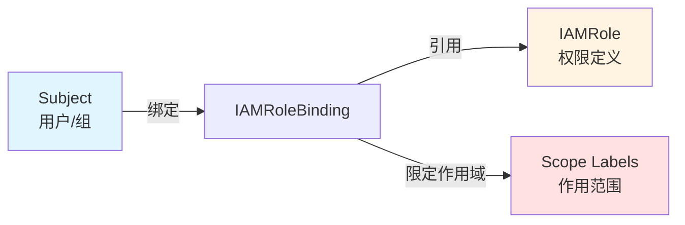
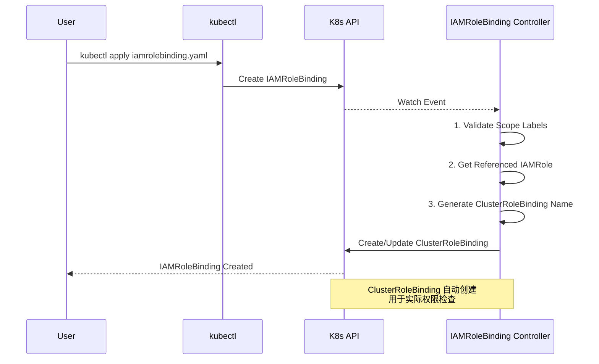

# IAMRoleBinding - 角色绑定

IAMRoleBinding 是边缘平台权限体系中连接用户与权限的核心资源，通过 Scope 标签实现精准的权限作用域控制。

## IAMRoleBinding 设计

### CRD 定义

```go
type IAMRoleBindingSpec struct {
    // 用户、组或 ServiceAccount
    Subjects []rbacv1.Subject `json:"subjects,omitempty"`

    // 引用的 IAMRole
    RoleRef rbacv1.RoleRef `json:"roleRef"`
}
```

### 三要素关联



## Scope 标签规范

IAMRoleBinding 必须通过标签明确指定作用域：

```yaml
apiVersion: iam.theriseunion.io/v1alpha1
kind: IAMRoleBinding
metadata:
  name: alice-workspace-developer
  labels:
    iam.theriseunion.io/scope: workspace        # Scope 类型
    iam.theriseunion.io/scope-value: dev-team   # 具体实例
spec:
  subjects:
  - kind: User
    name: alice
  roleRef:
    kind: IAMRole
    name: workspace-developer
```

**标签含义：**
- `iam.theriseunion.io/scope` - 权限的作用域层级（namespace/workspace/cluster/platform）
- `iam.theriseunion.io/scope-value` - 作用域的具体实例名称

## 绑定规则

### 规则 1: Scope 必须对齐

IAMRoleBinding 和 IAMRole 的 Scope 必须一致：

```yaml
# 错误示例：Scope 不匹配
apiVersion: iam.theriseunion.io/v1alpha1
kind: IAMRoleBinding
metadata:
  labels:
    iam.theriseunion.io/scope: namespace  # namespace scope
spec:
  roleRef:
    name: workspace-developer  # workspace scope role
    # ❌ 错误：Scope 不匹配
```

```yaml
# 正确示例：Scope 对齐
apiVersion: iam.theriseunion.io/v1alpha1
kind: IAMRoleBinding
metadata:
  labels:
    iam.theriseunion.io/scope: workspace  # workspace scope
spec:
  roleRef:
    name: workspace-developer  # workspace scope role
    # ✅ 正确：Scope 对齐
```

### 规则 2: 支持多个 Subjects

一个 IAMRoleBinding 可以绑定多个用户/组：

```yaml
spec:
  subjects:
  - kind: User
    name: alice
  - kind: User
    name: bob
  - kind: Group
    name: developers
  - kind: ServiceAccount
    name: ci-bot
    namespace: ci-system
```

### 规则 3: Scope-Value 必填（除 platform）

除了 platform scope，所有绑定都必须指定 scope-value：

```yaml
# workspace scope - 必须指定 workspace 名称
labels:
  iam.theriseunion.io/scope: workspace
  iam.theriseunion.io/scope-value: dev-team  # 必填

# platform scope - 不需要 scope-value
labels:
  iam.theriseunion.io/scope: platform
  # scope-value 可省略（或设置为 "global"）
```

## 实战示例

### 示例 1: 团队开发者权限

为开发团队授予 workspace 级别权限：

```yaml
# 创建 Workspace Scope 的 IAMRole
apiVersion: iam.theriseunion.io/v1alpha1
kind: IAMRole
metadata:
  name: team-developer
  labels:
    iam.theriseunion.io/scope: workspace
spec:
  aggregationRoleTemplates:
    roleSelector:
      matchLabels:
        category: development

---
# 绑定到 dev-team workspace
apiVersion: iam.theriseunion.io/v1alpha1
kind: IAMRoleBinding
metadata:
  name: dev-team-developers
  labels:
    iam.theriseunion.io/scope: workspace
    iam.theriseunion.io/scope-value: dev-team
spec:
  subjects:
  - kind: Group
    name: dev-team-members
  roleRef:
    kind: IAMRole
    name: team-developer
```

**效果：**
- `dev-team-members` 组的所有成员
- 在 `dev-team` workspace 下的所有 namespace
- 拥有 `team-developer` 角色定义的权限

### 示例 2: 节点组运维权限

为运维人员授予节点组管理权限：

```yaml
apiVersion: iam.theriseunion.io/v1alpha1
kind: IAMRole
metadata:
  name: nodegroup-operator
  labels:
    iam.theriseunion.io/scope: nodegroup
spec:
  rules:
  - apiGroups: [""]
    resources: ["nodes"]
    verbs: ["get", "list", "update", "patch"]
  - apiGroups: [""]
    resources: ["nodes/status"]
    verbs: ["update"]

---
apiVersion: iam.theriseunion.io/v1alpha1
kind: IAMRoleBinding
metadata:
  name: bob-beijing-nodes
  labels:
    iam.theriseunion.io/scope: nodegroup
    iam.theriseunion.io/scope-value: edge-beijing
spec:
  subjects:
  - kind: User
    name: bob
  roleRef:
    kind: IAMRole
    name: nodegroup-operator
```

**效果：**
- `bob` 用户
- 可以管理 `edge-beijing` 节点组中的所有节点
- 包括查看、更新节点信息和状态

### 示例 3: 平台管理员

授予全局管理权限：

```yaml
apiVersion: iam.theriseunion.io/v1alpha1
kind: IAMRole
metadata:
  name: platform-admin
  labels:
    iam.theriseunion.io/scope: platform
spec:
  rules:
  - apiGroups: ["*"]
    resources: ["*"]
    verbs: ["*"]
  - nonResourceURLs: ["*"]
    verbs: ["*"]

---
apiVersion: iam.theriseunion.io/v1alpha1
kind: IAMRoleBinding
metadata:
  name: admin-platform-access
  labels:
    iam.theriseunion.io/scope: platform
spec:
  subjects:
  - kind: User
    name: admin
  roleRef:
    kind: IAMRole
    name: platform-admin
```

## 绑定冲突解决

### 同一用户多个绑定

用户可以在不同 Scope 拥有多个绑定：

```yaml
# 用户 carol 的多个绑定
---
# 绑定 1: namespace scope
apiVersion: iam.theriseunion.io/v1alpha1
kind: IAMRoleBinding
metadata:
  name: carol-namespace-viewer
  labels:
    iam.theriseunion.io/scope: namespace
    iam.theriseunion.io/scope-value: prod-ns
spec:
  subjects:
  - kind: User
    name: carol
  roleRef:
    kind: IAMRole
    name: namespace-viewer  # 只读权限

---
# 绑定 2: workspace scope
apiVersion: iam.theriseunion.io/v1alpha1
kind: IAMRoleBinding
metadata:
  name: carol-workspace-developer
  labels:
    iam.theriseunion.io/scope: workspace
    iam.theriseunion.io/scope-value: prod-workspace
spec:
  subjects:
  - kind: User
    name: carol
  roleRef:
    kind: IAMRole
    name: workspace-developer  # 读写权限
```

**权限合并逻辑：**
- 访问 `prod-ns` namespace 时，两个绑定都生效
- Namespace scope 检查先执行（允许只读）
- Workspace scope 补充更高权限（允许读写）
- 最终效果：carol 在 prod-ns 拥有读写权限

### 权限优先级原则

**原则：** 任何一层 Allow = 整体 Allow（权限并集）

```
高优先级 namespace scope
    ↓
  workspace scope
    ↓
  cluster scope
    ↓
低优先级 platform scope
```

检查顺序从上到下，但权限是**并集**而非覆盖。

## 批量绑定模式

### 使用 Group 批量授权

```yaml
# 定义用户组（通过外部 IdP 如 LDAP/AD）
# K8s 中使用 Group 类型的 Subject

apiVersion: iam.theriseunion.io/v1alpha1
kind: IAMRoleBinding
metadata:
  name: developers-workspace-access
  labels:
    iam.theriseunion.io/scope: workspace
    iam.theriseunion.io/scope-value: dev-team
spec:
  subjects:
  - kind: Group
    name: ldap:cn=developers,ou=groups,dc=example,dc=com
  roleRef:
    kind: IAMRole
    name: workspace-developer
```

**优势：**
- 用户从 LDAP/AD 自动同步到组
- 无需为每个用户创建单独的绑定
- 用户离职自动失去权限

### Label Selector 批量管理

使用标签批量查询和管理绑定：

```bash
# 查找特定 workspace 的所有绑定
kubectl get iamrolebinding -l iam.theriseunion.io/scope-value=dev-team

# 查找特定角色的所有绑定
kubectl get iamrolebinding -o json | \
  jq '.items[] | select(.spec.roleRef.name=="workspace-developer")'

# 批量删除测试绑定
kubectl delete iamrolebinding -l env=test
```

## Controller 处理流程



详见 Controller 源码：`/Users/neov/src/github.com/edge/apiserver/edge-apiserver/internal/controller/iamrolebinding_controller.go`

## 权限委派

### ServiceAccount 权限委派

将权限委派给 ServiceAccount（用于 Pod/Job）：

```yaml
apiVersion: iam.theriseunion.io/v1alpha1
kind: IAMRoleBinding
metadata:
  name: ci-bot-deploy-access
  labels:
    iam.theriseunion.io/scope: namespace
    iam.theriseunion.io/scope-value: ci-system
spec:
  subjects:
  - kind: ServiceAccount
    name: ci-bot
    namespace: ci-system
  roleRef:
    kind: IAMRole
    name: deployer
```

### 临时权限授予

通过 TTL 注解实现临时权限：

```yaml
apiVersion: iam.theriseunion.io/v1alpha1
kind: IAMRoleBinding
metadata:
  name: alice-temp-admin
  labels:
    iam.theriseunion.io/scope: cluster
    iam.theriseunion.io/scope-value: prod
  annotations:
    iam.theriseunion.io/expires-at: "2025-01-20T00:00:00Z"
spec:
  subjects:
  - kind: User
    name: alice
  roleRef:
    kind: IAMRole
    name: cluster-admin
```

（需要实现 TTL Controller 自动清理过期绑定）

## 最佳实践

### 1. 使用明确的命名

```yaml
# 命名格式：<user>-<scope>-<role>
metadata:
  name: alice-workspace-developer
  name: bob-nodegroup-operator
  name: dev-team-namespace-viewer
```

### 2. 添加描述注解

```yaml
metadata:
  annotations:
    iam.theriseunion.io/description: "授予 Alice 在 dev-team workspace 的开发者权限"
    iam.theriseunion.io/created-by: "admin"
    iam.theriseunion.io/jira-ticket: "OPS-12345"
```

### 3. 定期审计绑定

```bash
# 审计脚本示例
#!/bin/bash

echo "=== IAMRoleBinding 审计报告 ==="
echo ""

# 统计各 Scope 的绑定数量
echo "按 Scope 统计："
kubectl get iamrolebinding -o json | \
  jq -r '.items[].metadata.labels."iam.theriseunion.io/scope"' | \
  sort | uniq -c

# 查找 platform scope 绑定（高权限）
echo ""
echo "Platform Scope 绑定："
kubectl get iamrolebinding -l iam.theriseunion.io/scope=platform

# 查找过期绑定（如果有 TTL 注解）
echo ""
echo "即将过期的绑定："
kubectl get iamrolebinding -o json | \
  jq -r '.items[] | select(.metadata.annotations."iam.theriseunion.io/expires-at" < now) | .metadata.name'
```

## 故障排除

### 问题 1: 绑定不生效

```bash
# 检查 IAMRoleBinding
kubectl get iamrolebinding <name> -o yaml

# 检查 IAMRole 是否存在
kubectl get iamrole <role-name>

# 检查生成的 ClusterRoleBinding
kubectl get clusterrolebinding -l iam.theriseunion.io/binding-name=<name>

# 查看 Controller 日志
kubectl logs -n edge-system deployment/edge-controller | grep IAMRoleBinding
```

### 问题 2: Scope 标签错误

```bash
# 验证 Scope 标签
kubectl get iamrolebinding <name> -o jsonpath='{.metadata.labels}'

# 修复错误的标签
kubectl label iamrolebinding <name> \
  iam.theriseunion.io/scope=workspace \
  iam.theriseunion.io/scope-value=dev-team \
  --overwrite
```

### 问题 3: Subject 无法识别

```bash
# 检查用户名格式
kubectl auth can-i get pods --as=<username>

# 对于 Group，确保 IdP 正确配置
kubectl get --raw /api/v1/users/<username>
```

## 下一步

- 学习 **[级联权限继承](./cascading.md)** - 深入理解权限级联算法
- 阅读 **[API 扩展](./api-extension.md)** - 扩展 API 的权限集成
- 参考 **[IAMRoleBinding CRD 源码](https://github.com/theriseunion/apiserver/blob/main/api/iam/v1alpha1/iamrolebinding_types.go)**

## 参考资料

- [Kubernetes RBAC Subject](https://kubernetes.io/docs/reference/access-authn-authz/rbac/#referring-to-subjects)
- [IAMRoleBinding Controller 源码](/Users/neov/src/github.com/edge/apiserver/edge-apiserver/internal/controller/iamrolebinding_controller.go)
