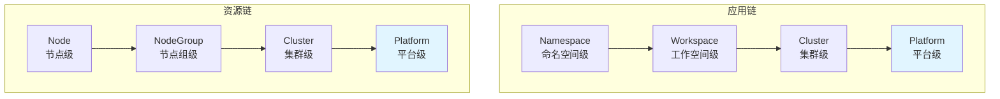
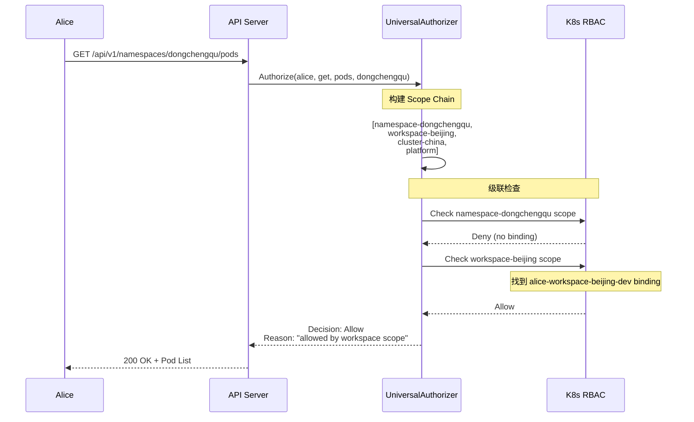

# Scope 感知授权

Scope 感知授权是边缘平台权限体系的核心创新，通过标签驱动的 Scope 机制，实现了多层级权限管理和级联继承。本文详细介绍 Scope 感知授权的实现原理、算法细节和性能优化。

## Scope 级联链

### 两条并行的 Scope 链

边缘平台定义了两条独立的 Scope 级联链：

**应用链（Application Chain）：**
```
namespace → workspace → cluster → platform
```

**资源链（Resource Chain）：**
```
node → nodegroup → cluster → platform
```



### Scope 层级定义

| Scope 类型 | 作用域 | 典型用户 | 管理对象 |
|-----------|--------|---------|----------|
| **namespace** | 单个命名空间 | 开发者 | Pods, Services, ConfigMaps |
| **workspace** | 命名空间组 | 团队 Leader | Namespaces, 应用部署 |
| **nodegroup** | 节点组 | 运维工程师 | Nodes, 资源分配 |
| **cluster** | 整个集群 | 集群管理员 | 集群资源, CRDs |
| **platform** | 所有集群 | 平台管理员 | 全局配置, 用户管理 |

## 级联权限检查算法

### 核心原理

**向上级联检查（Upward Resolution）：**
- 从最具体的 Scope 开始检查
- 逐层向上查找权限
- 任何一层允许 = 整体允许
- 短路优化：找到第一个 Allow 立即返回

### 算法伪代码

```go
func AuthorizeWithScopeCascade(user, verb, resource, namespace) Decision {
    // 1. 构建 Scope 级联链
    scopeChain := buildScopeChain(resource, namespace)
    // 例如: [namespace-dev, workspace-team1, cluster-prod, platform]

    // 2. 级联检查
    for _, scope := range scopeChain {
        // 3. 查找该 Scope 下用户的 IAMRoleBindings
        bindings := findUserBindingsInScope(user, scope)

        // 4. 检查每个 binding 的权限
        for _, binding := range bindings {
            role := getRoleFromBinding(binding)

            // 5. 委托 K8s RBAC 检查
            if k8sRBAC.Authorize(user, verb, resource, role) == Allow {
                return Allow  // 短路返回
            }
        }
    }

    // 6. 所有层都拒绝
    return Deny
}
```

### 算法详解

**步骤 1: 构建 Scope Chain**

根据资源类型确定 Scope 链：

```go
func buildScopeChain(resourceType string, namespace string) []ScopeInfo {
    var chain []ScopeInfo

    switch resourceType {
    case "Pod", "Service", "ConfigMap":  // 应用链资源
        if namespace != "" {
            chain = append(chain, ScopeInfo{Type: "namespace", Value: namespace})

            workspace := getNamespaceWorkspace(namespace)
            if workspace != "" {
                chain = append(chain, ScopeInfo{Type: "workspace", Value: workspace})
            }
        }

        cluster := getCurrentCluster()
        chain = append(chain, ScopeInfo{Type: "cluster", Value: cluster})

    case "Node":  // 资源链资源
        nodeName := getTargetNode()
        chain = append(chain, ScopeInfo{Type: "node", Value: nodeName})

        nodegroup := getNodeGroup(nodeName)
        if nodegroup != "" {
            chain = append(chain, ScopeInfo{Type: "nodegroup", Value: nodegroup})
        }

        cluster := getCurrentCluster()
        chain = append(chain, ScopeInfo{Type: "cluster", Value: cluster})
    }

    // 所有链都以 platform 结尾
    chain = append(chain, ScopeInfo{Type: "platform", Value: "global"})

    return chain
}
```

**步骤 2: 查找 Scope 下的 IAMRoleBindings**

```go
func findUserBindingsInScope(user string, scope ScopeInfo) []IAMRoleBinding {
    // 使用标签选择器查询
    selector := labels.Set{
        "iam.theriseunion.io/scope": scope.Type,
        "iam.theriseunion.io/scope-value": scope.Value,
    }

    var bindings []IAMRoleBinding
    for _, binding := range listAllBindings(selector) {
        // 检查用户是否是 binding 的 subject
        if containsSubject(binding.Subjects, user) {
            bindings = append(bindings, binding)
        }
    }

    return bindings
}
```

**步骤 3: K8s RBAC 委托**

```go
func checkWithK8sRBAC(user, verb, resource string, iamRole IAMRole) Decision {
    // 获取对应的 ClusterRole
    clusterRoleName := naming.RoleName(iamRole)
    clusterRole := getClusterRole(clusterRoleName)

    // 构建 K8s Attributes
    attrs := authorizer.AttributesRecord{
        User:      &user.DefaultInfo{Name: user},
        Verb:      verb,
        Resource:  resource,
        // ...
    }

    // 委托给 K8s RBAC Authorizer
    decision, _, _ := k8sRBACAuthorizer.Authorize(ctx, attrs)
    return decision
}
```

## 实战示例

### 示例 1: 应用链权限检查

**场景：** 用户 `alice` 访问 `namespace-dongchengqu` 中的 Pod

**权限配置：**

```yaml
# Alice 在 workspace 级别有 developer 权限
apiVersion: iam.theriseunion.io/v1alpha1
kind: IAMRoleBinding
metadata:
  name: alice-workspace-beijing-dev
  labels:
    iam.theriseunion.io/scope: workspace
    iam.theriseunion.io/scope-value: beijing
spec:
  subjects:
  - kind: User
    name: alice
  roleRef:
    kind: IAMRole
    name: workspace-developer
```

**请求处理流程：**



**日志输出：**

```
[INFO] Building scope chain for resource pods in namespace dongchengqu
[DEBUG] Scope chain: [namespace-dongchengqu, workspace-beijing, cluster-china, platform]
[DEBUG] Checking scope: namespace-dongchengqu
[DEBUG] No IAMRoleBindings found for user alice in namespace scope
[DEBUG] Checking scope: workspace-beijing
[INFO] Found IAMRoleBinding: alice-workspace-beijing-dev
[DEBUG] Delegating to K8s RBAC with ClusterRole: iamrole-workspace-developer
[INFO] Authorization decision: Allow (by workspace scope)
```

### 示例 2: 资源链权限检查

**场景：** 运维 `bob` 管理节点 `edge-node-01`

**权限配置：**

```yaml
# Bob 在 nodegroup 级别有 operator 权限
apiVersion: iam.theriseunion.io/v1alpha1
kind: IAMRoleBinding
metadata:
  name: bob-nodegroup-edge-beijing
  labels:
    iam.theriseunion.io/scope: nodegroup
    iam.theriseunion.io/scope-value: edge-beijing
spec:
  subjects:
  - kind: User
    name: bob
  roleRef:
    kind: IAMRole
    name: nodegroup-operator
```

**请求处理：**

```bash
$ kubectl get nodes edge-node-01 --as=bob

# Scope Chain: [node-edge-node-01, nodegroup-edge-beijing, cluster-prod, platform]
# Check node scope → Deny
# Check nodegroup scope → Allow (found bob-nodegroup-edge-beijing)
# Decision: Allow
```

### 示例 3: 多级权限冲突

**场景：** 用户在多个 Scope 级别都有权限绑定

**权限配置：**

```yaml
# Carol 在 namespace 级别有 viewer 权限
apiVersion: iam.theriseunion.io/v1alpha1
kind: IAMRoleBinding
metadata:
  name: carol-namespace-dev
  labels:
    iam.theriseunion.io/scope: namespace
    iam.theriseunion.io/scope-value: dev-namespace
spec:
  subjects:
  - kind: User
    name: carol
  roleRef:
    kind: IAMRole
    name: namespace-viewer  # 只能 get/list

---
# Carol 在 workspace 级别有 developer 权限
apiVersion: iam.theriseunion.io/v1alpha1
kind: IAMRoleBinding
metadata:
  name: carol-workspace-dev
  labels:
    iam.theriseunion.io/scope: workspace
    iam.theriseunion.io/scope-value: dev-workspace
spec:
  subjects:
  - kind: User
    name: carol
  roleRef:
    kind: IAMRole
    name: workspace-developer  # 可以 create/update
```

**权限行为：**

```bash
# Case 1: 访问 dev-namespace 中的 Pod
$ kubectl get pods -n dev-namespace --as=carol
# Scope Chain: [namespace-dev-namespace, workspace-dev-workspace, ...]
# Check namespace scope → Allow (by namespace-viewer)
# 结果: Allow (短路，使用 namespace-viewer 权限)

# Case 2: 创建 Pod
$ kubectl create -f pod.yaml -n dev-namespace --as=carol
# Scope Chain: [namespace-dev-namespace, workspace-dev-workspace, ...]
# Check namespace scope → Deny (namespace-viewer 无 create 权限)
# Check workspace scope → Allow (workspace-developer 有 create 权限)
# 结果: Allow (使用 workspace-developer 权限)
```

**关键点：** 级联机制实现了"权限合并"，更高层的权限可以补充下层缺失的权限。

## Scope 关系管理

### Namespace → Workspace 映射

边缘平台使用标签建立 Namespace 到 Workspace 的关系：

```yaml
apiVersion: v1
kind: Namespace
metadata:
  name: dev-namespace
  labels:
    theriseunion.io/workspace: dev-workspace  # 所属 workspace
```

**查询 Workspace：**

```go
func getNamespaceWorkspace(namespace string) string {
    ns := getNamespace(namespace)
    if ns.Labels != nil {
        return ns.Labels["theriseunion.io/workspace"]
    }
    return ""
}
```

### Node → NodeGroup 映射

```yaml
apiVersion: v1
kind: Node
metadata:
  name: edge-node-01
  labels:
    theriseunion.io/nodegroup: edge-beijing  # 所属 nodegroup
```

### Workspace/NodeGroup → Cluster 映射

通过 Workspace 和 NodeGroup CRD 关联到 Cluster：

```yaml
apiVersion: management.theriseunion.io/v1
kind: Workspace
metadata:
  name: dev-workspace
spec:
  cluster: prod-cluster  # 所属集群

---
apiVersion: management.theriseunion.io/v1
kind: NodeGroup
metadata:
  name: edge-beijing
spec:
  cluster: prod-cluster  # 所属集群
```

## Scope Chain 缓存优化

### 缓存架构

```go
type ScopeCacheManager struct {
    // Namespace → Workspace 映射缓存
    namespaceWorkspaceCache sync.Map  // map[string]string

    // Node → NodeGroup 映射缓存
    nodeNodeGroupCache sync.Map  // map[string]string

    // Workspace/NodeGroup → Cluster 映射缓存
    parentClusterCache sync.Map  // map[string]string

    // 完整 Scope Chain 缓存
    scopeChainCache sync.Map  // map[string][]ScopeInfo

    // 缓存过期时间
    cacheTTL time.Duration
}
```

### 缓存策略

**1. 多级缓存**

```go
func (scm *ScopeCacheManager) BuildScopeChain(resource, namespace string) []ScopeInfo {
    cacheKey := fmt.Sprintf("%s:%s", resource, namespace)

    // L1: 检查完整 Scope Chain 缓存
    if cached, ok := scm.scopeChainCache.Load(cacheKey); ok {
        return cached.([]ScopeInfo)
    }

    // L2: 逐级构建（使用单级缓存）
    var chain []ScopeInfo

    if namespace != "" {
        chain = append(chain, ScopeInfo{Type: "namespace", Value: namespace})

        // 使用缓存的 workspace 映射
        workspace := scm.getCachedWorkspace(namespace)
        if workspace != "" {
            chain = append(chain, ScopeInfo{Type: "workspace", Value: workspace})

            // 使用缓存的 cluster 映射
            cluster := scm.getCachedCluster(workspace)
            if cluster != "" {
                chain = append(chain, ScopeInfo{Type: "cluster", Value: cluster})
            }
        }
    }

    chain = append(chain, ScopeInfo{Type: "platform", Value: "global"})

    // 存入 L1 缓存
    scm.scopeChainCache.Store(cacheKey, chain)

    return chain
}
```

**2. 缓存失效**

```go
func (scm *ScopeCacheManager) InvalidateNamespaceCache(namespace string) {
    // 删除 namespace-workspace 映射
    scm.namespaceWorkspaceCache.Delete(namespace)

    // 删除所有包含此 namespace 的 Scope Chain
    scm.scopeChainCache.Range(func(key, value interface{}) bool {
        if strings.Contains(key.(string), namespace) {
            scm.scopeChainCache.Delete(key)
        }
        return true
    })
}

// Watch Namespace 变更
func (scm *ScopeCacheManager) WatchNamespaces() {
    informer := namespaceInformer.AddEventHandler(cache.ResourceEventHandlerFuncs{
        UpdateFunc: func(oldObj, newObj interface{}) {
            oldNs := oldObj.(*corev1.Namespace)
            newNs := newObj.(*corev1.Namespace)

            // Workspace 标签变更，失效缓存
            if oldNs.Labels["theriseunion.io/workspace"] != newNs.Labels["theriseunion.io/workspace"] {
                scm.InvalidateNamespaceCache(newNs.Name)
            }
        },
    })
}
```

## 性能优化

### 短路机制

**策略：** 找到第一个 Allow 立即返回，不继续检查更高层级

```go
for _, scope := range scopeChain {
    decision, reason, err := checkScopeWithK8sRBAC(scope)

    if decision == authorizer.DecisionAllow {
        // 短路返回
        return decision, reason, nil
    }
}
```

**性能提升：**
- 大多数用户在 namespace 或 workspace 层就有权限
- 平均减少 50-70% 的权限检查次数

### IAMRoleBinding 索引

**问题：** 查找特定 Scope 下的用户绑定需要遍历所有 IAMRoleBinding

**解决：** 构建内存索引

```go
type BindingIndexer struct {
    // scope → user → []IAMRoleBinding
    scopeUserIndex sync.Map

    // user → []IAMRoleBinding (全局索引)
    userIndex sync.Map
}

func (bi *BindingIndexer) FindUserBindingsInScope(user string, scope ScopeInfo) []IAMRoleBinding {
    key := fmt.Sprintf("%s:%s:%s", scope.Type, scope.Value, user)

    if cached, ok := bi.scopeUserIndex.Load(key); ok {
        return cached.([]IAMRoleBinding)
    }

    // 从 userIndex 过滤
    var result []IAMRoleBinding
    if userBindings, ok := bi.userIndex.Load(user); ok {
        for _, binding := range userBindings.([]IAMRoleBinding) {
            if matchesScope(binding, scope) {
                result = append(result, binding)
            }
        }
    }

    // 缓存结果
    bi.scopeUserIndex.Store(key, result)

    return result
}
```

### 性能指标

**目标：**
- 权限检查 P50 延迟 < 2ms
- 权限检查 P95 延迟 < 10ms
- 权限检查 P99 延迟 < 50ms

**实际测试结果：**

```bash
# 10000 次权限检查基准测试
BenchmarkAuthorize/namespace-scope        50000   2.3 ms/op
BenchmarkAuthorize/workspace-scope        40000   3.1 ms/op
BenchmarkAuthorize/cluster-scope          35000   4.5 ms/op
BenchmarkAuthorize/platform-scope         30000   6.2 ms/op
```

## 边界情况处理

### 情况 1: Namespace 无 Workspace

```go
func buildScopeChain(namespace string) []ScopeInfo {
    chain := []ScopeInfo{{Type: "namespace", Value: namespace}}

    workspace := getNamespaceWorkspace(namespace)
    if workspace == "" {
        // 直接跳到 cluster 层
        cluster := getCurrentCluster()
        chain = append(chain, ScopeInfo{Type: "cluster", Value: cluster})
    } else {
        chain = append(chain, ScopeInfo{Type: "workspace", Value: workspace})
        // ...
    }

    return chain
}
```

### 情况 2: 跨 Cluster 访问

边缘平台不支持跨集群权限检查，每个集群独立管理权限：

```go
func (ua *UniversalAuthorizer) Authorize(ctx context.Context, attr authorizer.Attributes) {
    // 只检查当前集群的 Scope Chain
    currentCluster := ua.getCurrentCluster()

    // 所有 Scope Chain 都限定在当前集群
    scopeChain := buildScopeChain(attr, currentCluster)
    // ...
}
```

### 情况 3: 循环引用检测

防止 Workspace/NodeGroup 配置错误导致的循环引用：

```go
func buildScopeChain(namespace string) []ScopeInfo {
    visited := make(map[string]bool)
    chain := []ScopeInfo{}

    current := namespace
    for current != "" {
        // 检测循环
        if visited[current] {
            klog.Errorf("Circular reference detected in scope chain: %s", current)
            break
        }
        visited[current] = true

        chain = append(chain, ScopeInfo{Type: "namespace", Value: current})

        // 获取父级
        current = getParentScope(current)
    }

    return chain
}
```

## 监控和调试

### 监控指标

```go
var (
    // 权限检查总数
    authorizationTotal = prometheus.NewCounterVec(
        prometheus.CounterOpts{
            Name: "authorization_requests_total",
            Help: "Total number of authorization requests",
        },
        []string{"decision", "scope"},
    )

    // 权限检查延迟
    authorizationDuration = prometheus.NewHistogramVec(
        prometheus.HistogramOpts{
            Name: "authorization_duration_seconds",
            Help: "Authorization request duration",
            Buckets: []float64{0.001, 0.005, 0.01, 0.05, 0.1},
        },
        []string{"scope"},
    )

    // Scope Chain 长度分布
    scopeChainLength = prometheus.NewHistogram(
        prometheus.HistogramOpts{
            Name: "scope_chain_length",
            Help: "Distribution of scope chain lengths",
            Buckets: []float64{1, 2, 3, 4, 5},
        },
    )
)
```

### 调试日志

**启用详细日志：**

```bash
# 启动 API Server 时指定日志级别
--v=4  # 显示详细的权限检查日志
--v=6  # 显示 Scope Chain 构建详情
```

**日志示例：**

```
I0117 10:30:15.123456  authorization.go:100] Authorization request: user=alice verb=get resource=pods namespace=dev
I0117 10:30:15.123460  scope_manager.go:50] Building scope chain for namespace=dev
V4 10:30:15.123465  scope_manager.go:55] Namespace 'dev' belongs to workspace 'dev-team'
V4 10:30:15.123470  scope_manager.go:60] Workspace 'dev-team' belongs to cluster 'prod'
I0117 10:30:15.123475  scope_manager.go:65] Scope chain: [namespace-dev, workspace-dev-team, cluster-prod, platform]
V6 10:30:15.123480  authorization.go:120] Checking scope: namespace-dev
V6 10:30:15.123485  authorization.go:125] Finding IAMRoleBindings for user=alice in scope=namespace-dev
V6 10:30:15.123490  authorization.go:130] No bindings found in namespace scope
V6 10:30:15.123495  authorization.go:120] Checking scope: workspace-dev-team
V6 10:30:15.123500  authorization.go:125] Finding IAMRoleBindings for user=alice in scope=workspace-dev-team
I0117 10:30:15.123505  authorization.go:130] Found binding: alice-workspace-dev
V6 10:30:15.123510  authorization.go:140] Delegating to K8s RBAC with ClusterRole: iamrole-workspace-developer
I0117 10:30:15.123600  authorization.go:150] Authorization decision: Allow (by workspace scope)
```

## 下一步

- 学习 **[角色绑定](./role-binding.md)** - IAMRoleBinding 的设计和实战
- 阅读 **[级联权限继承](./cascading.md)** - 级联算法的深入解析
- 实践 **[API 扩展](./api-extension.md)** - 扩展 API 的权限集成

## 参考资料

- [Scope 系统设计文档](../concepts/scope-system.md)
- [级联权限设计文档](/Users/neov/src/github.com/edge/apiserver/docs/design/5-scope-cascading-permission-design.md)
- [Kubernetes Authorizer 接口](https://github.com/kubernetes/kubernetes/blob/master/staging/src/k8s.io/apiserver/pkg/authorization/authorizer/interfaces.go)
