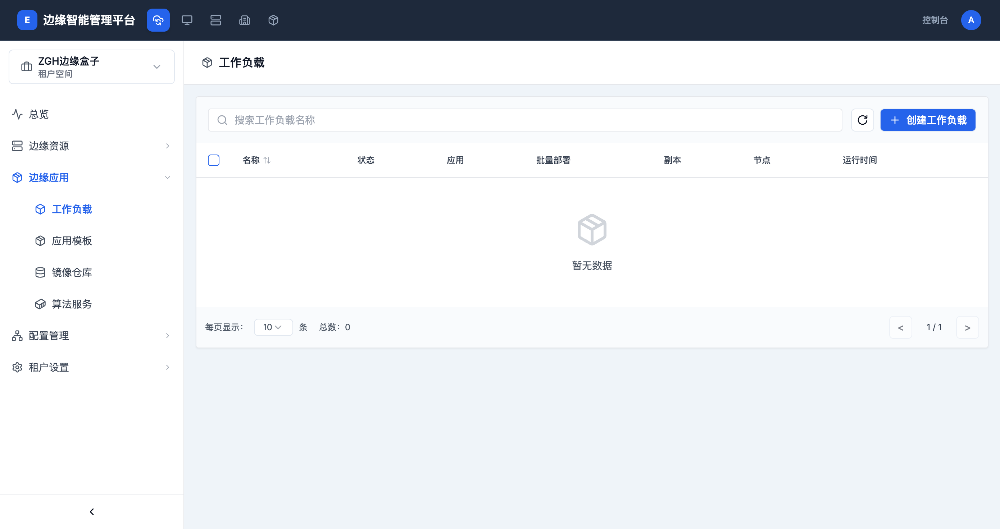

# 工作负载管理

> **导航路径**: 智能边缘平台 > 工作台 > 边缘应用 > 工作负载
> **访问地址**: `/tenant/{工作台ID}/namespaces/{项目ID}/deployments`
> **所需权限**: 工作台管理员或应用管理权限

## 功能说明

工作负载管理允许您在工作台的项目中部署和管理应用。工作负载是运行在边缘节点上的应用实例，支持部署、有状态副本集、守护进程集等类型。

## 页面概览

工作负载列表页面显示当前项目中的所有工作负载，包含名称、状态、关联应用、副本数、所在节点和运行时间。

## 操作指南

### 操作一：查看工作负载列表

**操作步骤**

1. 在工作台侧边栏中，展开 **边缘应用**，点击 **工作负载**

2. 工作负载列表显示以下信息：

   | 列名 | 说明 |
   |------|------|
   | 名称 | 工作负载的名称 |
   | 状态 | 运行状态（运行中、更新中、已停止等） |
   | 应用 | 关联的应用模板名称 |
   | 批量部署 | 是否为批量部署 |
   | 副本 | 就绪副本数 / 期望副本数 |
   | 节点 | 运行的目标节点 |
   | 运行时间 | 从创建到现在的时间 |

3. 使用页面顶部搜索框按名称搜索工作负载

**操作结果**

查看到当前项目中所有工作负载的运行状况。

### 操作二：创建工作负载

**操作步骤**

1. 在工作负载列表页面，点击右上角的 **创建工作负载** 按钮

2. 在创建页面中，填写工作负载的基本信息和容器配置

3. 配置完成后点击 **创建** 按钮

**操作结果**

工作负载创建成功后，系统会自动调度容器组到边缘节点运行。

### 操作三：查看工作负载详情

**操作步骤**

1. 在工作负载列表中，点击目标工作负载的名称

2. 在详情页面查看容器组状态、事件、日志等信息

**操作结果**

查看到工作负载的运行详情和容器组状态。

## 常见问题

### 问题：工作负载列表显示「暂无数据」
**现象**：进入工作负载页面后列表为空
**原因**：当前项目中尚未创建任何工作负载
**解决**：点击 **创建工作负载** 按钮部署新的应用

### 问题：工作负载状态显示异常
**现象**：工作负载状态不是「运行中」
**原因**：可能是镜像拉取失败、资源不足或配置错误
**解决**：点击工作负载名称进入详情页，查看事件日志中的错误信息
