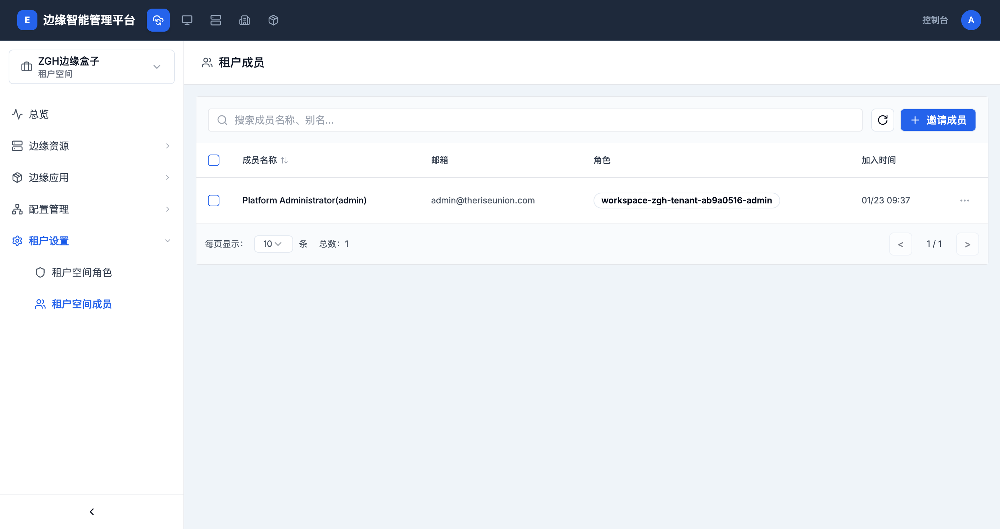
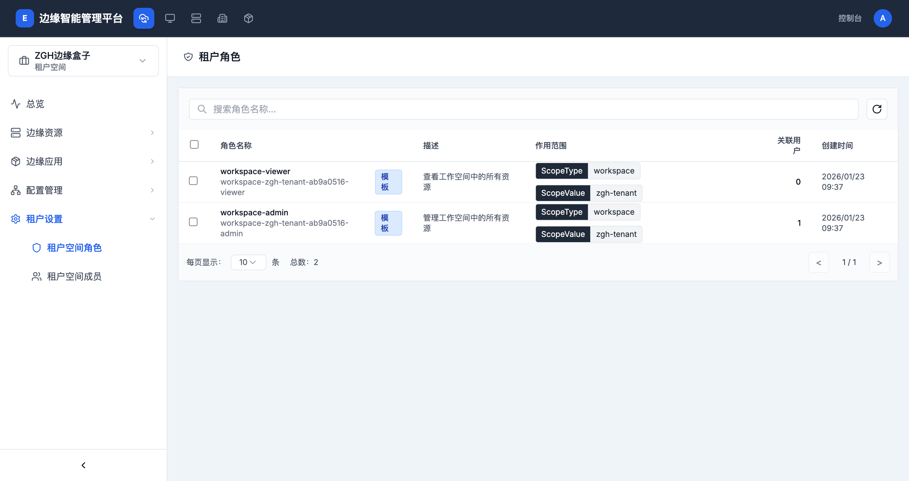

# 成员和权限管理

> **导航路径**: 智能边缘平台 > 工作台 > 租户设置
> **所需权限**: 工作台管理员

## 功能说明

工作台的成员和权限管理允许管理员邀请用户加入工作台、为用户分配角色以及移除成员。每个工作台有独立的角色和成员列表。

## 页面概览

成员列表页面显示当前工作台的所有成员，包括成员名称、邮箱、角色和加入时间。

## 操作指南

### 操作一：查看工作台角色

**操作步骤**

1. 在工作台侧边栏中，展开 **租户设置**，点击 **租户空间角色**

   

2. 角色列表显示以下信息：

   | 列名 | 说明 |
   |------|------|
   | 角色名称 | 角色的标识名和显示名 |
   | 描述 | 角色的功能说明 |
   | 作用范围 | 角色的生效范围 |
   | 关联用户 | 当前拥有该角色的用户数量 |
   | 创建时间 | 角色的创建时间 |

3. 工作台默认包含以下角色：

   | 角色 | 说明 |
   |------|------|
   | workspace-admin | 管理工作空间中的所有资源 |
   | workspace-viewer | 查看工作空间中的所有资源（只读） |

**操作结果**

查看到当前工作台的所有可用角色及其权限说明。

### 操作二：邀请成员

**操作步骤**

1. 在侧边栏中，展开 **租户设置**，点击 **租户空间成员**

2. 点击页面右上角的 **邀请成员** 按钮

3. 在弹出的对话框中，填写以下信息：

   | 字段 | 是否必填 | 说明 |
   |------|----------|------|
   | 用户名 | 是 | 输入要邀请的平台用户名，支持输入多个 |
   | 角色 | 是 | 从下拉列表中选择要分配的角色 |

4. 点击 **确认** 完成邀请

**操作结果**

被邀请的用户立即获得工作台的访问权限，在其工作台列表中可以看到该工作台。

### 操作三：修改成员角色

**操作步骤**

1. 在成员列表中，找到目标成员

2. 点击该成员行右侧的操作按钮

3. 在弹出菜单中选择 **修改角色**

4. 在对话框中选择新的角色，点击 **确认**

**操作结果**

成员的权限立即变更为新角色对应的权限。

### 操作四：移除成员

**操作步骤**

1. 在成员列表中，找到目标成员

2. 点击该成员行右侧的操作按钮

3. 在弹出菜单中选择 **移除成员**

4. 在确认对话框中点击 **确认**

**操作结果**

该成员立即失去工作台的访问权限。成员之前部署的应用不受影响，会继续运行。

### 操作五：搜索成员

**操作步骤**

1. 在成员列表页面顶部的搜索框中，输入成员名称或别名

2. 输入时列表自动筛选匹配结果

**操作结果**

列表仅显示名称匹配的成员。

## 常见问题

### 问题：邀请时找不到用户
**现象**：输入用户名后，没有匹配结果
**原因**：该用户尚未在平台注册，或用户名输入有误
**解决**：确认用户已在平台创建账户；检查用户名拼写是否正确

### 问题：无法修改某个成员的角色
**现象**：操作菜单中的「修改角色」不可用
**原因**：您可能没有管理员权限，或该成员是工作台创建者
**解决**：确认您拥有 workspace-admin 角色

### 问题：成员移除后仍能访问
**现象**：成员被移除后短时间内仍能访问工作台
**原因**：权限缓存有短暂延迟
**解决**：等待片刻后权限变更将自动生效
