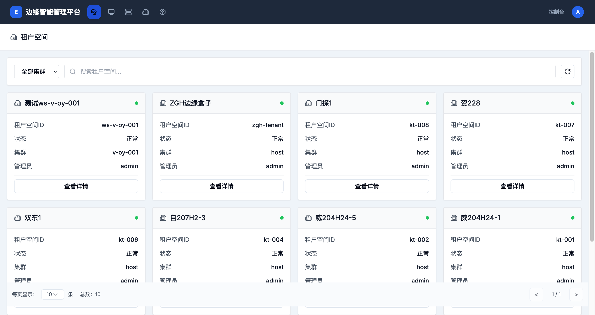
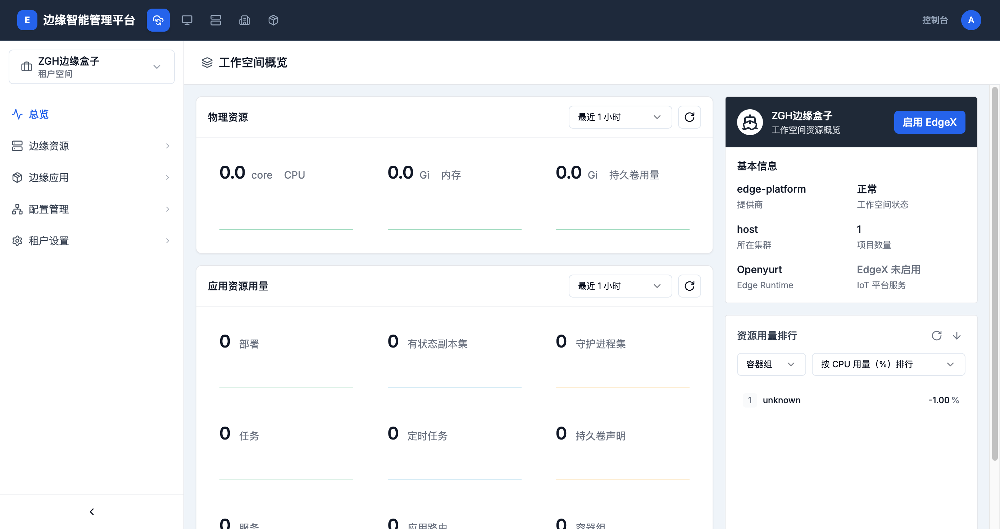
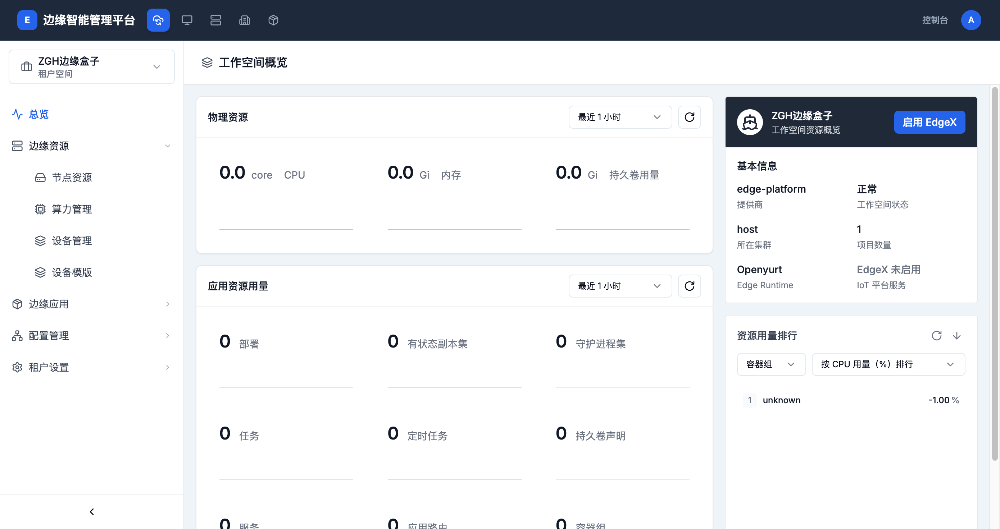

# 工作台快速入门

> **导航路径**: 顶部导航栏 > 智能边缘平台
> **访问地址**: `/tenant`
> **所需权限**: 平台用户

## 功能说明

本指南帮助您快速了解工作台的基本操作流程，包括进入工作台、查看资源概览和导航到各功能模块。

## 操作指南

### 操作一：进入工作台

**操作步骤**

1. 登录边缘智能管理平台后，点击顶部导航栏中的 **智能边缘平台**

2. 在工作台列表页面，找到您要管理的工作台卡片

   

3. 点击卡片上的 **查看详情** 按钮，进入该工作台

**操作结果**

成功进入工作台后，您将看到工作台概览页面，左侧显示功能导航菜单。

### 操作二：查看工作台概览

**操作步骤**

1. 进入工作台后，默认显示「总览」页面

   

2. 在概览页面中，您可以查看以下信息：

   | 区域 | 说明 |
   |------|------|
   | 物理资源 | 显示 CPU、内存、持久卷的使用情况和趋势图 |
   | 应用资源用量 | 显示部署、有状态副本集、守护进程集、容器组等数量统计 |
   | 基本信息 | 显示工作台的提供商、状态、所在集群、项目数量、Edge Runtime 等 |
   | 资源用量排行 | 按 CPU 或内存用量排列容器组 |

3. 在物理资源区域右上角，通过下拉框切换时间范围（如「最近 1 小时」）

**操作结果**

您可以全面了解当前工作台的资源使用情况和运行状态。

### 操作三：使用侧边栏导航

**操作步骤**

1. 在工作台页面左侧，点击菜单分组名称（如 **边缘资源**）展开子菜单

   

2. 点击子菜单项（如 **节点资源**）进入对应功能页面

3. 如需切换到其他工作台，点击左上角的工作台名称（如「ZGH边缘盒子」），在弹出的下拉菜单中选择目标工作台

**操作结果**

通过侧边栏，您可以访问工作台的所有功能模块。

## 常见问题

### 问题：看不到任何工作台
**现象**：进入「智能边缘平台」后，列表为空
**原因**：您尚未被邀请加入任何工作台
**解决**：联系工作台管理员，请其在「租户设置 > 租户空间成员」中邀请您

### 问题：工作台状态显示异常
**现象**：工作台卡片上状态显示为「异常」
**原因**：工作台所属集群可能存在连接问题
**解决**：联系平台管理员检查集群状态
