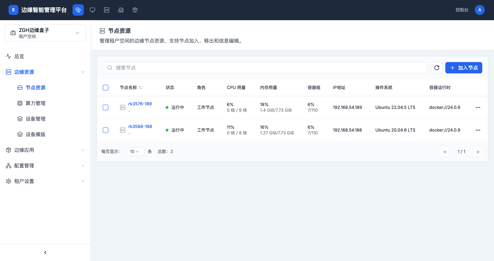

# 边缘资源管理

> **导航路径**: 智能边缘平台 > 工作台 > 边缘资源
> **所需权限**: 工作台管理员或相应资源管理权限

## 功能说明

边缘资源管理包含节点资源、算力管理、设备管理和设备模版四个功能模块。您可以在此查看和管理工作台内的边缘节点、GPU 设备和 IoT 设备。

## 操作指南

### 操作一：查看节点列表

**操作步骤**

1. 在工作台侧边栏中，展开 **边缘资源** 菜单，点击 **节点资源**

   

2. 节点列表显示以下信息：

   | 列名 | 说明 |
   |------|------|
   | 节点名称 | 节点的唯一标识，点击可查看详情 |
   | 状态 | 运行中、未就绪等 |
   | 角色 | 工作节点、控制节点 |
   | CPU 用量 | CPU 使用百分比和核心数 |
   | 内存用量 | 内存使用百分比和容量 |
   | 容器组 | 已运行容器组数量 / 最大容器组数量 |
   | IP地址 | 节点的网络地址 |
   | 操作系统 | 操作系统名称和版本 |
   | 容器运行时 | 容器运行时类型和版本 |

3. 使用页面顶部的搜索框按节点名称搜索

**操作结果**

查看到工作台内所有边缘节点的运行状态和资源使用情况。

### 操作二：加入新节点

**操作步骤**

1. 在节点列表页面，点击右上角的 **加入节点** 按钮

2. 按照弹出的引导步骤完成节点注册

**操作结果**

新节点注册成功后，将出现在节点列表中。

### 操作三：查看节点详情

**操作步骤**

1. 在节点列表中，点击目标节点的 **节点名称** 链接

2. 在节点详情页面，您可以查看节点的运行状态、系统信息、资源使用趋势等

**操作结果**

查看到该节点的详细状态信息和监控数据。

### 操作四：查看算力资源

**操作步骤**

1. 在侧边栏中，展开 **边缘资源** 菜单，点击 **算力管理**

2. 查看工作台内 GPU 设备的型号、使用状态和分配情况

**操作结果**

了解工作台内 GPU 资源的使用状况。

### 操作五：管理设备

**操作步骤**

1. 在侧边栏中，展开 **边缘资源** 菜单，点击 **设备管理**

2. 查看工作台内 IoT 设备的连接状态和设备信息

**操作结果**

查看到工作台内所有 IoT 设备的列表和状态。

### 操作六：管理设备模版

**操作步骤**

1. 在侧边栏中，展开 **边缘资源** 菜单，点击 **设备模版**

2. 查看和管理设备配置模版列表

**操作结果**

查看到可用的设备模版及其配置信息。

## 常见问题

### 问题：节点状态显示为「未就绪」
**现象**：节点列表中某个节点状态不是「运行中」
**原因**：节点可能网络断开、服务异常或资源不足
**解决**：检查节点的网络连接是否正常；登录节点检查边缘 Agent 服务是否运行

### 问题：CPU/内存用量显示为空
**现象**：节点的 CPU 或内存用量列显示为「-」
**原因**：监控数据尚未采集到，或节点刚刚加入
**解决**：等待片刻后刷新页面；如持续为空，检查监控服务是否正常运行
