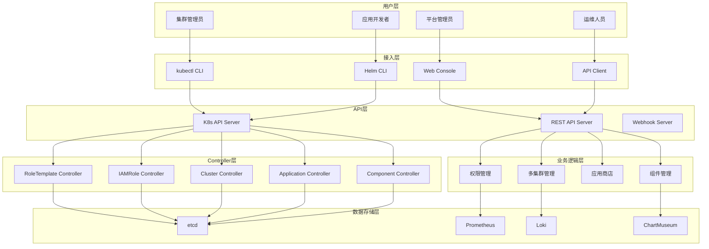
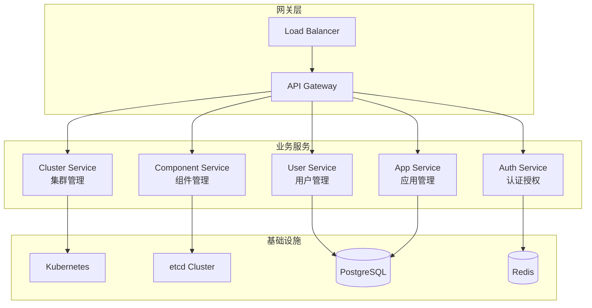
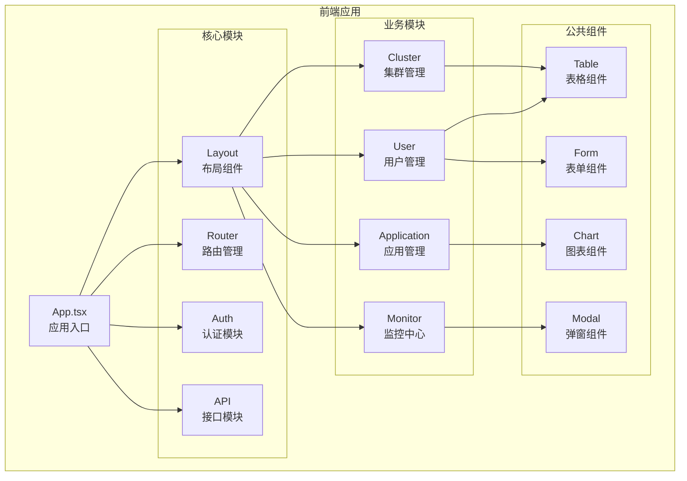
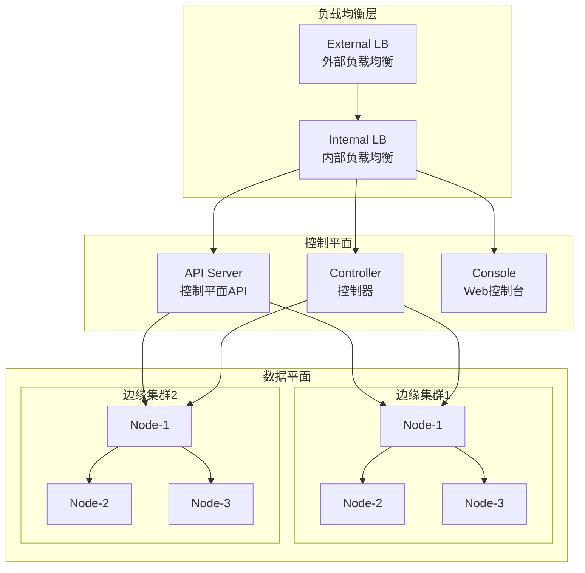
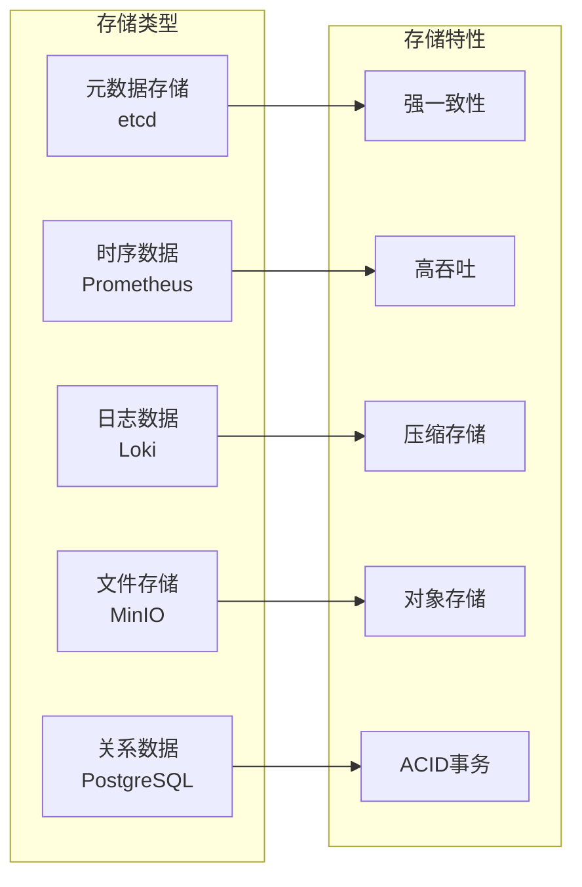
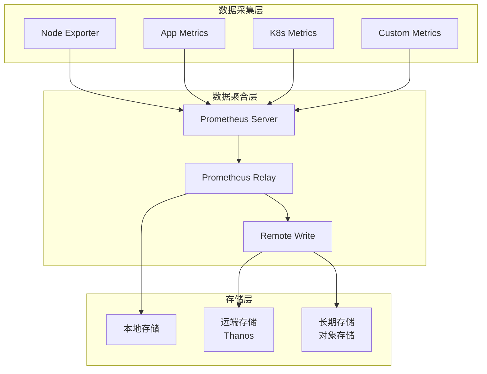
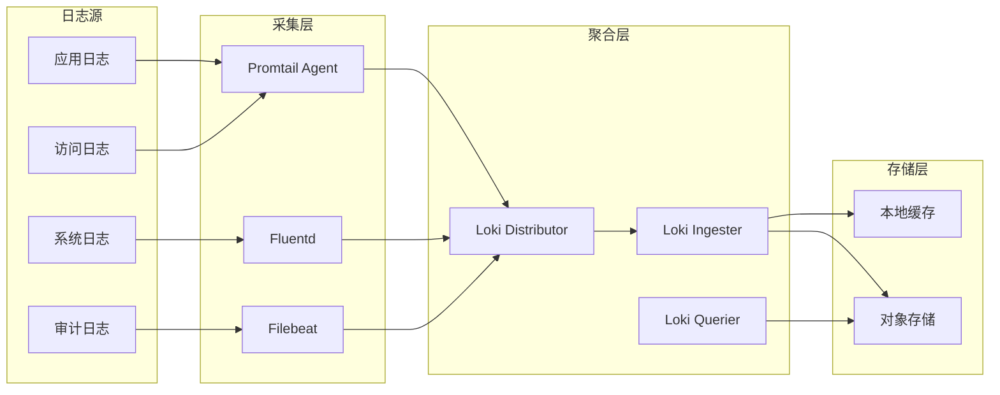

# 第四章 技术架构

## 系统逻辑架构

### 分层架构设计



### 各层职责

#### 用户层
- **平台管理员**：负责平台级配置和用户管理
- **集群管理员**：负责集群和节点管理
- **应用开发者**：负责应用开发和部署
- **运维人员**：负责系统运维和监控

#### 接入层
- **Web Console**：基于React的Web管理界面
- **kubectl CLI**：Kubernetes命令行工具
- **Helm CLI**：Helm包管理工具
- **API Client**：REST API客户端

#### API层
- **REST API Server**：提供业务API接口
- **K8s API Server**：Kubernetes原生API
- **Webhook Server**：准入控制和验证

#### 业务逻辑层
- **权限管理**：5层Scope权限模型实现
- **多集群管理**：vcluster虚拟集群管理
- **应用商店**：应用生命周期管理
- **组件管理**：Chart组件管理

#### Controller层
- **RoleTemplate Controller**：权限模板控制器
- **IAMRole Controller**：权限角色控制器
- **Cluster Controller**：集群控制器
- **Application Controller**：应用控制器
- **Component Controller**：组件控制器

#### 数据存储层
- **etcd**：Kubernetes元数据存储
- **Prometheus**：监控指标存储
- **Loki**：日志数据存储
- **ChartMuseum**：Helm Chart仓库

## 系统技术架构

### 后端架构

#### 微服务设计



#### 核心技术栈

| 组件 | 技术选型 | 版本 | 说明 |
|------|----------|------|------|
| **编程语言** | Go | 1.21+ | 高性能、并发友好 |
| **Web框架** | Gin | v1.9+ | 轻量级HTTP框架 |
| **ORM框架** | GORM | v1.25+ | 数据库操作框架 |
| **缓存** | Redis | 7.0+ | 会话、权限缓存 |
| **消息队列** | NATS | 2.9+ | 轻量级消息队列 |
| **配置中心** | etcd | 3.5+ | 配置管理和服务发现 |

### 前端架构

#### 技术栈

| 技术栈 | 选型 | 版本 | 说明 |
|--------|------|------|------|
| **框架** | React | 18.3+ | 用户界面框架 |
| **构建工具** | Vite | 5.0+ | 现代化构建工具 |
| **状态管理** | Zustand | 4.4+ | 轻量级状态管理 |
| **UI组件库** | Ant Design | 5.12+ | 企业级UI组件库 |
| **图表库** | Apache ECharts | 5.4+ | 数据可视化 |
| **类型检查** | TypeScript | 5.3+ | 类型安全 |

#### 模块架构



### 网络架构

#### 网络拓扑



#### 网络安全

**TLS加密**：
- 所有外部通信使用TLS 1.3加密
- 内部服务间通信使用mTLS
- 证书自动轮换和管理

**网络隔离**：
- 基于Kubernetes NetworkPolicy的网络隔离
- 命名空间级别的访问控制
- 微服务间的细粒度访问控制

### 存储架构

#### 存储分类



#### 高可用设计

**etcd集群**：
- 3节点或5节点奇数集群
- Raft一致性协议保证数据一致性
- 自动故障转移和选举

**Prometheus集群**：
- 远程存储支持
- 联邦集群架构
- 本地和远程存储分层

## 数据库架构

### etcd存储设计

#### 数据模型

```yaml
# 权限相关数据
/registry/edge.theriseunion.io/roletemplates/
/registry/edge.theriseunion.io/iamroles/
/registry/edge.theriseunion.io/iamrolebindings/

# 集群相关数据
/registry/edge.theriseunion.io/clusters/
/registry/edge.theriseunion.io/nodegroups/

# 应用相关数据
/registry/edge.theriseunion.io/applications/
/registry/edge.theriseunion.io/applicationversions/
/registry/edge.theriseunion.io/applicationdeployments/

# 组件相关数据
/registry/edge.theriseunion.io/components/
```

#### 性能优化

**批量操作优化**：
```go
func (r *RoleTemplateReconciler) reconcileRoleTemplates(ctx context.Context) error {
    // 批量获取RoleTemplate
    roleTemplates, err := r.roleTemplateLister.List(labels.Everything())
    if err != nil {
        return err
    }

    // 批量处理
    for _, rt := range roleTemplates {
        if err := r.reconcileRoleTemplate(ctx, rt); err != nil {
            return err
        }
    }
    return nil
}
```

**缓存策略**：
- Informer缓存机制
- 本地缓存和etcd数据同步
- 缓存失效和更新策略

### Prometheus监控存储

#### 数据采集架构



#### 存储策略

**本地存储**：
- 最近15天的高频访问数据
- SSD存储，保证查询性能
- 数据压缩，减少存储空间

**远端存储**：
- 超过15天的历史数据
- 对象存储，成本优化
- 数据分片和压缩

### Loki日志存储

#### 日志采集架构



#### 存储优化

**日志压缩**：
- 自动识别和压缩重复日志
- 支持多种压缩算法（Gzip、Snappy、LZ4）
- 根据日志类型选择最优压缩策略

**索引优化**：
- 基于标签的快速检索
- 智能索引策略
- 查询性能优化

---

**下一章节**：[第五章 部署架构](./deployment.md)