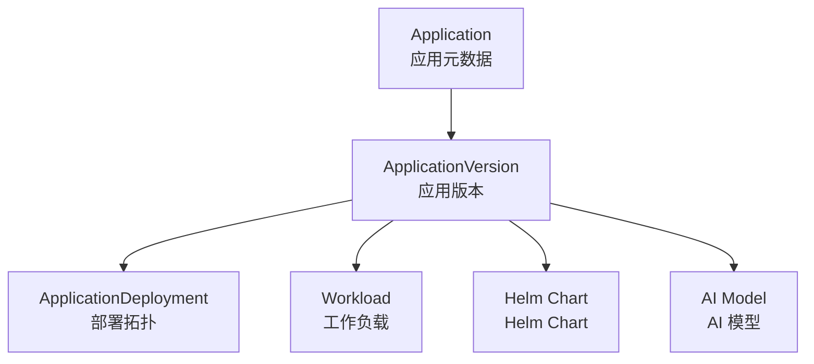

# 第一章 产品介绍

## 产品定位

**Edge Platform** 是基于 Kubernetes 构建的云原生边缘计算管理平台，为企业提供统一的多集群、多租户管理能力。平台采用 100% Kubernetes Native 架构，所有功能通过 CRD 实现，完全兼容 Kubernetes 生态。

### 核心能力概览

#### 统一权限管理
- **5层 Scope 权限模型**：完美映射企业从集团到设备的组织架构
- **权限自动级联**：告别传统 K8s RBAC 的级联困难
- **双视图设计**：Workspace（应用视图）和 NodeGroup（资源视图）并行

#### 多集群管理
- **虚拟集群自动化**：基于 vcluster 实现资源高效的虚拟集群
- **边缘运行时集成**：自动安装 KubeEdge/OpenYurt
- **声��式管理**：通过 Cluster CR 声明期望状态

#### 应用生命周期管理
- **三层架构**：Application → ApplicationVersion → ApplicationDeployment
- **多类型支持**：Workload、Helm Chart、AI Model
- **多拓扑部署**：支持跨节点组、跨集群的统一分发

#### 组件管理
- **声明式安装**：Component CR 驱动，自动执行 Helm 安装
- **独立 Chart 仓库**：每集群独立 ChartMuseum，零跨集群依赖
- **离线部署**：Chart 预置镜像，支持完全离线环境

## 核心概念

### Scope 权限模型

Edge Platform 创新性地提出了 5 层 Scope 权限模型，完美匹配企业的组织架构：

```
Platform (平台)
├── Cluster (集群)
│   ├── Workspace (工作空间 - 应用视图)
│   │   └── Namespace (命名空间)
│   │       └── Resource (资源)
│   └── NodeGroup (节点组 - 资源视图)
│       └── Node (节点)
│           └── Resource (资源)
```

#### 双视图设计

**Workspace（应用视图）**：
- 以应用为中心的组织方式
- 适合开发团队和应用管理
- 包含 Namespace、Application、Deployment 等资源

**NodeGroup（资源视图）**：
- 以基础设施为中心的组织方式
- 适合运维团队和资源管理
- 包含 Node、Storage、Network 等资源

### vcluster 虚拟集群

vcluster 是 Edge Platform 多集群管理的核心技术：

- **资源高效**：每个虚拟集群仅需 200MB 内存
- **完全隔离**：独立的 API Server 和控制平面
- **原生兼容**：完全兼容 kubectl 和 Kubernetes 工具链

### 应用商店三层架构



#### Application
- 应用的基本信息和元数据
- 描述应用的用途、特性、配置项
- 不包含具体的实现代码

#### ApplicationVersion
- 应用的具体实现版本
- 包含部署模板、配置文件、依赖关系
- 支持 Plugin 机制扩展新的应用类型

#### ApplicationDeployment
- 应用的部署拓扑和运行状态
- 支持多集群、多节点组的批量部署
- 记录部署历史和运行状态

### Component 组件管理

Component 是 Edge Platform 的组件声明机制：

```yaml
apiVersion: edge.theriseunion.io/v1alpha1
kind: Component
metadata:
  name: prometheus
spec:
  chartName: prometheus
  chartVersion: "2.40.0"
  values:
    server:
      resources:
        requests:
          memory: "1Gi"
```

- **声明式**：用户声明期望的组件状态
- **幂等性**：重复执行结果一致
- **自动化**：Controller 自动执行 Helm 安装/升级

## 设计理念

### Kubernetes Native

Edge Platform 遵循 Kubernetes 的设计哲学：

- **CRD 驱动**：所有功能通过自定义资源实现
- **Controller 模式**：状态驱动的自动化操作
- **声明式 API**：用户声明期望状态，系统负责实现

### 声明式设计

所有的配置和管理都是声明式的：

- **配置即代码**：所有配置都可以版本控制
- **幂等操作**：重复执行结果一致
- **状态同步**：自动检测和修复偏差

### 插件化架构

Edge Platform 采用插件化设计：

- **Provisioner Plugin**：扩展应用类型支持
- **Scope Pattern**：扩展权限模型
- **开放接口**：支持客户定制开发

### GitOps 友好

完全支持 GitOps 工作流：

- **配置文件**：所有配置都是 YAML 文件
- **版本控制**：支持 Git 进行版本管理
- **CI/CD 集成**：支持自动化流水线

## 适用场景

Edge Platform 适用于以下典型场景：

### 制造业工业互联网
- 全国多个工厂的统一管理
- 设备监控和质量检测应用
- 预测性维护和故障诊断

### 零售业智慧门店
- 连锁门店的统一应用部署
- 收银、库存、客流分��系统
- 快速业务迭代和版本管理

### 能源行业智能电网
- 变电站的远程监控和管理
- 离线环境下的可靠运行
- 等保合规要求

### 交通行业智慧交通
- 高速公路、隧道、桥梁监控
- 边缘 AI 视频分析
- 实时数据采集和处理

## 技术优势

### 性能优势
- **权限查询**：P99 延迟 < 5ms
- **虚拟集群创建**：30 秒完成
- **应用部署**：支持批量部署，秒级响应

### 可扩展性
- **用户规模**：支持 10000+ 用户
- **集群规模**：支持 1000+ 虚拟集群
- **应用数量**：支持 10000+ 应用实例

### 可靠性
- **高可用部署**：99.9%+ 可用性
- **故障自动恢复**：Controller 自动修复
- **数据备份**：支持 etcd 备份和恢复

---

**下一章节**：[第二章 产品优势](./advantages.md)