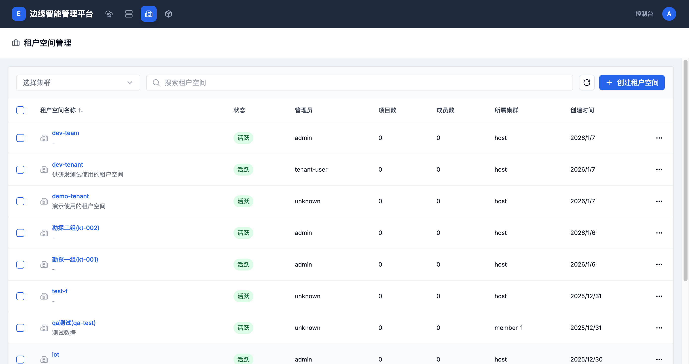
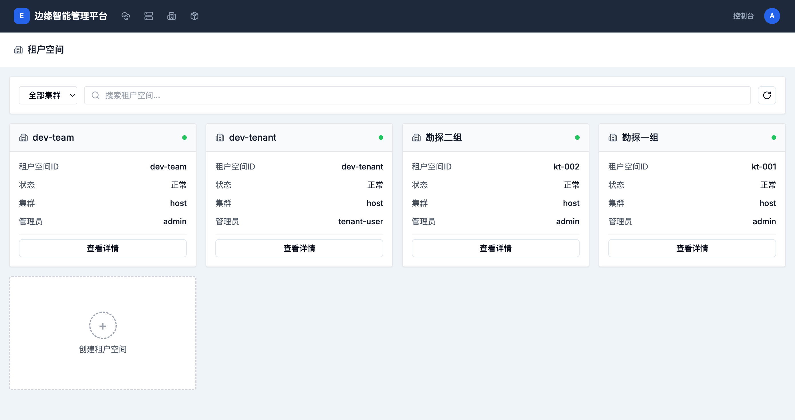
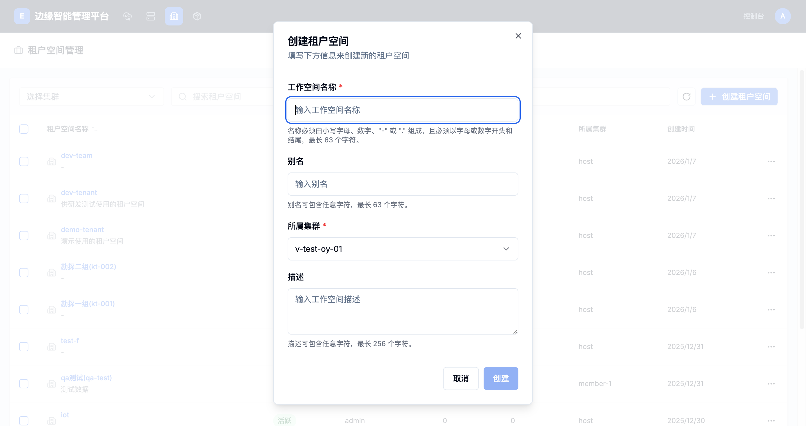

# 工作空间管理

工作空间（租户空间）是边缘计算平台的多租户隔离单元，用于组织项目、管理资源和控制访问权限。每个工作空间都有独立的资源配额和用户管理。

## 工作空间列表

### 查看工作空间列表

工作空间列表页面显示所有已创建的工作空间，包括以下信息：

- **租户空间名称**：工作空间的唯一标识符
- **别名**：工作空间的显示名称
- **状态**：工作空间当前状态（活跃、禁用等）
- **管理员**：工作空间的管理员用户
- **项目数**：工作空间中包含的项目数量
- **成员数**：工作空间中的用户数量
- **所属集群**：工作空间关联的集群
- **创建时间**：工作空间的创建日期

### 导航入口

租户空间管理可以通过以下路径访问：

1. **从控制台首页**：
   - 登录后在控制台首页找到"租户空间管理"卡片
   - 点击卡片进入租户空间管理页面

2. **从顶部导航栏**：
   - 点击顶部导航栏中的"租户空间"链接
   - 直接跳转到租户空间管理页面

### 工作空间操作

每个工作空间都有操作菜单，提供以下功能：

- **编辑**：修改工作空间的基本信息和配置
- **删除**：删除工作空间及其所有资源

## 创建工作空间

### 创建工作空间流程

点击"��建租户空间"按钮，填写以下信息：

### 基本信息配置

- **工作空间名称**：必填
  - 必须由小写字母、数字、"-" 或 "." 组成
  - 必须以字母或数字开头和结尾
  - 最长63个字符
  - 示例：`dev-team`, `project-alpha`, `workspace-01`

- **别名**：可选
  - 可包含任意字符
  - 最长63个字符
  - 用于友好的显示名称
  - 示例：`研发团队`, `项目A`, `工作空间1`

- **所属集群**：必填
  - 选择一个已配置的集群
  - 工作空间将在该集群中创建相应的命名空间和资源

- **描述**：可选
  - 可包含任意字符
  - 最长256个字符
  - 描述工作空间的用途和功能

## 工作空间管理功能

### 集群选择

- 页面顶部显示"选择集群"选项
- 可以筛选显示特定集群的工作空间
- 方便管理多集群环境

### 搜索和筛选

- 使用搜索框快速查找工作空间
- 支持按名称和描述进行搜索

### 分页显示

- 默认每页显示10个工作空间
- 支持分页浏览大量工作空间

## 工作空间的作用

### 多租户隔离

工作空间提供了以下隔离能力：

1. **资源隔离**：每个工作空间有独立的资源配额和限制
2. **用户隔离**：工作空间的成员只能访问自己工作空间的资源
3. **网络隔离**：工作空间之间的网络通信可以隔离
4. **策略隔离**：每个工作空间可以配置独立的访问控制和权限策略

### 组织结构

工作空间支持以下组织结构：

- **按团队组织**：为不同的团队创建独立的工作空间
- **按项目组织**：为不同的项目创建独立的工作空间
- **按环境组织**：为开发、测试、生产环境创建独立的工作空间
- **按客户组织**：为不同的客户创建独立的工作空间（多租户场景）

## 最佳实践

### 命名规范

1. **使用有意义的名称**：反映工作空间的用途或所属团队
   - 示例：`dev-team`, `qa-environment`, `customer-a`

2. **使用一致的命名模式**：便于管理和识别
   - 按团队：`team-{name}`
   - 按项目：`project-{name}`
   - 按环境：`env-{type}`

3. **合理使用别名**：提供更友好的显示名称
   - 中文名称：`研发团队`, `测试环境`
   - 英文描述：`Development Team`, `QA Environment`

### 资源管理

1. **合理分配资源配额**：根据实际需求设置CPU、内存等资源限制
2. **定期清理未使用的资源**：避免资源浪费
3. **监控资源使用情况**：及时发现和解决资源瓶颈

### 用户管理

1. **合理设置工作空间管理员**：指���负责的用户管理权限
2. **控制工作空间成员数量**：避免过多用户导致管理复杂
3. **定期审查用户权限**：确保用户权限与其职责匹配

### 安全建议

1. **最小权限原则**：只给用户必要的权限
2. **定期审计**：定期检查工作空间的访问日志和操作记录
3. **网络隔离**：对敏感工作空间启用网络隔离
4. **备份重要数据**：定期备份工作空间中的重要配置和数据

## 使用场景

### 1. 开发测试环境

为不同的开发团队创建独立的工作空间：

- `dev-team-alpha`：Alpha团队的开发环境
- `dev-team-beta`：Beta团队的开发环境
- `qa-environment`：共享的测试环境

### 2. 多租户场景

为不同的客户创建独立的工作空间：

- `customer-a`：客户A的专用工作空间
- `customer-b`：客户B的专用工作空间
- `shared-services`：共享服务工作空间

### 3. 项目管理

为不同的项目创建独立的工作空间：

- `project-mobile-app`：移动应用项目
- `project-web-portal`：Web门户项目
- `project-data-platform`：数据平台项目

### 4. 环境隔离

为不同的环境创建独立的工作空间：

- `dev-environment`：开发环境
- `test-environment`：测试环境
- `staging-environment`：预发布环境
- `production-environment`：生产环境

## 故障排除

### 常见问题

1. **工作空间创建失败**
   - 检查集群状态是否正常
   - 确认有足够的资源配额
   - 验证工作空间名称是否符合命名规范

2. **无法访问工作空间**
   - 检查用户是否有该工作空间的访问权限
   - 确认工作空间状态是否为活跃
   - 联系工作空间管理员添加访问权限

3. **资源配额不足**
   - 联系平台管理员增加资源配额
   - 清理未使用的资源
   - 优化资源使用效率

4. **工作空间删除失败**
   - 确保工作空间中没有正在运行的资源
   - 检查是否有依赖关系需要先删除
   - 联系平台管理员强制删除