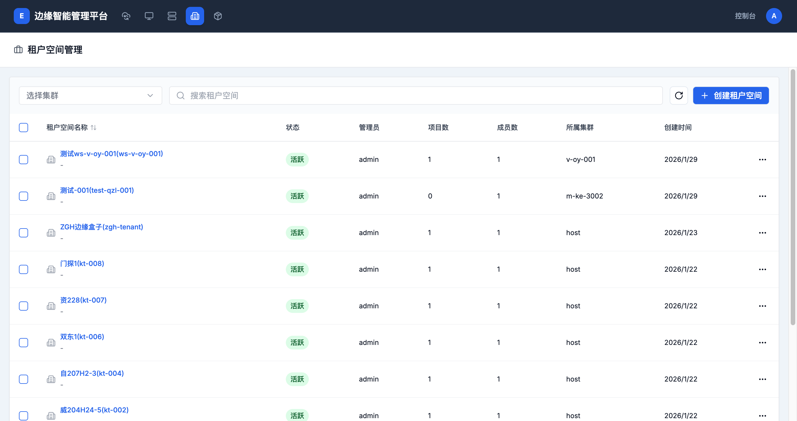

# 租户空间管理

> **导航路径**: 顶部导航栏 > 租户空间
> **访问地址**: `/boss/workspaces`
> **所需权限**: 平台管理员

## 功能说明

租户空间管理页面展示平台中所有租户空间。您可以在此查看各租户空间的状态、管理员、项目数量等信息，创建新的租户空间或进入租户空间详情。

## 页面概览

租户空间列表包含以下信息：

| 列 | 说明 |
|------|------|
| 租户空间名称 | 名称和别名 |
| 状态 | 运行状态（活跃、停止等） |
| 管理员 | 租户空间的管理员用户 |
| 项目数 | 租户空间内的项目数量 |
| 成员数 | 租户空间内的成员数量 |
| 所属集群 | 租户空间所在的集群 |
| 创建时间 | 租户空间的创建时间 |

## 操作指南

### 操作一：查看租户空间列表

**操作步骤**

1. 在顶部导航栏中，点击 **租户空间**

2. 查看所有租户空间的名称、状态和统计信息

3. 使用搜索框按名称查找租户空间

**操作结果**

查看到平台中所有租户空间及其概要信息。

### 操作二：创建租户空间

**操作步骤**

1. 在租户空间列表页面，点击 **创建租户空间** 按钮

2. 填写租户空间信息：

   | 字段 | 是否必填 | 说明 |
   |------|----------|------|
   | 名称 | 是 | 小写字母、数字和连字符，最长 63 个字符 |
   | 别名 | 否 | 用于展示的友好名称 |
   | 描述 | 否 | 租户空间的用途说明 |
   | 管理员 | 是 | 选择租户空间的管理员用户 |
   | 所属集群 | 是 | 选择租户空间所在的集群 |

3. 点击 **确认** 创建租户空间

**操作结果**

租户空间创建成功，出现在列表中，状态为「活跃」。

### 操作三：进入租户空间详情

**操作步骤**

1. 在租户空间列表中，点击目标租户空间的名称

2. 进入租户空间概览页面，查看资源使用和基本信息

**操作结果**

进入租户空间详情页，左侧显示租户空间专属的侧边栏菜单。

### 操作四：删除租户空间

**操作步骤**

1. 在租户空间列表中，点击目标租户空间右侧的操作按钮

2. 选择 **删除**

3. 输入租户空间名称确认删除

**操作结果**

租户空间及其内的所有项目和资源被删除。此操作不可恢复。

## 常见问题

### 问题：租户空间状态异常
**现象**：租户空间列表中状态不是「活跃」
**原因**：所属集群网络不通或集群组件异常
**解决**：检查所属集群的运行状态是否正常

### 问题：无法创建租户空间
**现象**：点击创建按钮后操作失败
**原因**：当前用户不是平台管理员，或所选集群不可用
**解决**：确认当前用户具有平台管理员角色，且目标集群状态正常
