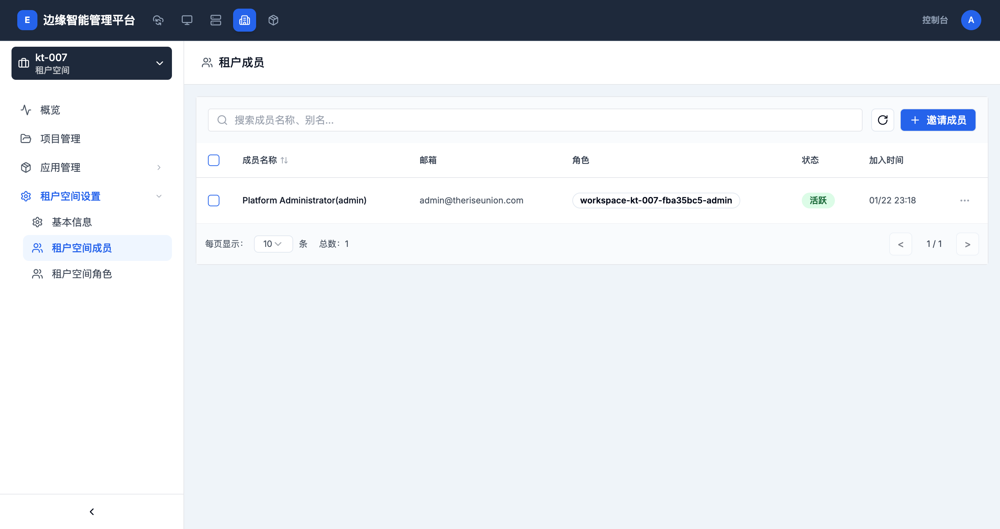

# 成员管理

> **导航路径**: 租户空间 > 选择租户空间 > 租户空间设置 > 租户空间成员
> **访问地址**: `/boss/clusters/{集群ID}/workspaces/{租户空间ID}/members`
> **所需权限**: 平台管理员或租户空间管理员

## 功能说明

成员管理页面用于管理租户空间内的用户。您可以邀请新成员、为成员分配角色、修改成员角色或移除成员。

## 页面概览

成员列表包含以下信息：

| 列 | 说明 |
|------|------|
| 成员名称 | 用户的名称和别名 |
| 邮箱 | 成员的邮箱地址 |
| 角色 | 成员在租户空间中的角色 |
| 状态 | 成员状态（活跃、未激活） |
| 加入时间 | 成员加入租户空间的时间 |

## 操作指南

### 操作一：查看成员列表

**操作步骤**

1. 进入目标租户空间，在侧边栏展开 **租户空间设置**

2. 点击 **租户空间成员**

3. 查看所有成员的名称、角色和状态

4. 使用搜索框按名称或别名查找成员

**操作结果**

查看到租户空间内所有成员及其角色信息。

### 操作二：邀请成员

**操作步骤**

1. 在成员列表页面，点击 **邀请成员** 按钮

2. 选择要邀请的用户

3. 为用户分配租户空间角色

4. 点击 **确认** 完成邀请

**操作结果**

用户被添加为租户空间成员，获得对应角色的权限。

### 操作三：修改成员角色

**操作步骤**

1. 在成员列表中，点击目标成员右侧的操作按钮

2. 选择 **修改角色**

3. 选择新的角色

4. 确认修改

**操作结果**

成员的租户空间权限按新角色生效。

### 操作四：移除成员

**操作步骤**

1. 在成员列表中，点击目标成员右侧的操作按钮

2. 选择 **移除**

3. 确认移除操作

**操作结果**

成员失去对该租户空间的访问权限。

## 常见问题

### 问题：邀请成员时找不到用户
**现象**：在邀请成员对话框中搜索不到目标用户
**原因**：目标用户尚未在平台中创建账号
**解决**：先在权限管理中创建用户，再进行成员邀请

### 问题：成员无法访问租户空间资源
**现象**：成员已添加到租户空间，但无法查看或操作资源
**原因**：分配的角色权限不足
**解决**：检查成员的角色是否具有所需的权限，必要时修改角色
