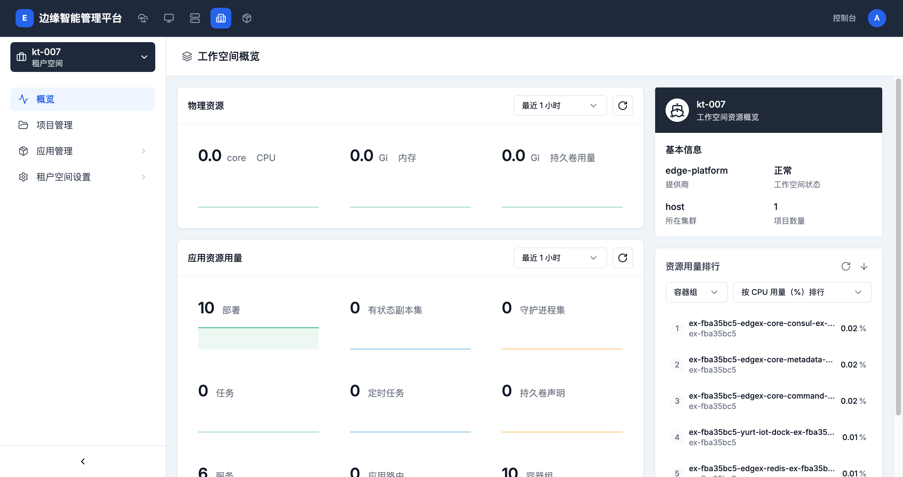

# 租户空间概览

> **导航路径**: 租户空间 > 选择租户空间 > 概览
> **访问地址**: `/boss/clusters/{集群ID}/workspaces/{租户空间ID}/overview`
> **所需权限**: 平台管理员或租户空间管理员

## 功能说明

租户空间概览页面展示资源使用情况、应用资源统计和基本信息，帮助管理员快速了解租户空间的整体状况。

## 页面概览

概览页面包含以下区域：

### 物理资源

以仪表盘形式展示：

| 指标 | 说明 |
|------|------|
| CPU | CPU 使用量与总量 |
| 内存 | 内存使用量与总量 |
| 持久卷 | 持久卷使用量与总量 |

### 应用资源用量

| 指标 | 说明 |
|------|------|
| 部署 | 部署数量 |
| 有状态副本集 | 有状态副本集数量 |
| 守护进程集 | 守护进程集数量 |
| 任务 | 任务数量 |
| 定时任务 | 定时任务数量 |
| 持久卷声明 | 持久卷声明数量 |
| 服务 | 服务数量 |
| 应用路由 | 应用路由数量 |
| 容器组 | 容器组数量 |

### 基本信息

| 字段 | 说明 |
|------|------|
| 提供商 | 集群类型 |
| 工作空间状态 | 租户空间运行状态 |
| 所在集群 | 租户空间所属集群名称 |
| 项目数量 | 租户空间内的项目总数 |

### 资源用量排行

按 CPU 或内存用量对租户空间内的资源进行排名。

## 操作指南

### 操作一：查看租户空间概览

**操作步骤**

1. 在租户空间列表中，点击目标租户空间的名称

2. 默认进入概览页面

3. 查看物理资源用量、应用资源统计和基本信息

**操作结果**

了解租户空间的资源使用情况和整体状态。
