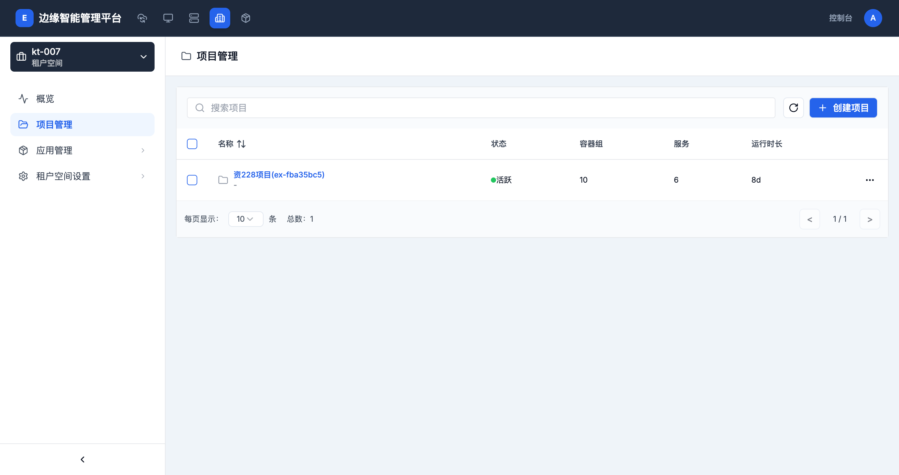

# 项目管理

> **导航路径**: 租户空间 > 选择租户空间 > 项目管理
> **访问地址**: `/boss/clusters/{集群ID}/workspaces/{租户空间ID}/namespaces`
> **所需权限**: 平台管理员或租户空间管理员

## 功能说明

项目管理页面展示租户空间内的所有项目。项目是资源隔离和部署的基本单位，每个项目中可以运行工作负载、服务等资源。

## 页面概览

项目列表包含以下信息：

| 列 | 说明 |
|------|------|
| 名称 | 项目名称和标识 |
| 状态 | 项目状态（活跃、停止等） |
| 容器组 | 项目中运行的容器组数量 |
| 服务 | 项目中的服务数量 |
| 运行时长 | 项目创建至今的时间 |

## 操作指南

### 操作一：查看项目列表

**操作步骤**

1. 进入目标租户空间，在侧边栏点击 **项目管理**

2. 查看所有项目的名称、状态和资源统计

3. 使用搜索框按名称查找项目

**操作结果**

查看到租户空间内所有项目及其运行状态。

### 操作二：创建项目

**操作步骤**

1. 在项目列表页面，点击 **创建项目** 按钮

2. 填写项目信息：

   | 字段 | 是否必填 | 说明 |
   |------|----------|------|
   | 项目名称 | 是 | 小写字母、数字和连字符，最长 63 个字符 |
   | 描述 | 否 | 项目的用途说明 |

3. 点击 **确认** 创建项目

**操作结果**

项目创建成功，出现在项目列表中，状态为「活跃」。

### 操作三：查看项目详情

**操作步骤**

1. 在项目列表中，点击目标项目的名称

2. 进入项目概览页面，查看资源使用情况

**操作结果**

进入项目详情页面，查看工作负载和资源统计。

### 操作四：删除项目

**操作步骤**

1. 在项目列表中，点击目标项目右侧的操作按钮

2. 选择 **删除**

3. 确认删除操作

**操作结果**

项目及其中的所有资源被删除。此操作不可恢复。

## 常见问题

### 问题：项目列表为空
**现象**：进入项目管理页面，列表中没有项目
**原因**：该租户空间尚未创建任何项目
**解决**：点击「创建项目」按钮创建第一个项目

### 问题：项目无法删除
**现象**：点击删除后操作失败
**原因**：项目中有正在运行的工作负载
**解决**：先清理项目中的工作负载和服务，再执行删除
