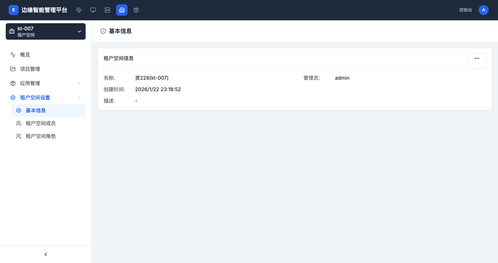

# 租户空间设置

> **导航路径**: 租户空间 > 选择租户空间 > 租户空间设置 > 基本信息
> **访问地址**: `/boss/clusters/{集群ID}/workspaces/{租户空间ID}/base-info`
> **所需权限**: 平台管理员或租户空间管理员

## 功能说明

租户空间设置页面包含基本信息、成员管理和角色管理三个子页面。基本信息页面展示租户空间的核心配置，支持编辑别名和描述。

## 页面概览

基本信息页面显示以下内容：

| 字段 | 说明 |
|------|------|
| 名称 | 租户空间的名称和别名 |
| 管理员 | 租户空间管理员 |
| 创建时间 | 租户空间的创建时间 |
| 描述 | 租户空间的用途说明 |

## 操作指南

### 操作一：查看基本信息

**操作步骤**

1. 进入目标租户空间，在侧边栏展开 **租户空间设置**

2. 点击 **基本信息**

3. 查看租户空间的名称、管理员、创建时间和描述

**操作结果**

查看到租户空间的核心配置信息。

### 操作二：编辑租户空间信息

**操作步骤**

1. 在基本信息页面，点击右上角的操作按钮

2. 选择 **编辑信息**

3. 修改别名或描述信息

4. 点击 **确认** 保存修改

**操作结果**

租户空间信息更新成功。

## 常见问题

### 问题：无法编辑租户空间信息
**现象**：操作按钮不可用或修改后保存失败
**原因**：当前用户没有租户空间管理权限
**解决**：确认当前用户是平台管理员或该租户空间的管理员
