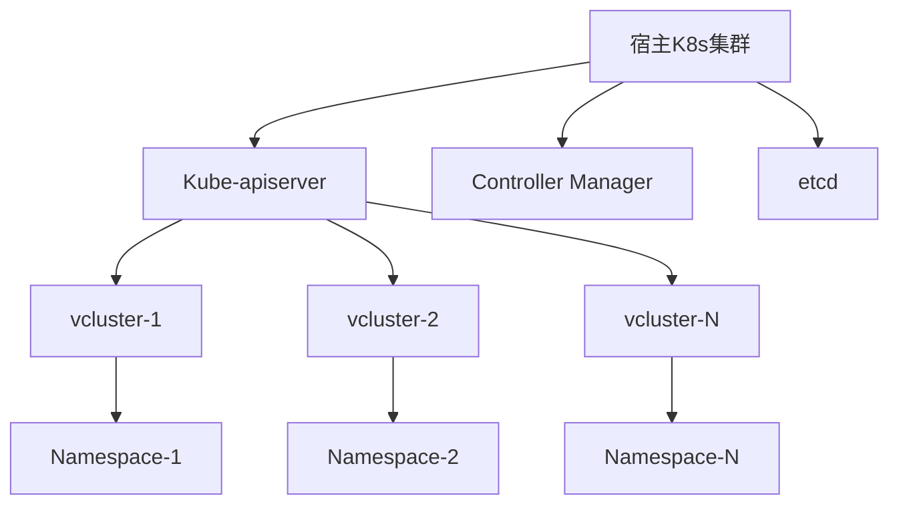
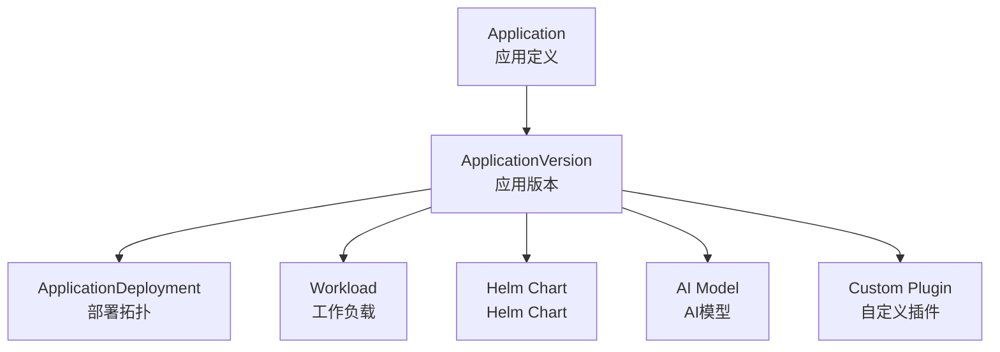
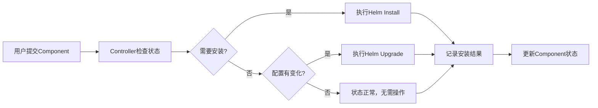

# 第三章 核心功能

## 功能模块总览

Edge Platform提供四大核心功能模块，每个模块都具有业界领先的技术创新：

| 模块 | 核心价值 | 技术创新 | 业务收益 |
|-----|---------|---------|----------|
| **权限管理** | 企业级多租户权限控制 | 5层Scope模型 + 权限级联 | 满足复杂组织架构 |
| **多集群管理** | 轻量级虚拟集群 | vcluster自动化编排 | 资源节省97% |
| **应用商店** | 统一应用生命周期 | 三层架构 + Plugin机制 | 一键分发到多节点组 |
| **声明式安装** | GitOps友好组件管理 | ChartMuseum + Component CR | 完全离线，零依赖 |

## 权限管理

### 核心价值

为企业提供**业界最灵活的多租户权限控制**，支持从全局到资源级的精确权限管理，完全兼容Kubernetes生态。

### 技术创新

#### 5层Scope权限模型（业界独创）

```
Platform(平台级)
    ↓
Cluster(集群级)
    ↓
Workspace(工作空间) / NodeGroup(节点组)  ← 双视图并行设计
    ↓
Namespace(命名空间) / Node(节点)
    ↓
Resource(资源级)
```

**创新点**：
- **双视图设计**：Workspace（应用视图）和NodeGroup（资源视图）并行
- **权限级联**：自动向上级Scope查找权限
- **前后端统一**：权限配置同时控制API和UI访问

#### 核心组件

**RoleTemplate CRD**：定义可复用的权限模板
```yaml
apiVersion: edge.theriseunion.io/v1alpha1
kind: RoleTemplate
metadata:
  name: workspace-admin
spec:
  displayName: "工作空间管理员"
  description: "工作空间内的完整权限"
  permissions:
    - apiGroups: ["*"]
      resources: ["*"]
      verbs: ["*"]
  scope: workspace
```

**IAMRole CRD**：基于模板创建具体权限角色
```yaml
apiVersion: edge.theriseunion.io/v1alpha1
kind: IAMRole
metadata:
  name: production-workspace-admin
  namespace: workspace-production
spec:
  roleTemplateRef: workspace-admin
  scopeRef:
    kind: Workspace
    name: production
```

#### 性能指标

- **权限查询延迟**：P99 < 5ms
- **支持用户规模**：10,000+
- **权限检查吞吐**：50,000 QPS
- **权限级联深度**：5级

### 应用场景

**集团型企业权限管理**：
- 集团 → 子公司 → 工厂 → 车间 → 产线
- 支持权限继承和覆盖
- 精确到具体资源的权限控制

**ISV多租户SaaS**：
- 租户隔离的权限管理
- 租户内自定义权限模型
- API级别的权限控制

## 多集群管理

### 核心价值

基于vcluster技术提供**轻量级虚拟集群管理**，每个虚拟集群仅需200MB内存，资源节省率达97%。

### 技术创新

#### vcluster虚拟化架构



**技术特点**：
- **共享控制平面**：多个vcluster共享宿主集群的kube-apiserver
- **独立数据平面**：每个vcluster有独立的etcd和scheduler
- **完全隔离**：网络、存储、权限完全隔离

#### 自动化创建流程

```yaml
apiVersion: edge.theriseunion.io/v1alpha1
kind: Cluster
metadata:
  name: factory-001
spec:
  type: virtual
  runtime: kubeedge
  version: "1.14.0"
  resources:
    requests:
      memory: "200Mi"
      cpu: "100m"
```

**自动化能力**：
- 30秒内完成虚拟集群创建
- 自动安装边缘运行时（KubeEdge/OpenYurt）
- 自动配置网络和存储

### 性能优势

| 指标 | 物理集群 | vcluster虚拟集群 | 优势 |
|------|----------|------------------|------|
| 内存占用 | 4GB+ | 200MB | 95%+ |
| 创建时间 | 10分钟+ | 30秒 | 95%+ |
| 运维成本 | 高 | 低 | 90%+ |
| 资源利用率 | 10-20% | 80%+ | 4倍 |

## 应用商店

### 核心价值

提供**统一的应用生命周期管理**，支持多云拓扑部署，通过Plugin机制支持任意类型的应用。

### 三层架构设计



#### Application - 应用定义

```yaml
apiVersion: edge.theriseunion.io/v1alpha1
kind: Application
metadata:
  name: ai-quality-inspection
spec:
  displayName: "AI质检应用"
  description: "基于深度学习的产品质量检测"
  category: "AI/ML"
  icon: "https://example.com/icon.png"
```

#### ApplicationVersion - 应用版本

```yaml
apiVersion: edge.theriseunion.io/v1alpha1
kind: ApplicationVersion
metadata:
  name: ai-quality-inspection-v2.1.0
spec:
  applicationRef: ai-quality-inspection
  version: "2.1.0"
  type: workload
  template:
    spec:
      containers:
        - name: ai-model
          image: ai-quality:2.1.0
          resources:
            requests:
              memory: "2Gi"
              cpu: "1000m"
```

#### ApplicationDeployment - 部署拓扑

```yaml
apiVersion: edge.theriseunion.io/v1alpha1
kind: ApplicationDeployment
metadata:
  name: ai-quality-inspection-deployment
spec:
  applicationVersionRef: ai-quality-inspection-v2.1.0
  targets:
    - clusterRef: factory-001
      nodeGroupRef: production-nodes
      replicas: 2
    - clusterRef: factory-002
      nodeGroupRef: production-nodes
      replicas: 1
```

### Plugin机制

#### 内置Plugin类型

**Workload Plugin**：
- 支持标准的Kubernetes工作负载
- Deployment、StatefulSet、DaemonSet等

**Helm Chart Plugin**：
- 支持Helm Chart应用
- 自动处理Chart依赖和values合并

#### 扩展Plugin示例

```go
// AI Model Plugin
type AIModelPlugin struct {
    Plugin
}

func (p *AIModelPlugin) Deploy(app *ApplicationVersion, target *Target) error {
    // 部署AI模型的特殊逻辑
    model := p.loadAIModel(app)
    return p.deployModelToNode(model, target.NodeGroup)
}
```

## 声明式组件管理

### 核心价值

提供**GitOps友好的组件管理**，支持完全离线部署，零跨集群依赖。

### Component CR设计

```yaml
apiVersion: edge.theriseunion.io/v1alpha1
kind: Component
metadata:
  name: monitoring-stack
spec:
  chartName: monitoring-stack
  chartVersion: "1.5.0"
  namespace: monitoring
  values:
    prometheus:
      resources:
        requests:
          memory: "1Gi"
          cpu: "500m"
    grafana:
      adminPassword: "admin123"
      persistence:
        enabled: true
        size: "10Gi"
```

### ChartMuseum集成

#### 独立Chart仓库

每个集群都有独立的ChartMuseum实例：

```yaml
apiVersion: apps/v1
kind: Deployment
metadata:
  name: chartmuseum
spec:
  replicas: 1
  template:
    spec:
      containers:
        - name: chartmuseum
          image: chartmuseum/chartmuseum:latest
          env:
            - name: STORAGE
              value: local
            - name: STORAGE_LOCAL_ROOTDIR
              value: /charts
          volumeMounts:
            - name: charts
              mountPath: /charts
```

#### Chart预置机制

**内置常用组件Chart**：
- Prometheus + Grafana监控系统
- ELK日志收集系统
- Nginx Ingress Controller
- Cert-Manager证书管理

**离线部署支持**：
- Chart文件内置在平台镜像中
- 支持完全断网环境部署
- 自动同步Chart到本地仓库

### 关键特性

#### 幂等操作



#### 故障自动恢复

- 定期检查组件运行状态
- 自动修复偏离的配置
- 支持版本回滚操作

---

**下一章节**：[第四章 技术架构](./architecture.md)